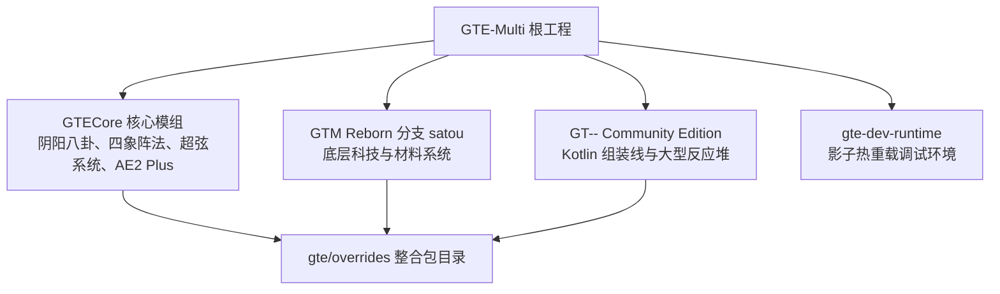

# GTE-Multi 聚合开发工程 (GregTech Easy)

<p align="center">
  
</p>

<p align="center">
  <strong>现代化 Minecraft 1.20.1 整合包</strong><br/>
  <i>简单 · 好玩 · 有趣 · 耗时短</i>
</p>

<p align="center">
  <a href="https://takanashisatou.github.io/GregtechEasy/">📖 在线多语言官方文档 (GitHub Pages)</a> •
  <a href="README_EN.md">🌐 English README</a> •
  <a href="https://www.curseforge.com/minecraft/modpacks/gregtech-easy">📦 CurseForge 页面</a>
</p>

---

## 🧭 项目架构概览

本项目集合了 **GTECore**（Java 核心模组）、**GTM-Reborn**（专属 GregTech Modern 分支，`satou` 分支）、**GT-- Community Edition**（GT-- CE 模组，`kotlin` 分支）以及 **GTE**（整合包主体与 KubeJS 脚本）。



---

## 📚 官方人类可读多语言文档导航

详细完整的多语言开发与游玩指南已内置于 [`docs/`](docs/) 目录并自动发布于 **GitHub Pages**：

- 🌐 **在线阅读**：[https://takanashisatou.github.io/GregtechEasy/](https://takanashisatou.github.io/GregtechEasy/)
- 📦 **[整合包下载与玩家指南](docs/zh/download-and-play/full-mod-pack.md)**：
  - [玩家完整模组客户端包 (`GTE-FullMod-*.zip`) 安装指南](docs/zh/download-and-play/full-mod-pack.md)
  - [CurseForge 规范包与服务端部署指南 (Java 21 配置)](docs/zh/download-and-play/curseforge-and-server.md)
- ⚙️ **[GTECore 核心模组详解](docs/zh/gtecore/overview.md)**：
  - [多方块机器图鉴 (蒸汽/电气/1B并行/1t超频)](docs/zh/gtecore/machines-and-multiblocks.md)
  - [阴阳八卦炼仙炉与东青龙/西白虎/南朱雀/北玄武四象阵法](docs/zh/gtecore/yin-yang-and-four-symbols.md)
  - [AE2 深度集成 (ME 样板总成 Plus 与镜像，81槽位跨机共享)](docs/zh/gtecore/ae2-integration.md)
  - [超弦电路 (ZPM-UEV) 与 阴阳电路 (UV-UIV) 体系](docs/zh/gtecore/circuits-and-materials.md)
- 🚀 **[GTM Reborn 模组分支 (satou 分支)](docs/zh/gtm-reborn/index.md)**：多安培配方、批处理模式、1t Subtick 超频、GameTest 自动化测试
- 🏗️ **[GT-- Community Edition (GTNN)](docs/zh/gt-minus-minus/index.md)**：Kotlin+Java 组装线、中子活化器、大型硅岩反应堆、太空电梯
- 🛠️ **[KubeJS 魔改与开发工具](docs/zh/kubejs/scripting-guide.md)**：
  - [材料注册与配方编写指南](docs/zh/kubejs/scripting-guide.md)
  - [`/dumpmultiblock` 木斧框选导出多方块结构工具](docs/zh/kubejs/tools-and-utilities.md)
- 🎨 **[美术与 Blockbench 资产工作流](docs/zh/art-and-ui/blockbench-workflow.md)**：一键同步任务 `syncBlockbenchAssets`
- 🛡️ **[开发与防崩溃实战手册](docs/zh/development/quick-start.md)**：
  - [开发者快速上手与环境准备](docs/zh/development/quick-start.md)
  - [`run_game.bat` 免启动器秒级启动与 `link_to_launcher.bat` 零复制映射](docs/zh/development/runtime-and-launchers.md)
  - [五大防崩溃铁律与实战排错经验库 (杜绝 Mixin Accessor 崩溃)](docs/zh/development/anti-crash-guide.md)
- 🔄 **[CI/CD 流水线与 AI 翻译](docs/zh/ci-cd-and-translation/ci-pipeline.md)**：
  - [GitHub Actions 自动化多产物构建与 Maven 发布](docs/zh/ci-cd-and-translation/ci-pipeline.md)
  - [`opencode_translate.py` AI 国际化翻译引擎](docs/zh/ci-cd-and-translation/ai-translation.md)

---

## 💻 快速开始

### 1. 环境准备
- **Java 环境**：必须安装 **JDK 21**（推荐 [Azul Zulu 21](https://www.azul.com/downloads/?version=java-21-lts) 或 [Eclipse Temurin 21](https://adoptium.net/temurin/releases/?version=21)）。
- **开发工具**：推荐使用 **IntelliJ IDEA 2023.3+**，并安装插件：*Minecraft Development*、*Lombok*、*Kotlin*。
- **内存预算**：仓库已按普通 16 GB 机器调优——Gradle 守护进程上限 4 GB，IDEA 建议 `-Xmx4G`（Help → Change Memory Settings；构建已通过 `idea.module.excludeDirs` 排除了 `run/` 游戏运行目录和 `gte/overrides/mods/` 整合包 jar，索引负担已大幅降低）。首次同步会下载并转制数 GB 依赖（Minecraft 工件 + 全部 mod 的反混淆 jar），CPU 打满数分钟属一次性成本，结果永久缓存于 `~/.gradle`。

### 2. 克隆与导入
```bash
git clone --recurse-submodules https://github.com/takanashisatou/GregtechEasy.git GTEGroup
cd GTEGroup
git submodule update --init --recursive
```

### 3. 常用指令
```powershell
$env:JAVA_HOME='C:\Users\Ex_Je\.jdks\ms-21.0.11'
.\gradlew.bat compileJava
.\gradlew.bat compileJava -Pwerror
.\gradlew.bat buildAll -x test
.\gradlew.bat syncBlockbenchAssets
python scripts/build_full_mod_pack.py <version>
```

### 4. 启动开发客户端（正确方式）

```powershell
$env:JAVA_HOME='C:\Users\Ex_Je\.jdks\ms-21.0.11'
.\gradlew.bat runFullPack                          # 推荐：根工程聚合入口
.\gradlew.bat :modules:gte-dev-runtime:runClient    # 等价写法
```

双击 `run_game.bat` 也是同一条路径（会自动探测 JDK、内存与核心数）。

**预期表现**：启动后约 **25 秒内屏幕上不会有任何窗口** —— 这是刻意为之。为规避 Embeddium/Oculus 在独显上的 GLFW 死锁，Forge 的早期进度窗口被禁用，窗口要到 `Minecraft.<init>` 才由 GLFW 创建。此时游戏进程是 Gradle 守护进程派生的后台进程，Windows 前台锁会拒绝它抢占焦点，窗口会被创建在当前活动窗口**下方**。因此 `runClient` 会自动拉起 `scripts/dev/raise_game_window.ps1`，等窗口出现后把它提到最前。完整冷启动约 70 秒。

| 环境变量 | 作用 |
| --- | --- |
| `GTE_WINDOW_WIDTH` / `GTE_WINDOW_HEIGHT` | 窗口尺寸（默认 1600x900） |
| `GTE_NO_WINDOW_RAISE=1` | 关闭自动置顶，保持 GLFW 原始位置 |
| `GTE_RUNTIME_XMX` | 客户端堆上限（默认 `8G`） |

> ⚠️ **不要**使用 `.vscode/launch.json` 里那些自动生成的配置启动游戏。它们直接调用 `net.neoforged.devlaunch.Main`，绕过 `runClient`，窗口不会被置顶；而且 ModDevGradle 会在每次 IDE 同步时重写该文件，手工修改不会保留。需要断点调试时再用 IDEA 的 `Run Client (Hot Debug)`（它挂载 JDWP，退出时会在 `run/client/` 留下 `hs_err_pid*.log`，属已知无害现象）。

详细原理见 [本地热联调与免启动器快速运行](docs/zh/development/runtime-and-launchers.md)。

---

## 🤝 贡献与开源政策 (AI-Friendly Policy)

- 🤖 **零 AI 工具限制**：本项目全面拥抱现代 AI 开发！欢迎使用任何 AI 工具（Claude Code, Cursor, Codex, Gemini, DeepSeek 等）或手写代码贡献。
- 🛡️ **唯一准绳：CI 门禁**：所有 PR 只要能 100% 通过 `-Werror` 编译、GameTest 实机测试与防崩溃规则检查，均受热烈欢迎！
- 📖 详细规范请参阅：[**CONTRIBUTING.md (贡献指南)**](CONTRIBUTING.md)。

