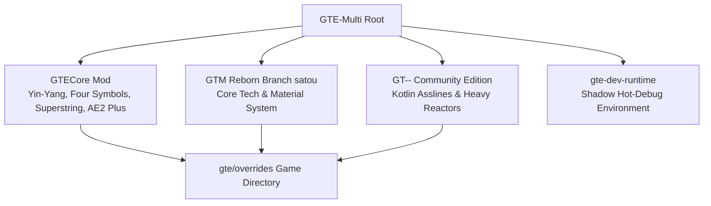

# GTE-Multi Aggregated Project (GregTech Easy)

<p align="center">
  
</p>

<p align="center">
  <strong>Modern Minecraft 1.20.1 Modpack</strong><br/>
  <i>Simple · Fun · Engaging · Respectful of Player Time</i>
</p>

<p align="center">
  <a href="https://takanashisatou.github.io/GregtechEasy/">📖 Multi-Lingual Online Documentation (GitHub Pages)</a> •
  <a href="README.md">🇨🇳 中文 README</a> •
  <a href="https://www.curseforge.com/minecraft/modpacks/gregtech-easy">📦 CurseForge Page</a>
</p>

---

## 🧭 Project Architecture Overview

GTE-Multi aggregates **GTECore** (Custom Java Core Mod), **GTM-Reborn** (Dedicated GregTech Modern Fork on branch `satou`), **GT-- Community Edition** (GT-- CE Mod on branch `kotlin`), and **GTE** (Modpack root and KubeJS scripts).



---

## 📚 Official Human-Readable Documentation Index

The complete bilingual documentation is located under [`docs/`](docs/) and deployed to **GitHub Pages**:

- 🌐 **Online Docs**: [https://takanashisatou.github.io/GregtechEasy/](https://takanashisatou.github.io/GregtechEasy/)
- 📦 **[Download & Player Guides](docs/en/download-and-play/full-mod-pack.md)**:
  - [Full-Mod Client Pack (`GTE-FullMod-*.zip`) Guide](docs/en/download-and-play/full-mod-pack.md)
  - [CurseForge Standard Pack & Server Deployment (Java 21 Setup)](docs/en/download-and-play/curseforge-and-server.md)
- ⚙️ **[GTECore Mod Deep Dive](docs/en/gtecore/overview.md)**:
  - [Multiblock Machine Compendium (Steam/Electric/1B Parallels/1t OC)](docs/en/gtecore/machines-and-multiblocks.md)
  - [Yin-Yang Eight Trigrams Blast Furnace & Four Symbols Formations](docs/en/gtecore/yin-yang-and-four-symbols.md)
  - [AE2 Deep Integration (ME Pattern Buffer Plus & Proxies, 81 Slots)](docs/en/gtecore/ae2-integration.md)
  - [Superstring Circuits (ZPM-UEV) & Yin-Yang Circuits (UV-UIV)](docs/en/gtecore/circuits-and-materials.md)
- 🚀 **[GTM Reborn Fork Guide (satou Branch)](docs/en/gtm-reborn/index.md)**: Multi-amp recipes, batch mode, 1t Subtick overclocking, GameTest test suite
- 🏗️ **[GT-- Community Edition (GTNN)](docs/en/gt-minus-minus/index.md)**: Kotlin+Java assembly lines, neutron activators, naquadah reactors, space elevator
- 🛠️ **[KubeJS Customization & Dev Tools](docs/en/kubejs/scripting-guide.md)**:
  - [Material Registration & Recipe Authoring](docs/en/kubejs/scripting-guide.md)
  - [`/dumpmultiblock` Visual Wooden Axe Pattern Exporter](docs/en/kubejs/tools-and-utilities.md)
- 🎨 **[Art & Blockbench Asset Workflow](docs/en/art-and-ui/blockbench-workflow.md)**: `syncBlockbenchAssets` task
- 🛡️ **[Developer Runbook & Anti-Crash Guide](docs/en/development/quick-start.md)**:
  - [Developer Quick Start & IDE Setup](docs/en/development/quick-start.md)
  - [`run_game.bat` Launcher-Free Instant Start & `link_to_launcher.bat` Zero-Copy Link](docs/en/development/runtime-and-launchers.md)
  - [Five Golden Anti-Crash Rules & Real-World Crash Post-Mortems](docs/en/development/anti-crash-guide.md)
- 🔄 **[CI/CD Pipelines & AI Translation](docs/en/ci-cd-and-translation/ci-pipeline.md)**:
  - [GitHub Actions Multi-Artifact CI & Maven Deployment](docs/en/ci-cd-and-translation/ci-pipeline.md)
  - [`opencode_translate.py` AI Localization Engine](docs/en/ci-cd-and-translation/ai-translation.md)

---

## 💻 Quick Start

### 1. Environment Requirements
- **Java Environment**: **JDK 21 is required** ([Azul Zulu 21](https://www.azul.com/downloads/?version=java-21-lts) or [Eclipse Temurin 21](https://adoptium.net/temurin/releases/?version=21)).
- **IDE**: IntelliJ IDEA 2023.3+ with *Minecraft Development*, *Lombok*, and *Kotlin* plugins.

### 2. Clone & Import
```bash
git clone --recurse-submodules https://github.com/takanashisatou/GregtechEasy.git GTEGroup
cd GTEGroup
git submodule update --init --recursive
```

### 3. Key Commands
```powershell
$env:JAVA_HOME='C:\Users\Ex_Je\.jdks\ms-21.0.11'
.\gradlew.bat compileJava
.\gradlew.bat compileJava -Pwerror
.\gradlew.bat buildAll -x test
.\gradlew.bat syncBlockbenchAssets
python scripts/build_full_mod_pack.py <version>
```

### 4. Launching the Dev Client (the correct way)

```powershell
$env:JAVA_HOME='C:\Users\Ex_Je\.jdks\ms-21.0.11'
.\gradlew.bat runFullPack                          # preferred, root aggregate entry point
.\gradlew.bat :modules:gte-dev-runtime:runClient    # equivalent
```

Double-clicking `run_game.bat` uses the same task (it auto-detects JDK, RAM and core count).

**What to expect**: for roughly the first **25 seconds nothing appears on screen** — this is intentional. Forge's early progress window is disabled to avoid the Embeddium/Oculus GLFW deadlock on discrete GPUs, so GLFW only creates the window inside `Minecraft.<init>`. At that point the game JVM is a background process forked by the Gradle daemon, so the Windows foreground lock denies its focus request and the window is created *behind* the active window. `runClient` therefore launches `scripts/dev/raise_game_window.ps1`, which waits for the window and pulls it to the front. A full cold start takes about 70 seconds.

| Environment variable | Effect |
| --- | --- |
| `GTE_WINDOW_WIDTH` / `GTE_WINDOW_HEIGHT` | Window size (default 1600x900) |
| `GTE_NO_WINDOW_RAISE=1` | Skip the raise, leave the window where GLFW put it |
| `GTE_RUNTIME_XMX` | Client heap limit (default `8G`) |

> ⚠️ **Do not** launch the game through the auto-generated configurations in `.vscode/launch.json`. They invoke `net.neoforged.devlaunch.Main` directly, bypassing `runClient`, so the window is never raised — and ModDevGradle rewrites that file on every IDE sync, so manual edits are lost. Use IntelliJ's `Run Client (Hot Debug)` only when you need breakpoints (it attaches JDWP and leaves `hs_err_pid*.log` files in `run/client/` on exit; that is a known, harmless artifact).

Full background: [Local Hot Debugging and Launcher-Free Quick Run](docs/en/development/runtime-and-launchers.md).

---

## 🤝 Contributing & AI-Friendly Open Source Policy

- 🤖 **Zero AI Restrictions**: We fully embrace modern AI-assisted engineering! Contributions crafted using any AI tool (Claude Code, Cursor, Codex, Gemini, DeepSeek, Copilot, etc.) or written purely by hand are welcome.
- 🛡️ **Sole Ground Truth: CI Gatekeeper**: Any Pull Request that 100% passes `-Werror` compilation, GameTest integration tests, and our anti-crash rules is eligible for review and merge!
- 📖 Read the full guidelines at: [**CONTRIBUTING.md**](CONTRIBUTING.md).

