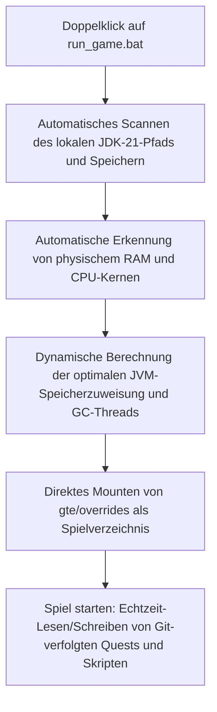

# Lokales Hot-Debugging und schneller Start ohne Launcher

GTE hat ein äußerst benutzerfreundliches, nahtloses Debugging-System für Modpack-Planer, Quest-Autoren und Mod-Programmierer entwickelt.

---

## ⚡ 1. Schnellstart-Skript ohne Launcher (`run_game.bat` / `run_game.sh`)

Für Quest-Autoren (FTB Quests) und KubeJS-Rezeptplaner: **Kein Öffnen von IntelliJ IDEA und keine Installation eines Drittanbieter-Launchers erforderlich** – einfach **`run_game.bat`** im Projektstammverzeichnis doppelklicken, um das Spiel blitzschnell zu starten!



### Kernfunktionen
1. **Automatische JDK-21-Erkennung**: Sucht automatisch nach installiertem Java 21 in `.jdks`, `Adoptium`, `Zulu` und `Program Files` und speichert den Pfad in `.jdk_path`.
2. **Hardwareadaptive Optimierung**: Weist automatisch die JVM-Heap-Größe basierend auf dem gesamten RAM des Computers im optimalen Verhältnis (50–60 % des verfügbaren physischen Speichers) zu und konfiguriert automatisch parallele GC-Threads.
3. **Null-Bewegungs-Workflow**: Änderungen an Quests im Spiel (`/ftbquests editing_mode true`) und Speichern werden direkt in Echtzeit im entsprechenden `config/ftbquests/`-Ordner des Git-Repositorys gespeichert. Öffnen Sie GitHub Desktop und committen Sie mit einem Klick!

---

## 🔗 2. Zero-Copy-Mapping-Tool für externe Launcher (`link_to_launcher.bat`)

Wenn Sie einen Launcher mit eigenen Skins und Tastenbelegungen verwenden (z. B. PCL2 / HMCL / Prism Launcher):

1. Doppelklicken Sie auf **`link_to_launcher.bat`** im Stammverzeichnis.
2. Ziehen Sie das Spielverzeichnis Ihres Launchers (z. B. `D:\PCL2\.minecraft\versions\GTE-Dev\.minecraft\`) gemäß den Anweisungen in die Konsole und drücken Sie Enter.
3. Das Skript erstellt automatisch Windows-Verzeichnis-Junctions:
   - `config` ➜ `gte/overrides/config`
   - `kubejs` ➜ `gte/overrides/kubejs`
   - `ftbquests` ➜ `gte/overrides/config/ftbquests`
   - `defaultconfigs` ➜ `gte/overrides/defaultconfigs`
4. Egal, wie Sie Quests oder Rezepte im Launcher ändern, **die physischen Daten werden in Echtzeit im Haupt-Git-Repository synchronisiert**!

---

## ☕ 3. Hot-Compile-Schattenumgebung für Mod-Code (`gte-dev-runtime`)

Für Java/Kotlin-Programmierer ist `modules/gte-dev-runtime` ein dediziertes Schatten-Debugging-Modul:

### Funktionsweise und Designüberlegungen
- **Zweck**: Reine lokale Hot-Compile-Debugging-Sandbox, **nicht für Veröffentlichung gedacht und erscheint in keinem Spieler-Build**.
- **ModDevGradle dynamisches Remapping**: Kompiliert automatisch den neuesten Quellcode von `gtm-reborn` und `gtecore` und hängt ihn in den Mojang-Deobfuscation-Namespace ein.

### Der richtige Weg zum Starten

Diese drei Einstiegspunkte sind gleichwertig und holen das Spielfenster jeweils automatisch in den Vordergrund:

```powershell
$env:JAVA_HOME='C:\Users\Ex_Je\.jdks\ms-21.0.11'
.\gradlew.bat runFullPack                          # preferred, root aggregate entry point
.\gradlew.bat :modules:gte-dev-runtime:runClient    # equivalent
.\run_game.bat                                     # same task, auto-detects JDK/RAM/cores
```

### Warum in den ersten 25 Sekunden kein Fenster erscheint (das ist normal)

Forges frühes Fortschrittsfenster ist absichtlich deaktiviert, um den GLFW-Kontext-Deadlock von Embeddium/Oculus auf dedizierten GPUs zu vermeiden. Der Preis dafür ist, dass das Fenster erst innerhalb von `Minecraft.<init>` erzeugt wird; zu diesem Zeitpunkt ist die Spiel-JVM ein vom Gradle-Daemon geforkter Hintergrundprozess. Die Windows-Vordergrundsperre verweigert dessen Fokusanforderung, sodass das Fenster korrekt erstellt und gerendert wird, aber unter dem aktiven Fenster liegt – was genau so aussieht, als wäre „das Fenster nie aufgetaucht“.

`runClient` startet daher `scripts/dev/raise_game_window.ps1` asynchron. Das Skript sucht per Polling nach dem `GLFW30`-Fenster, das zur JVM dieses Durchlaufs gehört, und hebt es mit `SetWindowPos` nach vorne (Änderungen der Z-Reihenfolge unterliegen nicht der Vordergrundsperre, das Anheben gelingt also immer). Sein Log liegt unter `modules/gte-dev-runtime/build/raise-game-window.log`. Ein vollständiger Kaltstart dauert etwa 70 Sekunden.

### Umgebungsvariablen

| Umgebungsvariable | Wirkung |
| --- | --- |
| `GTE_WINDOW_WIDTH` / `GTE_WINDOW_HEIGHT` | Fenstergröße (Standard 1600x900) |
| `GTE_NO_WINDOW_RAISE=1` | Anheben überspringen, Fenster dort lassen, wo GLFW es platziert hat |
| `GTE_RUNTIME_XMX` | Heap-Limit des Clients (Standard `8G`) |

### Nicht über `.vscode/launch.json` starten

Die Konfigurationen in `.vscode/launch.json` werden von ModDevGradle während der IDE-Synchronisierung automatisch generiert. Sie rufen `net.neoforged.devlaunch.Main` direkt auf und umgehen damit die Task `runClient`, sodass das Fenster nie angehoben wird – außerdem wird die Datei bei jeder IDE-Synchronisierung neu geschrieben, manuelle Änderungen bleiben also nicht erhalten. Dauerhafte Startargumente gehören in den `runs {}`-Block von `build.gradle`.

Wenn Sie Breakpoints benötigen, verwenden Sie die IntelliJ-Konfiguration `Run Client (Hot Debug)`. Sie hängt einen JDWP-Debugger an und kann beim Beenden `hs_err_pid*.log`-Dateien in `run/client/` hinterlassen; das ist ein bekanntes, harmloses Artefakt ohne Bezug zum Startvorgang.