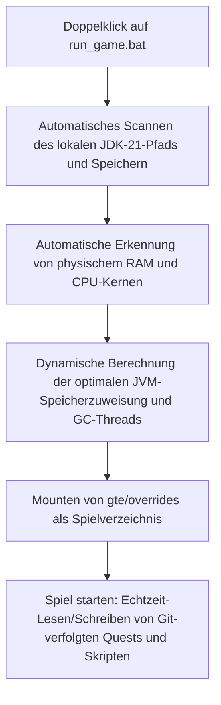

# Lokale Hot-Reload-Entwicklung und schneller Start ohne Launcher

GTE hat ein äußerst benutzerfreundliches Hot-Reload-System für Modpack-Planer, Quest-Autoren und Mod-Programmierer entwickelt.

---

## ⚡ 1. Schnellstart-Skript ohne Launcher (`run_game.bat` / `run_game.sh`)

Für Quest-Autoren (FTB Quests) und KubeJS-Rezeptplaner: **Ohne IntelliJ IDEA zu öffnen und ohne Installation eines Drittanbieter-Launchers** können Sie einfach **`run_game.bat`** im Projektstammverzeichnis doppelklicken, um das Spiel sofort zu starten!



### Kernfunktionen
1. **Vollautomatische JDK-21-Erkennung**: Automatische Suche nach installiertem Java 21 in `.jdks`, `Adoptium`, `Zulu`, `Program Files` und automatisches Speichern in `.jdk_path`.
2. **Hardwareadaptive Optimierung**: Automatische Zuweisung der JVM-Heap-Größe basierend auf dem gesamten RAM des Computers im optimalen Verhältnis (50%–60% des verfügbaren physischen Speichers) und automatische Konfiguration der parallelen GC-Threads.
3. **Null-Verschiebungs-Workflow**: Änderungen an Quests im Spiel (`/ftbquests editing_mode true`) und Speichern werden direkt in Echtzeit im entsprechenden `config/ftbquests/`-Ordner des Git-Repositorys gespeichert. Öffnen Sie GitHub Desktop und committen Sie mit einem Klick!

---

## 🔗 2. Zero-Copy-Mapping-Tool für externe Launcher (`link_to_launcher.bat`)

Wenn Sie einen Launcher mit eigenen Skins und Tastenbelegungen verwenden (z. B. PCL2 / HMCL / Prism Launcher):

1. Doppelklicken Sie auf **`link_to_launcher.bat`** im Stammverzeichnis.
2. Ziehen Sie gemäß den Anweisungen das Spielverzeichnis Ihres Launchers (z. B. `D:\PCL2\.minecraft\versions\GTE-Dev\.minecraft\`) in die Konsole und drücken Sie die Eingabetaste.
3. Das Skript erstellt automatisch Windows-Verzeichnis-Junctions:
   - `config` ➜ `gte/overrides/config`
   - `kubejs` ➜ `gte/overrides/kubejs`
   - `ftbquests` ➜ `gte/overrides/config/ftbquests`
   - `defaultconfigs` ➜ `gte/overrides/defaultconfigs`
4. Egal wie Sie Quests oder Rezepte im Launcher ändern, **die physischen Daten werden in Echtzeit im Haupt-Git-Repository synchronisiert**!

---

## ☕ 3. Hot-Compile-Schattenumgebung für Mod-Code (`gte-dev-runtime`)

Für Java/Kotlin-Programmierer ist `modules/gte-dev-runtime` ein dediziertes Schatten-Debug-Modul:

### Funktionsweise und Designüberlegungen
- **Zweck**: Reine lokale Hot-Compile-Sandbox für die Entwicklung, **Veröffentlichung verboten, erscheint nicht in Spieler-Builds**.
- **ModDevGradle dynamisches Remapping**: Automatisches Hot-Compile der neuesten Quellcodes von `gtm-reborn` und `gtecore` und Einbinden in den Mojang-Deobfuscation-Namespace.
- **Startmethoden**:
  - Wählen Sie in IDEA die Run-Konfiguration **`Run GTE Full Pack (Client - Hot Debug)`**.
  - Oder über die Befehlszeile:
    ```powershell
    .\gradlew.bat :modules:gte-dev-runtime:runClient
    ```