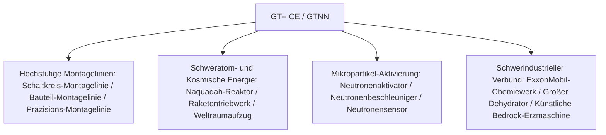

# GT-- Community Edition (GTNN)

`modules/gt--` (Paketname `dev.arbor.gtnn`) ist ein offizielles Community-Editons-Modul von GT-- Community Edition, das auf einer **Kotlin + Java** Hybridarchitektur basiert (Entwicklungsbranch `kotlin`).

---

## 🏗️ Architektur und Technologie-Stack

- **Entwicklungssprachen**: Kotlin 2.0.21 + Java 21.
- **Positionierung**: Führt die bei Spielern beliebten riesigen Montagelinien, Schwerreaktor-Systeme, Dehydratoren und die industrielle Weltraumforschung aus dem klassischen GT 5.09 und modernen Erweiterungen ein.



---

## 🏭 Kern-Multiblock-Maschinen und -Anlagen

### 1. Montagelinien-Array
- **Schaltkreis-Montagelinie (`circuit_assembly_line`)**: Spezialisiert auf die effiziente Massenproduktion von mittleren und höheren Chips sowie komplexen Schaltkreisen; unterstützt mehrstufige Präzisionsgehäuse.
- **Bauteil-Montagelinie (`component_assembly_line`)**: Verwendet je nach Spannungsebene (LV bis MAX) entsprechende Gehäuseklassen und montiert in Serie Kernmotoren und Sensoren.
- **Präzisions-Montagelinie (`precision_assembly_line`)**: Produziert hochpräzise Nano-Lithografie-Masken und Supercomputer-Busse.

### 2. Teilchenbeschleunigung und Neutronenaktivierungssysteme
- **Neutronenaktivator (`neutron_activator`)** und **Neutronenbeschleuniger (`neutron_accelerator`)**:
  - Simulieren Hochenergie-Kollisionen und schnelle Neutroneneinfangreaktionen, um stabile Isotope in radioaktive Schweratom-Materialien oder superschwere supraleitende Elemente zu aktivieren.
- **Neutronensensor (`neutron_sensor`)**: Erkennt in Echtzeit den Neutronenkinetik-Fluss im Reaktionsraum und liefert Redstone- oder Computer-Signal-Feedback.

### 3. Schweratom-Energie und Raumfahrtindustrie
- **Großer Naquadah-Reaktor (`large_naquadah_reactor`)**: Nutzt Naquadah-Legierungen und angereicherten Brennstoff für eine stabile, hochdichte EU-Energieausgabe.
- **Raketentriebwerk (`rocket_engine`)**: Verbraucht fortschrittlichen Raketentreibstoff und liefert Impulsenergie für Hochlast-Ausrüstung.
- **Weltraumaufzug (`space_elevator`)**: Verbindet die erdnahe Umlaufbahn und ermöglicht weltraumgestützte Mineralgewinnung sowie Mikrogravitations-Industriefertigung.

### 4. Chemie- und Bergbau-Verbundanlagen
- **ExxonMobil-Chemiewerk (`exxonmobil_chemical_plant`)**: Ultra-große Erdöl-Tiefverarbeitungsanlage, die in einer einzigen Maschine die gesamten Prozesse Cracken, Reformieren, Aromatisieren und Polymerisieren durchführt.
- **Großer Dehydrator (`large_dehydrator`)**: Entfernt effizient Kristall- und freies Wasser aus Flüssigkeiten oder chemischen Mineralien.
- **Künstliche Bedrock-Erzmaschine (`homemade_bedrock_ore_machine`)**: Setzt künstliche Bohrer in der Bedrock-Schicht ein und fördert kontinuierlich unendliche tiefe Erzadern.

---

## 🌿 Git-Workflow für Submodule

`modules/gt--` entspricht dem separaten Git-Repository `takanashisatou/GT---Community-Edition`, Entwicklungsbranch `kotlin`:

```bash
# Unabhängig im Submodul entwickeln und committen
cd modules/gt--
git checkout kotlin
git add .
git commit -m "feat: add precision assembly line recipes"
git push origin kotlin

# Zurück zum Hauptprojekt, um den Submodul-Zeiger zu aktualisieren
cd ../..
git add modules/gt--
git commit -m "chore: bump gt-- submodule pointer"
```