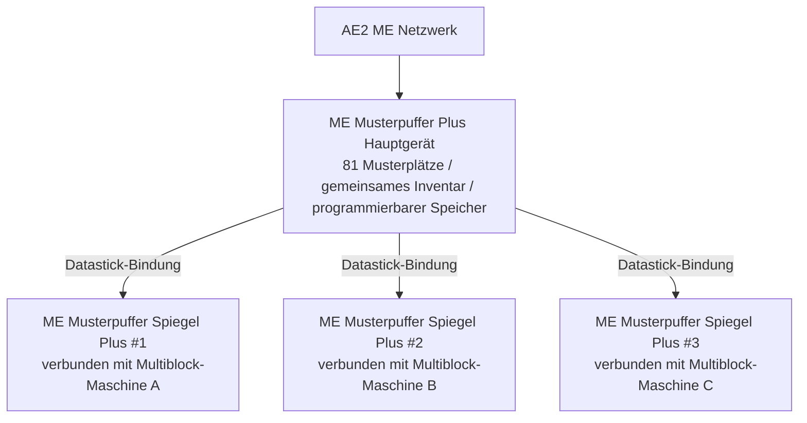

# AE2 深度集成与样板总成 Plus 系统

GTECore 为应用能源 2 (Applied Energistics 2) 与 GregTech 多方块结构之间搭建了极其强大的直接数据互联桥梁。

---

## 🧩 ME 样板总成 Plus (`me_pattern_buffer_plus`)

在传统科技模组中，将 AE2 样板供应器连接到多方块机器通常面临**槽位不足、流体与物品无法混合输出、样板难以多机共享**的痛点。

GTECore 研发的 **ME 样板总成 Plus** 彻底解决了这一问题：

### Kernfunktionen
1. **Massive Musterkapazität**: Ein einzelner Puffer-Host besitzt **81 Musterplätze** (entspricht der Summe von 9 Standard-AE2-Musterlieferanten).
2. **Allround-Fähigkeiten**: Verfügt gleichzeitig über `IMPORT_ITEMS`, `IMPORT_FLUIDS`, `EXPORT_ITEMS` und `EXPORT_FLUIDS` – unterstützt gemischte Interaktion von Flüssigkeiten und Gegenständen im selben Fach.
3. **Unterstützung für programmierbaren Speicher**: Integriert die Programmable-Storage-Mechanik für präzise Zuführung und Zwischenspeicherung komplexer Rezepte.

---

## 🪞 ME Musterpuffer Spiegel Plus (`me_pattern_buffer_proxy_plus`)

**Musterpuffer Spiegel Plus** ist ein revolutionäres verteiltes Automatisierungs-Strukturteil:

### Funktionsprinzip und maschinenübergreifende Freigabe
- Installieren Sie den Spiegel-Puffer an einer beliebigen Bus-Position einer Multiblock-Maschine.
- Halten Sie einen **Datastick** in der Hand, klicken Sie mit der rechten Maustaste auf den Haupt-**ME Musterpuffer Plus**, um die Koordinaten zu lesen, und klicken Sie dann mit der rechten Maustaste auf den **Musterpuffer Spiegel Plus**, um die Bindung durchzuführen.
- **Alle gebundenen Spiegel teilen in Echtzeit alle 81 Muster, die im Haupt-Puffer abgelegt sind!**
- Wenn das AE2-Netzwerk einen automatisierten Syntheseauftrag startet, verteilt das Netzwerk die Last automatisch auf alle freien Spiegel-Maschinen, die parallel arbeiten!

### Jade-Schwebestatusanzeige
Wenn Sie auf den Musterpuffer oder den Spiegel zielen, zeigt Jade automatisch an:
- Haupt-Puffer: `Anzahl verbundener Spiegel: X`
- Spiegel-Komponente: `Gebunden an - X: ..., Y: ..., Z: ...`

---

## 💨 ME Dampf-Bus (`me_steam_hatch`)

- **Funktion**: Direkte Verbindung zwischen dem AE2-Flüssigkeitsnetzwerk und der Dampf-Multiblock-Struktur.
- **Wirkung**: Die Dampf-Multiblock-Struktur benötigt keine externen komplexen Hochgeschwindigkeits-Dampfrohre und -tanks; sie kann Dampf direkt mit maximalem Durchsatz aus dem ME-Netzwerk beziehen, wodurch Engpässe in der Rohrleitung vermieden werden.