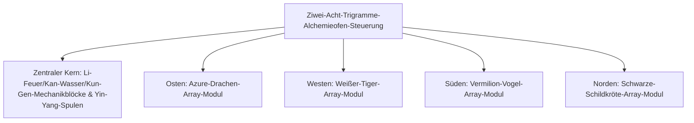

# Yin-Yang-Acht-Trigramme-Alchemieofen und Vier-Symbole-Array-System

GTECore hat einzigartig ein **„Tai-Chi-Acht-Trigramme- und Vier-Symbole-Array-System“** entwickelt, das östliche daoistische Philosophie mit moderner Schwerindustrie-Technik verbindet. Dieses System bildet den zentralen Knotenpunkt für Metallurgie, Synthese supraleitender Materialien und den Sprung der Unsterblichkeitstechnologie in der mittleren bis späten Spielphase.

---

## 🌌 Yin-Yang-Acht-Trigramme-Alchemieofen (`yin_yang_eight_trigmas_blast_furnace`)

**Der Ziwei-Acht-Trigramme-Alchemieofen** ist eine der größten und präzisesten Multiblock-Strukturen in der Tech-Mod-Community (belegt über 55×55 Blöcke):



### 🧭 Feng-Shui-Ausrichtungsregel (Kritischer Mechanismus)
> [!IMPORTANT]
> **Feng-Shui-Ausrichtungsgesetz**: Aufgrund von Feng-Shui- und Magnetfeldbeschränkungen muss der **Hauptcontroller des Alchemieofens nach Süden ausgerichtet sein**, um mit der Yin-Yang-Energie von Himmel und Erde zu kommunizieren und normal zu funktionieren!

### Grundfähigkeiten des Ofens
- **Rezeptbibliothek**: Nativ kompatibel mit Standard-Hochofenrezepten (`blast_recipes`), Schmelzofenrezepten (`furnace_recipes`), Legierungsofenrezepten (`alloy_smelter_recipes`), GCYM-Riesenlegierungshochofenrezepten (`alloy_blast_recipes`) sowie den exklusiven **Yin-Yang-Acht-Trigramme-Rezepten (`yin_yang_eight_trigmas_blast`)**.
- **Übertaktungsfunktion**: Unterstützt perfekt **1T-Subtick-Instant-Übertaktung** und **Stapelverarbeitungsmodus (Batch Mode)**.

---

## 🐉 Vier-Symbole-Array-Submodule und dynamische Bedingungserkennung

Rund um den Alchemieofen können vier Array-Flügel erweitert werden: **Ost-Drache, West-Tiger, Süd-Vogel, Nord-Schildkröte**:

| Array-Modul | Array-Ausrichtung | Array-Block | Rezeptbedingung (`RecipeCondition`) | Vorteile und Effekte nach Aktivierung |
| :--- | :--- | :--- | :--- | :--- |
| **Qing-Long-Array** (`Qing Long`) | **Osten (East)** | `qinglong_module` | `QING_LONG_CONDITION` | Aktiviert die Holz-zu-Feuer-Energie, reduziert den Energieverbrauch bei ultrahohen Temperaturen erheblich, schaltet endlose hochstufige Katalyserezepte frei |
| **Bai-Hu-Array** (`Bai Hu`) | **Westen (West)** | `baihu_module` | `BAI_HU_CONDITION` | Metall-Töten dominiert, schaltet Rezepte für hochharte göttliche Metalle, Spaltung superschwerer Kernelemente und Quantenmetall-Transmutation frei |
| **Zhu-Que-Array** (`Zhu Que`) | **Süden (South)** | `zhuque_module` | `ZHU_QUE_CONDITION` | Südliches Ming-Feuer, bietet unbegrenzte extreme Ofentemperaturen, schaltet stellare Plasma-Schmelz- und göttliche Pillen-Rezepte frei |
| **Xuan-Wu-Array** (`Xuan Wu`) | **Norden (North)** | `xuanwu_module` | `XUAN_WU_CONDITION` | Kan-Wasser-Wache, kühlt ultrahohe Temperaturprodukte extrem schnell, schaltet sofortige Verfestigung und Antimaterie-Stabilisierungsrezepte frei |

### Dynamische Erkennung und Status-Feedback
- Der Controller ruft bei jedem Strukturscan und Rezeptabgleich automatisch `checkModule()` auf, um zu berechnen, ob die Array-Blöcke an den vier Offset-Koordinaten bereit sind.
- Mit **Jade** schwebend auf den Controller gerichtet, können Sie den Aktivierungsstatus der vier Arrays direkt sehen (grün für aktiv, rot für nicht bereit).

---

## 🔮 Abgeleitete Tao-Kerne und Sternenmatrix

Auf Basis des Acht-Trigramme-Alchemieofens erweitert GTECore die Serie um mehrere Himmels-Tao-Multiblöcke:

```
GTE-Hochstufen-Array-Industriegruppe
├── Tai-Chi-Fünf-Elemente-Trennungs-Array
├── Kun-Gen-Stern-Hub
├── Qian-Qiong-Engine
├── Roter-Sonnen-Tao-Kern
└── Asche-Stern-Fusions-Array
```

1. **Tai-Chi-Fünf-Elemente-Trennungs-Array (`taichi_five_elements_separation_array`)**:
   - Trennt und analysiert jedes Mineral und jede chemische Substanz aus Realität und Fantasie in die reinen **Fünf-Elemente-Ursprungselemente: Metall, Holz, Wasser, Feuer, Erde**.
2. **Kun-Gen-Stern-Hub (`kun_gen_star_hub`)**:
   - Verbindet Gravitationswellen von Erde und Sternen, um mikroskopische Gravitonen zu sammeln und mikroskopische Schwarze Löcher zu konstruieren.
3. **Qian-Qiong-Engine (`qian_qiong_engine`)**:
   - Vakuum-Energie-Engine, die riesige Vakuumenergie aus quantenmechanischen Fluktuationen des Nichts extrahiert.
4. **Roter-Sonnen-Tao-Kern (`red_sun_tao_core`)**:
   - Künstlicher mikroskopischer Sternkern, der extreme physikalische Bedingungen von Billionen Grad in der Sonnenkorona simuliert.
5. **Asche-Stern-Fusions-Array (`ashing_star_fusion_array`)**:
   - Supernova-Überrest-Annihilations-Fusionsmatrix zur Rekonstruktion des Gleichgewichts von Dunkler Materie und Antimaterie.