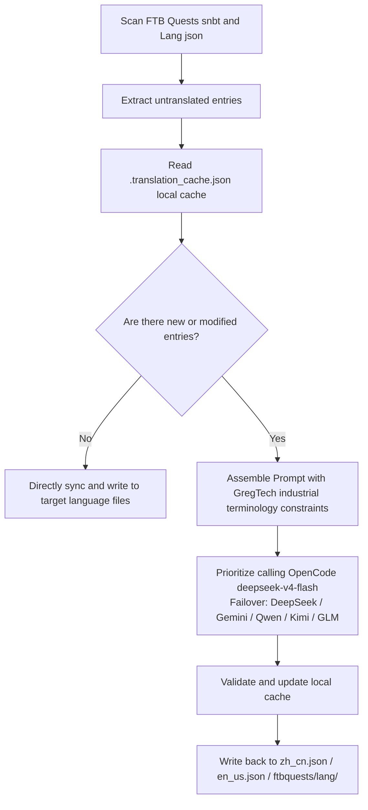

# AI Internationalization Translation Engine (`opencode_translate.py`)

The GTE project implements an industrial-grade multilingual internationalization translation system driven by a unified script, covering three major areas: Mod assets, FTB quest books, and Markdown documentation.

---

## 🔒 Five Iron Rules of Translation

The translation work of this project follows the following **5 inviolable iron rules**:

1. **Single Script**: All translations are driven solely by `scripts/opencode_translate.py`, integrated with OpenCode Zen's `deepseek-v4-flash` model. Introducing a second translation script or manually assembling API calls is prohibited.
2. **Cloud Execution**: All full-scale translations must run in GitHub Actions CI (`translate.yml` / `docs-deploy.yml` / `sync-build.yml`). Large-scale manual execution locally is strictly prohibited.
3. **Single Deployment**: The entire site is uniformly deployed to `https://takanashisatou.github.io/GregtechEasy/` (`gh-pages` branch). No second documentation site, no duplicate deployments.
4. **English Rules**:
   - Documentation system (`docs/en/`): English must be fully translated by AI from `docs/zh/`, manual overwriting is prohibited;
   - Mod project: Only `gtecore`'s `en_us.json` remains manually maintained; the script has built-in protection logic and will never machine-translate overwrite it.
5. **Deep Localization**: Navigation menus (`nav_translations`), Mermaid flowchart text, code comments, and table labels must be 100% localized to the corresponding language.

---

## 🤖 Translation Engine Architecture

Traditional community localization relies on manual maintenance of complex JSON and SNBT texts, leading to lagging updates and frequent errors.

GTE's AI translation engine, through a standardized OpenAI-compatible API, achieves **automated incremental extraction, terminology alignment, and concurrent translation** for FTB Quests quest books and core Mod language files:

---

## 🔑 Supported LLM Providers and Environment Variables

The script automatically selects the first available API Key according to the following priority, without needing to manually specify a provider:

| Priority | Provider Name | API Key Environment Variable | Base URL Environment Variable | Default Model |
| :---: | :--- | :--- | :--- | :--- |
| **1 (Preferred)** | **OpenCode Zen** | `OPENCODE_API_KEY` | `OPENCODE_BASE_URL` | **`deepseek-v4-flash`** |
| 2 | DeepSeek | `DEEPSEEK_API_KEY` | `DEEPSEEK_BASE_URL` | `deepseek-chat` |
| 3 | Google Gemini | `GEMINI_API_KEY` | `GEMINI_BASE_URL` | `gemini-3.6-flash` |
| 4 | Qwen (DashScope) | `DASHSCOPE_API_KEY` | `DASHSCOPE_BASE_URL` | `qwen-plus` |
| 5 | Moonshot AI (Moonshot) | `MOONSHOT_API_KEY` | `MOONSHOT_BASE_URL` | `moonshot-v1-8k` |
| 6 | Zhipu AI (Zhipu GLM) | `ZHIPU_API_KEY` | `ZHIPU_BASE_URL` | `glm-4-flash` |
| 7 | OpenAI | `OPENAI_API_KEY` | `OPENAI_BASE_URL` | `gpt-4o-mini` |
| 8 | Generic Aggregation Proxy | `LLM_API_KEY` | `LLM_BASE_URL` | `LLM_MODEL` (custom) |

> **Note**: Only configuring `OPENCODE_API_KEY` in GitHub Secrets is required for CI to run completely. The rest are backup Failover.

---

## 🎯 Industrial-grade Prompt Constraint Principles

When calling the API for translation, the system has built-in strict Minecraft and GregTech terminology rules:

1. **Absolute Preservation of Formatting Codes**: Fully preserve Minecraft native color formatting codes (e.g., `§a`, `§c`, `§6`) and placeholders (`%s`, `%d`, `{0}`).
2. **Unified Technical Terminology**: Strictly lock the translation of technical proper nouns (e.g., `UHV`, `EU/t`, `Amps`, `Voltage`, `Overclock`, `Subtick`, etc.).
3. **Hash Incremental Cache**: All translated entries are automatically persisted in `.translation_cache.json`. Only new or changed texts trigger network requests, greatly saving token costs and CI time.
4. **Mermaid Diagram Text Localization**: Flowchart node labels (e.g., `A[Label]`) are translated to the target language, while syntax keywords like `graph TD`, `-->`, `subgraph` remain unchanged.
5. **Code Comments and Table Labels**: Comments inside code blocks (`//` / `#`) and table column headers are fully localized.

---

## 🏗️ Protected Files (Not Machine-Translatable)

| Path | Protection Reason | Protection Mechanism |
| :--- | :--- | :--- |
| `modules/gtecore/src/main/resources/assets/gtecore/lang/en_us.json` | gtecore English translation is manually maintained by the author | The script detects the `is_gtecore` flag and skips overwriting for the `en_us` language. |

---

## 💻 CI Trigger Methods (Cloud Execution, Iron Rule 2)

| Scenario | Workflow | Trigger Method |
| :--- | :--- | :--- |
| Automatic full build + translation after code push | `sync-build.yml` | Automatically triggered on push to `main`/`master` |
| Automatic translation + deployment after documentation changes | `docs-deploy.yml` | Triggered when `docs/` or `mkdocs.yml` changes |
| Manual full-scale mod asset translation | `translate.yml` | Manually triggered on Actions page, with selectable Provider and language |
| Manual full-scale documentation translation | `translate.yml` | Check the `translate_docs` input |

> [!CAUTION]
> It is forbidden to manually run `python scripts/opencode_translate.py` locally for large-scale full translation. Local execution is only for debugging a single file or verifying API Key connectivity.