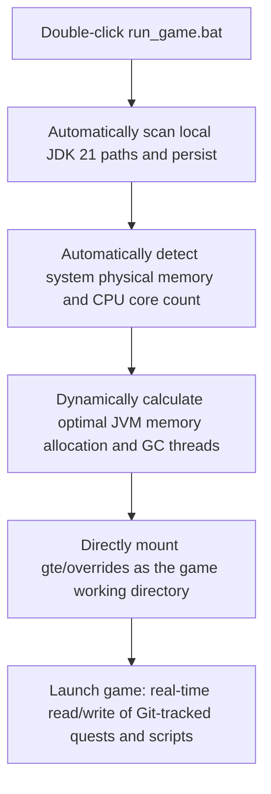
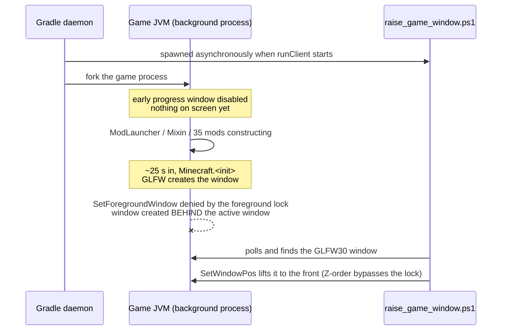

# Local Hot Debugging and Launcher-Free Quick Run

GTE has designed a seamless debugging system that is extremely friendly to modpack planners, quest writers, and mod programmers.

---

## ⚡ 1. Launcher-Free Ultra-Fast Startup Script (`run_game.bat` / `run_game.sh`)

For quest book authors (FTB Quests) and KubeJS recipe planners, **there is no need to open IntelliJ IDEA or install any third-party launcher**. Simply double-click **`run_game.bat`** in the project root directory to enter the game at lightning speed!



### Core Features
1. **Fully Automatic JDK 21 Detection**: Automatically searches for installed Java 21 in `.jdks`, `Adoptium`, `Zulu`, and `Program Files`, and automatically remembers it in `.jdk_path`.
2. **Hardware Adaptive Optimization**: Automatically allocates JVM heap size based on the optimal ratio (50%~60% of available physical memory) according to the current computer's total RAM, and automatically configures parallel GC threads.
3. **Zero-Move Workflow**: Modify quests in-game (`/ftbquests editing_mode true`) and save. Changes are saved in real-time directly to the corresponding `config/ftbquests/` directory in the Git repository. Open GitHub Desktop and commit with one click!

---

## 🔗 2. External Launcher Zero-Copy Mapping Tool (`link_to_launcher.bat`)

If you prefer using a launcher with your own configured skins and key bindings (such as PCL2 / HMCL / Prism Launcher):

1. Double-click **`link_to_launcher.bat`** in the root directory.
2. Follow the prompts to drag your launcher's game directory (e.g., `D:\PCL2\.minecraft\versions\GTE-Dev\.minecraft\`) into the console and press Enter.
3. The script will automatically create Windows directory junctions:
   - `config` ➜ `gte/overrides/config`
   - `kubejs` ➜ `gte/overrides/kubejs`
   - `ftbquests` ➜ `gte/overrides/config/ftbquests`
   - `defaultconfigs` ➜ `gte/overrides/defaultconfigs`
4. No matter how you modify quests or recipes in the launcher, **physical data is synchronized in real-time and saved in the main Git repository**!

---

## ☕ 3. Mod Code Hot-Compile Shadow Environment (`gte-dev-runtime`)

For Java/Kotlin programmers, `modules/gte-dev-runtime` is a dedicated shadow debugging module:

### Working Principle and Design Considerations
- **Positioning**: A purely local hot-compile debugging sandbox. **Packaging and publishing are prohibited; it will not appear in any player artifacts**.
- **ModDevGradle Dynamic Remapping**: Automatically hot-compiles the latest source code of `gtm-reborn` and `gtecore` and mounts them into the Mojang deobfuscated namespace.

### The Correct Way to Launch

These three entry points are equivalent, and all of them raise the game window automatically:

```powershell
$env:JAVA_HOME='C:\Users\Ex_Je\.jdks\ms-21.0.11'
.\gradlew.bat runFullPack                          # preferred, root aggregate entry point
.\gradlew.bat :modules:gte-dev-runtime:runClient    # equivalent
.\run_game.bat                                     # same task, auto-detects JDK/RAM/cores
```

### Why No Window Appears For The First 25 Seconds (This Is Normal)



Forge's early progress window is **deliberately disabled** to avoid the Embeddium/Oculus GLFW context deadlock on discrete GPUs (see the [anti-crash guide](anti-crash-guide.md)). The cost is that the window is only created inside `Minecraft.<init>`, by which time the game JVM is a background process forked by the Gradle daemon. The Windows foreground lock denies its focus request, so the window is created and rendered correctly but sits underneath the active window — which looks exactly like "the window never popped up".

`runClient` therefore spawns `scripts/dev/raise_game_window.ps1` asynchronously. It polls for the `GLFW30` window belonging to this run's own JVM and lifts it with `SetWindowPos` (Z-order changes are not subject to the foreground lock, so the raise always succeeds). Its log is at `modules/gte-dev-runtime/build/raise-game-window.log`. A full cold start takes about 70 seconds.

### Environment Knobs

| Environment variable | Effect |
| --- | --- |
| `GTE_WINDOW_WIDTH` / `GTE_WINDOW_HEIGHT` | Window size (default 1600x900) |
| `GTE_NO_WINDOW_RAISE=1` | Skip the raise, leave the window where GLFW put it |
| `GTE_RUNTIME_XMX` | Client heap limit (default `8G`; `run_game.bat` derives it from physical RAM) |

### ⚠️ Do Not Launch Through `.vscode/launch.json`

The configurations in `.vscode/launch.json` are auto-generated by ModDevGradle during IDE sync (group names look like `Mod Development - gte-dev-runtime`). They invoke `net.neoforged.devlaunch.Main` directly, **bypassing the `runClient` task**, so the window is never raised — and the file is rewritten on every IDE sync, so manual edits do not survive. Put durable run arguments in the `runs {}` block of `build.gradle`; both paths read the same `build/moddev/*RunProgramArgs.txt` argfiles.

When you need breakpoints, use IntelliJ's **`Run Client (Hot Debug)`** configuration. It attaches a JDWP debugger and may leave `hs_err_pid*.log` files in `run/client/` on exit (crashing inside `jdwp.dll` at `Shutdown.halt0`); that is a known, harmless artifact unrelated to startup.


<<<<<FILE_END: development/runtime-and-launchers.md>>>>