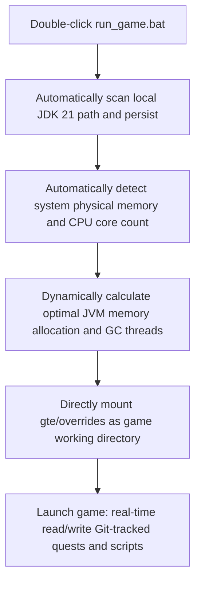

# Local Hot Reload and Launcher-Free Quick Launch

GTE has designed a seamless hot-reload system that is extremely friendly to modpack planners, quest writers, and mod programmers.

---

## ⚡ 1. Launcher-Free Quick Launch Script (`run_game.bat` / `run_game.sh`)

For quest authors (FTB Quests) and KubeJS recipe planners, **no need to open IntelliJ IDEA or install any third-party launcher**; simply double-click **`run_game.bat`** in the project root to enter the game instantly!



### Core Features
1. **Fully Automatic JDK 21 Detection**: Automatically searches for Java 21 installed under `.jdks`, `Adoptium`, `Zulu`, and `Program Files`, and remembers it in `.jdk_path`.
2. **Hardware-Adaptive Optimization**: Automatically allocates JVM heap size based on the total RAM of the current computer at an optimal ratio (50%~60% of available physical memory), and automatically configures parallel GC threads.
3. **Zero-Move Workflow**: Modify quests in-game (`/ftbquests editing_mode true`) and save; changes are saved in real time to the corresponding `config/ftbquests/` in the Git repository. Open GitHub Desktop to commit with one click!

---

## 🔗 2. External Launcher Zero-Copy Mapping Tool (`link_to_launcher.bat`)

If you prefer using a launcher with your own skin and keybind settings (such as PCL2 / HMCL / Prism Launcher):

1. Double-click **`link_to_launcher.bat`** in the root directory.
2. Follow the prompts to drag your launcher's game directory (e.g., `D:\PCL2\.minecraft\versions\GTE-Dev\.minecraft\`) into the console and press Enter.
3. The script will automatically create Windows directory junctions:
   - `config` ➜ `gte/overrides/config`
   - `kubejs` ➜ `gte/overrides/kubejs`
   - `ftbquests` ➜ `gte/overrides/config/ftbquests`
   - `defaultconfigs` ➜ `gte/overrides/defaultconfigs`
4. No matter how you modify quests or recipes in the launcher, **the physical data is synchronized and saved in real time to the main Git repository**!

---

## ☕ 3. Mod Code Hot-Compile Shadow Environment (`gte-dev-runtime`)

For Java/Kotlin programmers, `modules/gte-dev-runtime` is a dedicated shadow debugging module:

### Working Principle and Design Considerations
- **Positioning**: A purely local hot-compile debugging sandbox; **forbidden from packaging and release, and will not appear in any player builds**.
- **ModDevGradle Dynamic Remapping**: Automatically hot-compiles the latest source code of `gtm-reborn` and `gtecore` and mounts them into the Mojang obfuscation namespace.
- **Launch Methods**:
  - In IDEA, select the run configuration **`Run GTE Full Pack (Client - Hot Debug)`**.
  - Or execute via command line:
    ```powershell
    .\gradlew.bat :modules:gte-dev-runtime:runClient
    ```