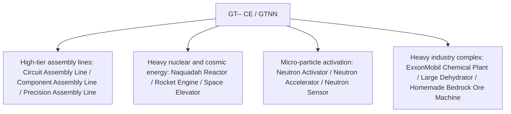

# GT-- Community Edition (GTNN)

`modules/gt--` (package name `dev.arbor.gtnn`) is the official community edition mod of GT-- Community Edition, built on a **Kotlin + Java** hybrid architecture (development branch: `kotlin`).

---

## 🏗️ Architecture and Tech Stack

- **Development Language**: Kotlin 2.0.21 + Java 21.
- **Positioning**: Introduces the beloved massive assembly lines, heavy nuclear reactors, dehydrator systems, and space exploration industry from classic GT 5.09 and modern expansions.



---

## 🏭 Core Multiblock Machines and Facilities

### 1. Assembly Line Array
- **Circuit Assembly Line (`circuit_assembly_line`)**: Specifically designed for efficient mass production of mid-to-high-tier chips and composite circuits, supporting multi-level precision casings.
- **Component Assembly Line (`component_assembly_line`)**: Uses corresponding tier casings based on voltage level (LV to MAX) to batch-assemble core motors and sensors.
- **Precision Assembly Line (`precision_assembly_line`)**: Produces the highest-precision nanolithography masks and supercomputing buses.

### 2. Particle Acceleration and Neutron Activation System
- **Neutron Activator (`neutron_activator`)** and **Neutron Accelerator (`neutron_accelerator`)**:
  - Simulates high-energy colliders and fast neutron capture reactions, activating ordinary stable isotopes into radioactive heavy nuclear materials or superheavy superconducting elements.
- **Neutron Sensor (`neutron_sensor`)**: Real-time detection of neutron kinetic energy flux inside the reaction chamber, providing redstone or computer signal feedback.

### 3. Heavy Nuclear Energy and Aerospace Industry
- **Large Naquadah Reactor (`large_naquadah_reactor`)**: Powered by naquadah alloy and enriched fuel, providing stable, high-density EU energy output.
- **Rocket Engine (`rocket_engine`)**: Consumes advanced rocket fuel to provide pulse power for high-load equipment.
- **Space Elevator (`space_elevator`)**: Connects to low Earth orbit, enabling space-based mineral collection and microgravity industrial manufacturing.

### 4. Chemical and Mining Complex Facilities
- **ExxonMobil Chemical Plant (`exxonmobil_chemical_plant`)**: An ultra-large petroleum deep-processing complex that completes cracking, reforming, aromatization, and polymerization in a single machine.
- **Large Dehydrator (`large_dehydrator`)**: Efficiently removes crystalline and free water from fluids or chemical minerals.
- **Homemade Bedrock Ore Machine (`homemade_bedrock_ore_machine`)**: Deploys artificial drill bits in the bedrock layer to continuously extract deep infinite ore veins.

---

## 🌿 Submodule Git Workflow Specification

`modules/gt--` corresponds to the independent Git repository `takanashisatou/GT---Community-Edition`, with the development branch `kotlin`:

```bash
# Develop and commit independently in the submodule
cd modules/gt--
git checkout kotlin
git add .
git commit -m "feat: add precision assembly line recipes"
git push origin kotlin

# Return to the main project and update the submodule pointer
cd ../..
git add modules/gt--
git commit -m "chore: bump gt-- submodule pointer"
```