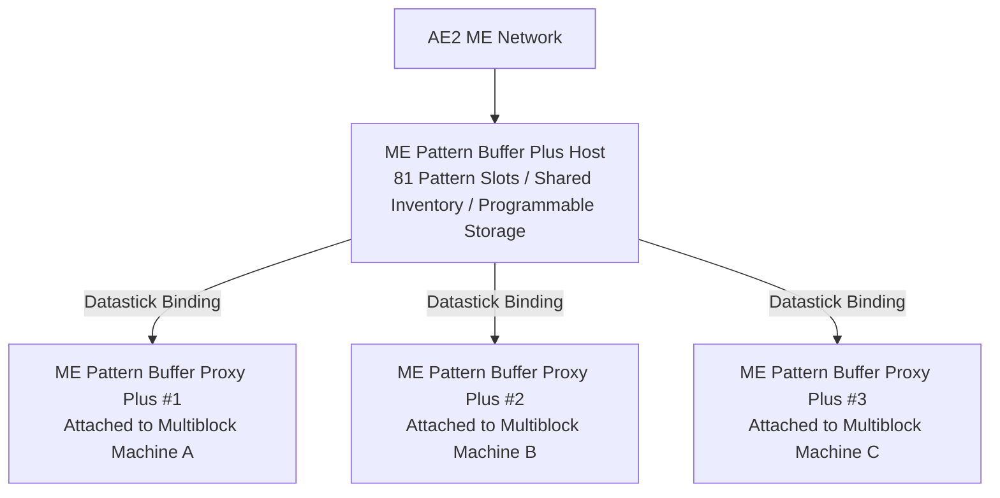

# AE2 Deep Integration & Pattern Buffer Plus System

GTECore establishes an extremely powerful direct data interconnection bridge between Applied Energistics 2 (AE2) and GregTech multiblock structures.

---

## 🧩 ME Pattern Buffer Plus (`me_pattern_buffer_plus`)

In traditional tech mods, connecting an AE2 Pattern Provider to a multiblock machine often faces pain points such as **insufficient slots, inability to mix fluid and item outputs, and difficulty sharing patterns across multiple machines**.

The **ME Pattern Buffer Plus** developed by GTECore completely solves this problem:

### Core Features
1. **Massive Pattern Capacity**: A single Buffer Host features **81 pattern slots** (equivalent to the combined capacity of 9 standard AE2 Pattern Providers).
2. **Omnidirectional Hatch Capabilities**: Simultaneously possesses `IMPORT_ITEMS`, `IMPORT_FLUIDS`, `EXPORT_ITEMS`, and `EXPORT_FLUIDS` capabilities, supporting mixed fluid and item interactions within the same hatch.
3. **Programmable Storage Support**: Integrates the Programmable Storage mechanism internally, supporting precise ingredient insertion and buffering for complex recipes.

---

## 🪞 ME Pattern Buffer Proxy Plus (`me_pattern_buffer_proxy_plus`)

**Pattern Buffer Proxy Plus** is a revolutionary distributed automation structural component:

### Working Principle & Cross-Machine Sharing
- Install the Proxy Buffer onto the hatch position of any multiblock machine.
- Hold a **Datastick** and right-click the main **ME Pattern Buffer Plus** to read its coordinates, then right-click the **Pattern Buffer Proxy Plus** to bind them.
- **All bound proxies will share all 81 patterns placed within the main Buffer in real-time!**
- When the AE2 network initiates an automated crafting task, the network automatically load-balances and distributes the tasks to all idle proxy machines for parallel processing!

### Jade Hover Status Display
When looking at the Buffer or Proxy, Jade will automatically display:
- Main Buffer: `Connected Proxies: X`
- Proxy Component: `Bound to - X: ..., Y: ..., Z: ...`

---

## 💨 ME Steam Hatch (`me_steam_hatch`)

- **Function**: Directly connects the AE2 fluid network to steam multiblock structures.
- **Purpose**: Steam multiblock structures no longer require complex high-speed steam piping and tanks externally; they can instantly draw steam from the ME network at maximum throughput for power generation, eliminating piping transmission bottlenecks.