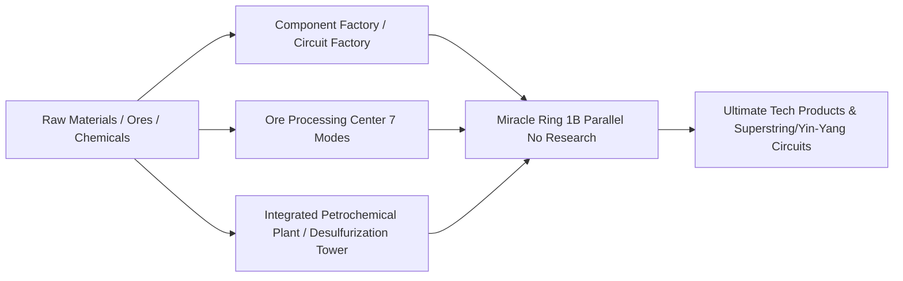

# GTECore Multiblock Machine Encyclopedia

GTECore addresses the cumbersome pipeline stacking in the mid-to-late tech progression by designing a large number of multiblock machines that combine **ultra-high parallel processing** and **aggregated production logic**.

---

## 🏭 Large Steam Age Multiblocks

To solve the issues of low single-machine output and excessive space usage in the Steam Age, GTECore introduces a series of large steam multiblocks, all supporting cross-recipe parallelism and high-capacity steam throughput:

| Machine Name (Block ID) | Core Function & Recipe Type | Features & Advantages |
| :--- | :--- | :--- |
| **Large Steam Alloy Furnace** (`gtceu:big_alloy`) | Alloy Smelting (`alloy_smelter`) | Early high-multiplier alloy production, supports high-pressure steam |
| **Large Steam Compressor** (`gtceu:big_compressor`) | Compressing (`compressor`) | Batch pressing dense metal plates and blocks |
| **Large Steam Forge Hammer** (`gtceu:big_forge_hammer`) | Forge Hammering Dust/Plates (`forge_hammer`) | Automated rapid crushing of plates and raw ores |
| **Large Steam Extractor** (`gtceu:big_steam_extractor`) | Rubber/Fluid Extraction (`extractor`) | Large-scale extraction of gum and industrial fluids |
| **Simple Steam Macerator** (`gtceu:steam_grinder_easy`) | Ore Grinding (`macerator`) | Early multi-processing of ores |
| **Simple Steam Oven** (`gtceu:steam_oven_easy`) | Pyrolysis Smelting (`pyrochlore_oven`) | Industrial large-scale production of coke and charcoal |
| **Steam Ore Processing Plant** (`gtecore:steam_op`) | Comprehensive ore crushing and refining | **1 billion (1B) parallelism**, all recipes complete in **1 tick**! Supports any input/output hatches |

---

## ⚡ Super Electric Industrial Multiblocks

Entering the electric age, GTECore provides all-in-one and advanced processing centers:

### 1. Core Production Factories

- **§6Component Factory (`gtceu:component_factory`)**:
  - **Purpose**: Produce motors, pumps, pistons, robot arms, conveyors, LEDs, and other common basic components in one step.
  - **Features**: Skip tedious intermediate sub-processes and rapidly produce standard industrial components of the specified voltage tier.
- **§6Circuit Factory (`gtceu:circuit_factory`)**:
  - **Purpose**: Integrates circuit substrate, chip etching, and integrated packaging into one.
  - **Features**: Supports cross-recipe parallel hatches, fully accelerating circuit board production across the entire voltage gradient from ULV to MAX.
- **§6Miracle Ring (`gtceu:miracle_ring`)**:
  - **Purpose**: The ultimate assembly facility for industrial miracles.
  - **Features**: Features **1 billion (1B) parallelism** and **1t Subtick overclocking**, and can directly run assembly line recipes **without any research/assembly line research**!
- **Chemistry Terminator (`gtecore:chemistry_terminator`)**:
  - **Purpose**: "Subverts the existence of chemistry and physics, representing the end of chemistry."
  - **Features**: Aggregates complex multi-step long-chain chemical reactions into one click, rapidly synthesizing various ultimate polymers and acid media.
- **Ten-in-One Universal Processing Factory (`gtecore:ten_in_one`)**:
  - **Purpose**: A universal integrated box that combines 10 basic processes including centrifugation, electrolysis, chemical leaching, polymerization, and high-pressure reaction.

### 2. Ore and Fluid Refining System

- **§6Ore Processing Center (`gtecore:ore_process_center`)**:
  - Supports **7 programming circuit modes**, achieving 5-8x ore refining with different product orientations (fully integrated crushing, washing, thermal separation, centrifugation, and electromagnetic beneficiation), and supports 1t Subtick overclocking.
- **Integrated Petrochemical Plant (`gtecore:integrated_petrochemical_plant`)**:
  - Integrates the entire chain of crude oil fractionation, catalytic cracking, reforming, and desulfurization, producing all hydrocarbon light gases and aromatic hydrocarbons in a single machine.
- **Desulfurization Machine (`gtceu:desulfurization`)**:
  - Rapidly purifies various heavy sulfur-containing fuels and recovers high-purity sulfur powder as a byproduct.
- **Simple/Advanced Fluid Drilling Rig (`gtecore:easy_fluid_drilling_rig` / `not_hard_fluid_drilling_rig`)**:
  - Automatically extracts bedrock fluid veins, never depleting, without the need for complex pipeline exploration.

### 3. High-End and Superconducting Cable Processing

- **§6Wire Factory (`gtecore:wiremill_factory`)**: One-click production of all metal single, double, quadruple, octuple, and sixteen-fold wires and superconducting cables.
- **§6Crystal Center (`gtecore:crystal_center`)**: Large-scale automated cultivation of monocrystalline silicon columns, emeralds, sapphires, and charged sextuple crystals.
- **§6Quantum Cable Assembler (`gtecore:quantum_cable_assembler`)**: Specialized in high-speed manufacturing of quantum optical fibers and hyperdimensional energy transmission cables.
- **§3Starblade Etching Machine (`gtecore:starblade_etching_machine`)**: Uses high-energy beams in the extreme ultraviolet/X-ray band to etch galaxy-scale micro-nano chips.

---

## 🔋 Energy and Generator Systems

| Machine Name | Energy Output/Tier | Core Mechanism & Features |
| :--- | :--- | :--- |
| **§6General Fuel Engine** (`gtceu:general_fuel_engine`) | Dynamic adaptive (up to MAX) | **Supports all fuel types in the world** (diesel, biomass, natural gas, rocket fuel, etc.), with **2 billion (2B) parallelism**, releasing immense energy in an instant! |
| **Large General Generator** (`gtecore:large_general_generator`) | Multi-tier voltage selectable | Compatible with conventional gas, steam, and plasma generator rotors |
| **Super Fusion Reactor** (`gtecore:super_fusion_reactor`) | Fusion plasma output | Completely eliminates the long heating wait of ordinary fusion, **perfectly supports 1T Subtick overclocking**, instantly outputs high-temperature fusion products |
| **Max Super Battery Buffer** (`gtecore:max_super_battery_buffer_1x`) | **MAX (2,147,483,647 V)** | Holds massive EU storage, supports zero-loss cross-dimensional wireless charging interface |