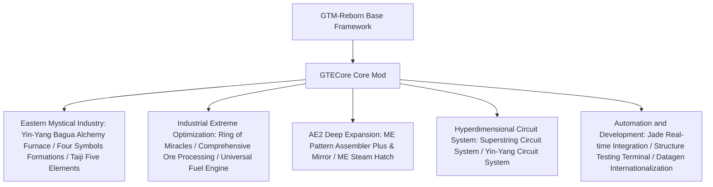

# GTECore Core Mod Overview

**GTECore** is the custom Java core mod for the GregTech Easy project. It directly depends on the `gtm-reborn` source code, expanding large-scale multiblock industrial structures, high-tier formation technology, deep AE2 interactions, and a super circuit manufacturing system.

---

## 🏛️ Mod Architecture and Design Positioning

---

## 📦 Creative Mode Tabs and Categories

GTECore registers its own creative mode tabs in-game:

1. **GregTech Easy Machines (`itemGroup.gtecore.gtecore_machines`)**:
   - Contains all GTE original multiblock controllers (Yin-Yang Bagua Blast Furnace, Ring of Miracles, Ore Processing Center, Chemical Terminator, etc.).
   - Contains multi-tier super battery buffers (Max Super Battery Buffer), ME Steam Hatches, ME Pattern Assembler Plus and Mirror.
2. **GregTech Easy Items (`itemGroup.gtecore.gtecore_items`)**:
   - Contains Superstring and Yin-Yang circuit series items (processors, clusters, supercomputers, mainframes).
   - Contains Five Elements Talismans, Bagua Chips, Three Pure Particles, Structure Testing Terminal, and other specialized tools.

---

## ⚙️ Mod Global Configuration (`GTEConfig`)

GTECore provides extensive in-game and file configuration options (located in `config/gtecore-common.toml` or via the in-game configuration menu):

| Configuration Option | Default Value | Detailed Description |
| :--- | :--- | :--- |
| `superPeace` (Super Peace Mode) | `false` | When enabled, completely disables hostile mob spawning, providing an absolutely clean environment for tech building |
| `durationMultiplier` (Recipe Time Multiplier) | `1.0` | Globally adjusts the duration multiplier for GTECore custom recipes |

---

## 🔍 Jade / TOP Native Integration

GTECore includes built-in support for the **`GTEJadePlugin`** plugin:
- **ME Pattern Assembler Plus Status**: Displays in real-time the number of patterns bound to the current assembler, as well as fluid and item output modes.
- **ME Pattern Assembler Mirror Plus Binding Info**: Hovering directly shows the bound main assembler coordinates `(X, Y, Z)` and network connectivity status.
- **Formation Activation Indicator**: On the Yin-Yang Bagua Alchemy Furnace, displays the readiness status of the Azure Dragon, White Tiger, Vermilion Bird, and Black Tortoise Four Symbols formations in real-time.

---

## 🛠️ Structure Testing Terminal

GTECore provides a dedicated handheld tool — the **Structure Testing Terminal** (`item.gtecore.check_structure_terminal`):
- **Right-click a multiblock controller**: Scans structure integrity in real-time.
- **Error diagnostic hints**: If the structure is not formed, the terminal will precisely indicate **the wrong block coordinates and positions that should not be placed** in both the chat and hover tooltip, greatly accelerating the construction and troubleshooting of large multiblocks.