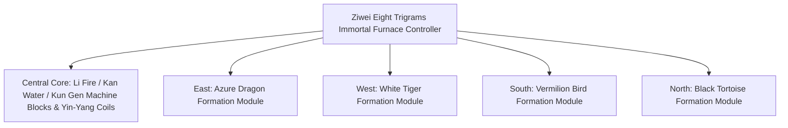

# Yin-Yang Eight Trigrams Immortal Furnace and Four Symbols Formation System

GTECore has pioneered a **"Tai Chi Eight Trigrams and Four Symbols Formation System"** that combines Eastern Taoist philosophy with modern heavy industrial engineering. This system forms the core hub for mid-to-late game metallurgy, superconducting material synthesis, and immortal-tech ascension.

---

## 🌌 Yin-Yang Eight Trigrams Immortal Furnace (`yin_yang_eight_trigmas_blast_furnace`)

**Ziwei Eight Trigrams Immortal Furnace** is one of the most massive and intricately engineered multiblock structures in the tech modding community (occupying over 55×55 blocks):



### 🧭 Feng Shui Orientation Rule (Key Mechanism)
> [!IMPORTANT]
> **Feng Shui Orientation Law**: Due to feng shui and magnetic field constraints, **the main controller of the Immortal Furnace must be placed facing south** to connect with the yin-yang qi of heaven and earth and form and operate normally!

### Furnace Basic Capabilities
- **Supported Recipe Library**: Natively compatible with standard blast furnace recipes (`blast_recipes`), smelting furnace recipes (`furnace_recipes`), alloy smelter recipes (`alloy_smelter_recipes`), GCYM giant alloy blast furnace recipes (`alloy_blast_recipes`), and the exclusive **Yin-Yang Eight Trigrams recipes (`yin_yang_eight_trigmas_blast`)**.
- **Overclocking Features**: Fully supports **1T Subtick instantaneous overclocking** and **Batch Mode**.

---

## 🐉 Four Symbols Formation Submodules and Dynamic Condition Detection

Around the Immortal Furnace, four formation wings can be extended: **East Azure Dragon, West White Tiger, South Vermilion Bird, and North Black Tortoise**.

| Formation Module | Formation Direction | Formation Block | Recipe Condition (`RecipeCondition`) | Gain and Effect When Activated |
| :--- | :--- | :--- | :--- | :--- |
| **Azure Dragon Formation** (`Qing Long`) | **East** | `qinglong_module` | `QING_LONG_CONDITION` | Activates the wood-generating-fire momentum, greatly reducing energy consumption for ultra-high-temperature smelting, and unlocks ever-generating high-tier catalytic recipes. |
| **White Tiger Formation** (`Bai Hu`) | **West** | `baihu_module` | `BAI_HU_CONDITION` | Metal's killing aura dominates; unlocks recipes for high-hardness divine metals, ultra-dense heavy nucleus element fission, and quantum metal transmutation. |
| **Vermilion Bird Formation** (`Zhu Que`) | **South** | `zhuque_module` | `ZHU_QUE_CONDITION` | Southern Bright Li Fire; provides unlimited extreme furnace temperature, unlocking stellar-level plasma smelting and divine pill refining recipes. |
| **Black Tortoise Formation** (`Xuan Wu`) | **North** | `xuanwu_module` | `XUAN_WU_CONDITION` | Kan Water guards; rapidly cools ultra-high-temperature products, unlocking instantaneous solidification and antimatter stabilization recipes. |

### Dynamic Detection and Status Feedback
- The controller automatically calls `checkModule()` each time it scans the structure and matches recipes to calculate whether the formation blocks at the four directional offset coordinates are ready.
- Using **Jade** to hover over the controller, you can visually see the activation status of the four formations (green indicates active, red indicates not ready).

---

## 🔮 Derived Tao Cores and Star Matrix

Building upon the Eight Trigrams Immortal Furnace, GTECore further extends a series of star-heaven Taoist multiblocks:

```
GTE High-Tier Array Industrial Group
├── Tai Chi Five Elements Separation Array
├── Kun Gen Star Hub
├── Qian Qiong Engine
├── Red Sun Tao Core
└── Ashing Star Fusion Array
```

1. **Tai Chi Five Elements Separation Array (`taichi_five_elements_separation_array`)**:
   - Strips and resolves any mineral and chemical substance from reality and fantasy into the pure **Metal, Wood, Water, Fire, and Earth** five-element primordial elements.
2. **Kun Gen Star Hub (`kun_gen_star_hub`)**:
   - Connects the earth and stellar gravitational waves to concentrate microscopic gravitons and construct miniature black holes.
3. **Qian Qiong Engine (`qian_qiong_engine`)**:
   - A void energy extraction engine that draws boundless void energy from quantum fluctuations of nothingness.
4. **Red Sun Tao Core (`red_sun_tao_core`)**:
   - An artificial ultra-micro stellar core that simulates extreme physical conditions of a star's corona at trillions of degrees.
5. **Ashing Star Fusion Array (`ashing_star_fusion_array`)**:
   - A supernova remnant annihilation fusion matrix used to reconstruct the equilibrium state of dark matter and antimatter.