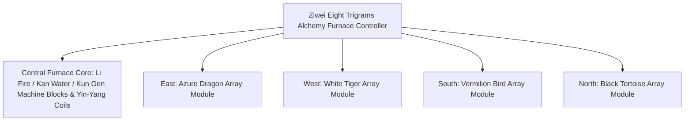

# Yin-Yang Eight Trigrams Alchemy Furnace and Four Symbols Array System

GTECore has pioneered a **"Tai Chi Eight Trigrams and Four Symbols Array System"** that combines Eastern Taoist philosophy with modern heavy industry engineering. This system forms the core hub for mid-to-late game metallurgy, superconducting material synthesis, and immortal Taoist technology leaps.

---

## 🌌 Yin-Yang Eight Trigrams Alchemy Furnace (`yin_yang_eight_trigmas_blast_furnace`)

**Ziwei Eight Trigrams Alchemy Furnace** is one of the largest and most intricate multiblock structures in the tech modding community (occupying over 55×55 blocks):



### 🧭 Feng Shui Orientation Rule (Key Mechanism)
> [!IMPORTANT]
> **Feng Shui Orientation Law**: Due to feng shui and magnetic field constraints, **the main controller of the alchemy furnace must be placed facing south** in order to connect with the heaven and earth yin-yang qi and function properly!

### Furnace Basic Capabilities
- **Supported Recipe Library**: Natively compatible with standard blast furnace recipes (`blast_recipes`), smelting furnace recipes (`furnace_recipes`), alloy smelter recipes (`alloy_smelter_recipes`), GCYM giant alloy blast furnace recipes (`alloy_blast_recipes`), and the exclusive **Yin-Yang Eight Trigrams recipes (`yin_yang_eight_trigmas_blast`)**.
- **Overclocking Features**: Perfectly supports **1T Subtick instant overclocking** and **Batch Mode**.

---

## 🐉 Four Symbols Array Submodules and Dynamic Condition Detection

Around the alchemy furnace, four array wings can be extended: **East Azure Dragon, West White Tiger, South Vermilion Bird, North Black Tortoise**.

| Array Module | Array Direction | Array Block | Recipe Condition (`RecipeCondition`) | Effects and Benefits When Activated |
| :--- | :--- | :--- | :--- | :--- |
| **Azure Dragon Array** (`Qing Long`) | **East** | `qinglong_module` | `QING_LONG_CONDITION` | Activates the Wood generating Fire trend, greatly reducing energy consumption for ultra-high temperature smelting, and unlocks endless high-level catalytic recipes. |
| **White Tiger Array** (`Bai Hu`) | **West** | `baihu_module` | `BAI_HU_CONDITION` | Metal evil dominates, unlocking recipes for high-hardness divine metals, ultra-dense heavy nucleus fission, and quantum metal transmutation. |
| **Vermilion Bird Array** (`Zhu Que`) | **South** | `zhuque_module` | `ZHU_QUE_CONDITION` | Southern Bright Li Fire, provides unlimited extreme furnace temperature, unlocking stellar plasma smelting and divine pill refining recipes. |
| **Black Tortoise Array** (`Xuan Wu`) | **North** | `xuanwu_module` | `XUAN_WU_CONDITION` | Kan Water guards, rapidly cools ultra-high temperature products, unlocking instant solidification and antimatter stabilization recipes. |

### Dynamic Detection and Status Feedback
- The controller automatically calls `checkModule()` to calculate whether the array blocks at the four directional offset coordinates are ready each time it scans the structure and matches recipes.
- Using **Jade** to hover over the controller, you can visually see the activation status of the four arrays (green indicates active, red indicates not ready).

---

## 🔮 Derived Tao Cores and Star Matrix

```
GTE High-Tier Array Industrial Group
├── Tai Chi Five Elements Separation Array
├── Kun Gen Star Hub
├── Qian Qiong Engine
├── Red Sun Tao Core
└── Ashing Star Fusion Array
```

1. **Tai Chi Five Elements Separation Array (`taichi_five_elements_separation_array`)**:
   - Strips and analyzes any mineral and chemical substance from reality and fantasy into pure **Metal, Wood, Water, Fire, Earth** five elements origin elements.
2. **Kun Gen Star Hub (`kun_gen_star_hub`)**:
   - Connects the earth and stellar gravitational waves, used to gather microscopic gravitons and construct miniature black holes.
3. **Qian Qiong Engine (`qian_qiong_engine`)**:
   - Void energy extraction engine, extracts vast void energy from quantum fluctuations of nothingness.
4. **Red Sun Tao Core (`red_sun_tao_core`)**:
   - Artificial ultra-miniature stellar core, simulating trillion-degree extreme physical conditions of the solar corona.
5. **Ashing Star Fusion Array (`ashing_star_fusion_array`)**:
   - Supernova remnant annihilation fusion matrix, used to reconstruct the equilibrium state of dark matter and antimatter.