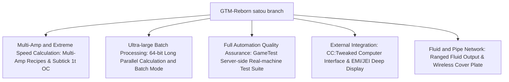

# GregTech Modern Reborn (GTM Reborn)

`modules/gtm-reborn` is a deeply customized independent branch of GregTech Modern for GTE-Multi (branch name `satou`).

---

## 🚀 Core Enhancements of the `satou` Branch

Compared to the upstream original, GTM-Reborn has achieved multiple revolutionary technological advancements and industrial experience upgrades on modern high-version Minecraft 1.20.1:



### 1. 64-bit Long Integer Parallelism and Batch Mode
- **Breaking the 32-bit integer limit**: Parallel computation fully adopts the `long` data type, completely solving the problem of numerical overflow or calculation truncation in ultra-large industrial clusters under extremely high parallelism.
- **Smart Batch Mode**: When raw materials are extremely abundant, the machine can pack hundreds or thousands of tiny recipes into a single cycle, greatly reducing server tick load.

### 2. 1T Subtick Instant Overclocking (OC_PERFECT_SUBTICK)
- Optimized the machine's Recipe Logic execution pipeline, allowing designated advanced machines to complete multiple recipe iterations within 1 tick, unleashing the pure industrial production limit.

### 3. Multi-Amp Input and Recipe Support (Multi-Amp)
- Machine recipes support consuming/outputting multiple amperes (Amperes) of current per recipe, and support EMI/JEI interfaces to intuitively render multi-amp values and wire specification hints.

### 4. Ranged Fluid Outputs
- Allows advanced distillation towers and chemical reactors to output fluid products with a range of fluctuations based on different temperature and pressure conditions.

### 5. CC:Tweaked (ComputerCraft) Modern Peripheral Integration
- All standard machines expose peripheral interfaces to ComputerCraft:
  - Query recipe progress, remaining time, and current EU/t consumption in real time.
  - Dynamically start, pause, or switch working modes of machines via Lua scripts.

---

## 🧪 Automated Testing and GameTest Verification

GTM-Reborn includes a complete Minecraft native GameTest automated test suite (located in `src/test`):

```powershell
# Run GameTest automated server-side tests
$env:JAVA_HOME='C:\Users\Ex_Je\.jdks\ms-21.0.11'
.\gradlew.bat :modules:gtm-reborn:runGameTestServer
```

### Test Coverage Scope
- **Cover System**: Tests the throughput and leak-proof logic of fluid pump covers, item transport covers, and energy conduit covers.
- **Machine Recipe Logic**: Tests multi-amp, batch processing, cross-recipe parallelism, and overclocking calculations.
- **Multiblock Formation and Rotation**: Tests structural validation of various casings and hatches under different orientations.

---

## 🌿 Submodule Git Workflow Specification

`modules/gtm-reborn` corresponds to the independent Git repository `takanashisatou/GregTech-Modern-Reborn`, with the default development branch `satou`:

```bash
# Develop and commit independently in the submodule
cd modules/gtm-reborn
git checkout satou
git add .
git commit -m "feat: optimize multiblock recipe logic"
git push origin satou

# Return to the main project to update the submodule pointer
cd ../..
git add modules/gtm-reborn
git commit -m "chore: bump gtm-reborn submodule pointer"
```