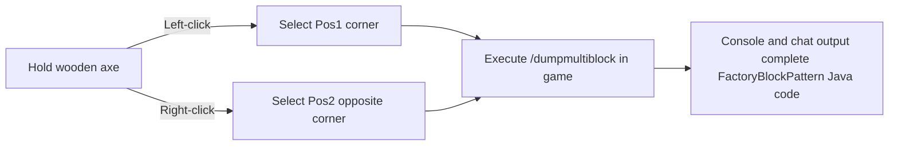

# KubeJS Toolset and Multiblock Exporter (`/dumpmultiblock`)

GTE includes developer-exclusive automated multiblock construction and structure extraction tools in KubeJS server scripts, completely liberating the multiblock structure design process.

---

## 🪓 Multiblock Visual Exporter (`/dumpmultiblock`)

When developing custom multiblocks (whether in Java code or KubeJS scripts), manually writing `FactoryBlockPattern.aisle(...)` composed of dozens of layers of characters is extremely time-consuming and error-prone.

GTE includes the **`/dumpmultiblock` wooden axe selection exporter** (`server_scripts/easymultiblock.js`):



### Usage Steps

1. Enter creative mode in game, holding a **wooden axe (`minecraft:wooden_axe`)**.
2. Build the complete multiblock physical structure in the world according to your design (including casings, hatches, coils, and the main controller).
3. Use the wooden axe to **left-click** a bottom corner block of the structure (chat message: `Pos1 set: x, y, z`).
4. Use the wooden axe to **right-click** the opposite top corner block of the structure (chat message: `Pos2 set: x, y, z`).
5. Enter the command in the chat box:
   ```mcfunction
   /dumpmultiblock
   ```
6. The script automatically scans all block types within the 3D bounding box, assigns character mappings (`.` for air, `A-Z/a-z/0-9` for specific blocks), and directly generates the structure code in the server log and client chat:

```java
// Automatically exported FactoryBlockPattern template
.pattern(definition -> FactoryBlockPattern.start()
    .aisle("BBB", "BBB", "BBB")
    .aisle("BBB", "BAB", "BBB")
    .aisle("BBB", "B#B", "BBB")
    .where('A', Predicates.blocks("minecraft:air"))
    .where('#', Predicates.controller(Predicates.blocks(definition.getBlock())))
    .where('B', Predicates.blocks("gtceu:steam_machine_casing").or(Predicates.autoAbilities(definition.getRecipeTypes())))
    .build()
)
```

---

## 🌌 Dimensional Gas and Fluid Vein Configuration

GTE extends fluid and gas collection across all dimensions via KubeJS:

### 1. All-Dimension Gas Extraction (`dimension_gas.js`)
Using the large gas collector (`gas_collector`) with different circuit numbers, you can extract the dimension-specific atmosphere in any dimension:
- **Overworld Air**: `circuit(4)` ➜ Output `gtceu:air 10000`
- **Nether Hellish Air**: `circuit(5)` ➜ Output `gtceu:nether_air 10000`
- **End Void Air**: `circuit(6)` ➜ Output `gtceu:ender_air 10000`

### 2. Universal Circuit Converter (`universal_circuit.js`)
To solve the complex recipe stacking across mods and various circuit tiers, GTE introduces the **universal circuit (`universal_circuit`)** system:
- Allows converting any circuit of the same voltage tier (ULV to MAX) into a unified universal circuit item losslessly at **1 EU / 1 tick** in the packer (`packer`).