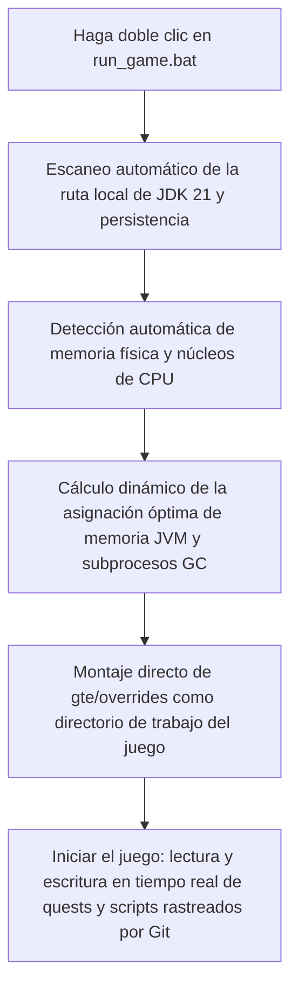

# Depuración local en caliente y ejecución rápida sin lanzador

GTE ha diseñado un sistema de depuración sin fricciones extremadamente amigable para planificadores de modpacks, escritores de misiones y programadores de mods.

---

## ⚡ 1. Script de inicio ultrarrápido sin lanzador (`run_game.bat` / `run_game.sh`)

Para autores de libros de misiones (FTB Quests) y planificadores de recetas de KubeJS, **no es necesario abrir IntelliJ IDEA ni instalar ningún lanzador de terceros**, simplemente haga doble clic en **`run_game.bat`** en la raíz del proyecto para entrar al juego a gran velocidad.



### Características principales

1. **Detección automática de JDK 21**: busca automáticamente Java 21 instalado en `.jdks`, `Adoptium`, `Zulu`, `Program Files`, y lo recuerda automáticamente en `.jdk_path`.
2. **Optimización adaptativa de hardware**: asigna automáticamente el tamaño del heap de JVM según la RAM total del equipo en una proporción óptima (50%~60% de memoria física disponible) y configura automáticamente los subprocesos de GC paralelos.
3. **Flujo de trabajo sin mover archivos**: modifica las misiones en el juego (`/ftbquests editing_mode true`) y guarda; los cambios se guardan en tiempo real en `config/ftbquests/` correspondiente del repositorio Git, ¡abre GitHub Desktop y haz commit con un clic!

---

## 🔗 2. Herramienta de mapeo sin copias para lanzadores externos (`link_to_launcher.bat`)

Si estás acostumbrado a usar un lanzador con tu piel y atajos de teclado configurados (como PCL2 / HMCL / Prism Launcher):

1. Haz doble clic en **`link_to_launcher.bat`** en el directorio raíz.
2. Sigue las indicaciones y arrastra el directorio del juego de tu lanzador (por ejemplo, `D:\PCL2\.minecraft\versions\GTE-Dev\.minecraft\`) a la consola y presiona Enter.
3. El script creará automáticamente enlaces simbólicos de directorios de Windows (Directory Junctions):
   - `config` ➜ `gte/overrides/config`
   - `kubejs` ➜ `gte/overrides/kubejs`
   - `ftbquests` ➜ `gte/overrides/config/ftbquests`
   - `defaultconfigs` ➜ `gte/overrides/defaultconfigs`
4. No importa cómo modifiques misiones o recetas en el lanzador, **los datos físicos se sincronizan y guardan en tiempo real en el repositorio principal de Git**!

---

## ☕ 3. Entorno sombra de compilación en caliente para código de mods (`gte-dev-runtime`)

Para programadores de Java/Kotlin, `modules/gte-dev-runtime` es un módulo de depuración sombra dedicado:

### Principio de funcionamiento y consideraciones de diseño

- **Posicionamiento**: sandbox de depuración local de compilación en caliente, **prohibido empaquetar y publicar, no aparecerá en ningún artefacto de jugador**.
- **Reasignación dinámica de ModDevGradle**: compila en caliente automáticamente el código fuente más reciente de `gtm-reborn` y `gtecore` y lo monta en el espacio de nombres de ofuscación inversa de Mojang.

### La forma correcta de iniciar

Estos tres puntos de entrada son equivalentes y todos ponen la ventana del juego en primer plano automáticamente:

```powershell
$env:JAVA_HOME='C:\Users\Ex_Je\.jdks\ms-21.0.11'
.\gradlew.bat runFullPack                          # preferred, root aggregate entry point
.\gradlew.bat :modules:gte-dev-runtime:runClient    # equivalent
.\run_game.bat                                     # same task, auto-detects JDK/RAM/cores
```

### Por qué no aparece ninguna ventana durante los primeros 25 segundos (esto es normal)

La ventana de progreso temprano de Forge está deshabilitada de forma deliberada para evitar el bloqueo mutuo del contexto GLFW de Embeddium/Oculus en GPU dedicadas. El coste es que la ventana solo se crea dentro de `Minecraft.<init>`, momento en el que la JVM del juego ya es un proceso en segundo plano bifurcado por el demonio de Gradle. El bloqueo de primer plano de Windows deniega su solicitud de foco, por lo que la ventana se crea y se renderiza correctamente, pero queda debajo de la ventana activa, lo que se parece exactamente a que «la ventana nunca apareció».

Por eso `runClient` lanza `scripts/dev/raise_game_window.ps1` de forma asíncrona. Este script sondea la ventana `GLFW30` que pertenece a la propia JVM de esta ejecución y la eleva con `SetWindowPos` (los cambios de orden Z no están sujetos al bloqueo de primer plano, por lo que la elevación siempre tiene éxito). Su registro está en `modules/gte-dev-runtime/build/raise-game-window.log`. Un arranque en frío completo tarda unos 70 segundos.

### Variables de entorno

| Variable de entorno | Efecto |
| --- | --- |
| `GTE_WINDOW_WIDTH` / `GTE_WINDOW_HEIGHT` | Tamaño de la ventana (predeterminado 1600x900) |
| `GTE_NO_WINDOW_RAISE=1` | Omitir la elevación y dejar la ventana donde GLFW la colocó |
| `GTE_RUNTIME_XMX` | Límite del heap del cliente (predeterminado `8G`) |

### No inicies a través de `.vscode/launch.json`

Las configuraciones de `.vscode/launch.json` las genera automáticamente ModDevGradle durante la sincronización del IDE. Invocan `net.neoforged.devlaunch.Main` directamente, omitiendo la tarea `runClient`, por lo que la ventana nunca se eleva; además, el archivo se reescribe en cada sincronización del IDE, así que las ediciones manuales no se conservan. Coloca los argumentos de ejecución duraderos en el bloque `runs {}` de `build.gradle`.

Cuando necesites puntos de interrupción, usa la configuración `Run Client (Hot Debug)` de IntelliJ. Adjunta un depurador JDWP y puede dejar archivos `hs_err_pid*.log` en `run/client/` al salir; se trata de un artefacto conocido e inofensivo, sin relación con el arranque.