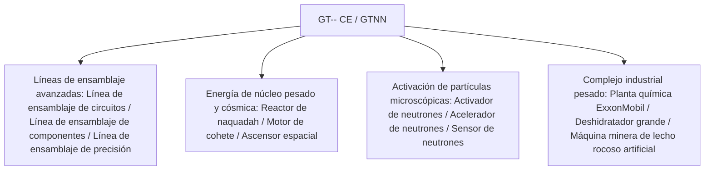

# GT-- Community Edition (GTNN)

`modules/gt--` (paquete `dev.arbor.gtnn`) es el módulo oficial de la edición comunitaria de GT-- Community Edition, construido sobre una arquitectura híbrida **Kotlin + Java** (la rama de desarrollo es `kotlin`).

---

## 🏗️ Arquitectura y pila tecnológica

- **Lenguaje de desarrollo**: Kotlin 2.0.21 + Java 21.
- **Enfoque**: introduce las líneas de ensamblaje masivas, reactores de núcleo pesado, sistemas de deshidratación e industria de exploración espacial que tanto gustan a los jugadores en el clásico GT 5.09 y sus extensiones modernas.



---

## 🏭 Máquinas e instalaciones multibloque principales

### 1. Matriz de líneas de ensamblaje
- **Línea de ensamblaje de circuitos (`circuit_assembly_line`)**: especializada en la producción en masa eficiente de chips de nivel medio-alto y circuitos compuestos, con soporte para carcasas de precisión de múltiples niveles.
- **Línea de ensamblaje de componentes (`component_assembly_line`)**: utiliza carcasas de la clase correspondiente según el nivel de voltaje (de LV a MAX) para ensamblar en masa motores centrales y sensores.
- **Línea de ensamblaje de precisión (`precision_assembly_line`)**: produce máscaras de nanolitografía de máxima precisión y buses de supercomputación.

### 2. Sistema de aceleración de partículas y activación de neutrones
- **Activador de neutrones (`neutron_activator`)** y **Acelerador de neutrones (`neutron_accelerator`)**:
  - Simulan colisiones de alta energía y reacciones de captura rápida de neutrones, activando isótopos estables comunes en materiales radiactivos de núcleo pesado o elementos superconductores superpesados.
- **Sensor de neutrones (`neutron_sensor`)**: detecta en tiempo real el flujo de energía cinética de neutrones dentro de la cavidad de reacción, proporcionando retroalimentación de señal de redstone o computadora.

### 3. Energía de núcleo pesado e industria aeroespacial
- **Reactor grande de naquadah (`large_naquadah_reactor`)**: impulsado por aleaciones de naquadah y combustible enriquecido, proporciona una salida de energía EU estable y de alta densidad.
- **Motor de cohete (`rocket_engine`)**: consume combustible de cohete avanzado para proporcionar potencia pulsante a equipos de alta carga.
- **Ascensor espacial (`space_elevator`)**: conecta la órbita terrestre baja, permitiendo la extracción de minerales desde el espacio y la fabricación industrial en microgravedad.

### 4. Instalaciones químicas y mineras combinadas
- **Planta química ExxonMobil (`exxonmobil_chemical_plant`)**: unidad combinada de procesamiento profundo de petróleo a gran escala, que realiza en una sola máquina todos los procesos de craqueo, reformado, aromatización y polimerización.
- **Deshidratador grande (`large_dehydrator`)**: elimina eficientemente el agua de cristalización y la humedad libre de fluidos o minerales químicos.
- **Máquina minera de lecho rocoso artificial (`homemade_bedrock_ore_machine`)**: despliega brocas artificiales en la capa de lecho rocoso para extraer continuamente vetas infinitas de minerales profundos.

---

## 🌿 Especificaciones del flujo de trabajo de Git para submódulos

`modules/gt--` corresponde al repositorio Git independiente `takanashisatou/GT---Community-Edition`, con la rama de desarrollo `kotlin`:

```bash
# Desarrollar y confirmar cambios de forma independiente en el submódulo
cd modules/gt--
git checkout kotlin
git add .
git commit -m "feat: añadir recetas de línea de ensamblaje de precisión"
git push origin kotlin

# Volver al proyecto principal y actualizar el puntero del submódulo
cd ../..
git add modules/gt--
git commit -m "chore: actualizar puntero del submódulo gt--"
```