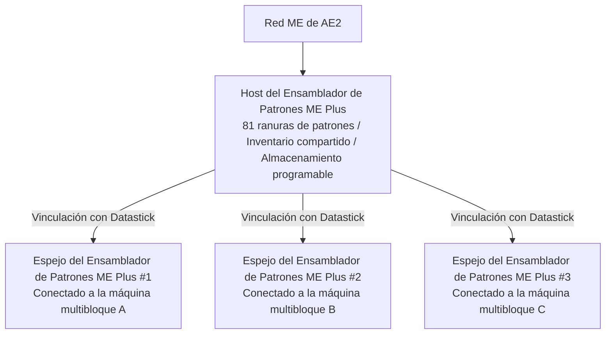

# Sistema de Integración Profunda AE2 y Ensamblador de Patrones Plus

GTECore establece un puente de datos directo extremadamente poderoso entre Applied Energistics 2 (AE2) y las estructuras multibloque de GregTech.

---

## 🧩 Ensamblador de Patrones ME Plus (`me_pattern_buffer_plus`)

En los mods tecnológicos tradicionales, conectar el Proveedor de Patrones de AE2 a máquinas multibloque generalmente enfrenta los puntos débiles de **ranuras insuficientes, imposibilidad de mezclar fluidos e ítems en la salida, y dificultad para compartir patrones entre múltiples máquinas**.

El **Ensamblador de Patrones ME Plus** desarrollado por GTECore resuelve este problema por completo:

### Características principales
1. **Capacidad masiva de patrones**: Un solo host del ensamblador tiene **81 ranuras de patrones** (equivalente a la suma de 9 Proveedores de Patrones estándar de AE2).
2. **Capacidad de compartimento universal**: Posee simultáneamente las capacidades `IMPORT_ITEMS`, `IMPORT_FLUIDS`, `EXPORT_ITEMS` y `EXPORT_FLUIDS`, soportando interacción mixta de fluidos e ítems en el mismo compartimento.
3. **Soporte de almacenamiento programable**: Integra internamente el mecanismo de Almacenamiento Programable, permitiendo la dosificación precisa y el almacenamiento en caché de recetas complejas.

---

## 🪞 Espejo del Ensamblador de Patrones ME Plus (`me_pattern_buffer_proxy_plus`)

El **Espejo del Ensamblador de Patrones ME Plus** es un componente estructural revolucionario para la automatización distribuida:

### Principio de funcionamiento y compartición entre máquinas
- Instale el espejo del ensamblador en la posición de compartimento de cualquier máquina multibloque.
- Sostenga un **Datastick** y haga clic derecho en el **Ensamblador de Patrones ME Plus** principal para leer las coordenadas, luego haga clic derecho en el **Espejo del Ensamblador de Patrones ME Plus** para vincularlo.
- **¡Todos los espejos vinculados compartirán en tiempo real los 81 patrones colocados en el ensamblador principal!**
- Cuando la red AE2 inicia una tarea de automatización de síntesis, la red distribuye automáticamente la carga de trabajo entre todas las máquinas espejo inactivas para que trabajen en paralelo.

### Visualización de estado flotante con Jade
Al apuntar al ensamblador de patrones o al espejo, Jade mostrará automáticamente:
- Ensamblador principal: `Número de espejos conectados: X`
- Componente espejo: `Vinculado a - X: ..., Y: ..., Z: ...`

---

## 💨 Compuerta de Vapor ME (`me_steam_hatch`)

- **Función**: Conecta directamente la red de fluidos de AE2 con las estructuras multibloque de vapor.
- **Efecto**: Las estructuras multibloque de vapor no necesitan tuberías de vapor de alta velocidad ni tanques de almacenamiento externos complejos; extraen vapor directamente de la red ME con el máximo rendimiento para alimentarse, eliminando los cuellos de botella en la transmisión por tuberías.