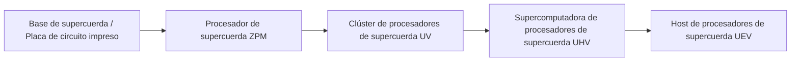
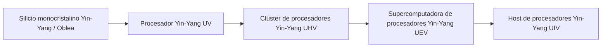

# Sistemas de Circuitos de Alta Gama y Materiales de Supercuerdas y Yin-Yang

GTECore expande dos ramas principales de circuitos de alta gama que abarcan todo el ciclo desde ZPM hasta MAX: **el sistema de circuitos de supercuerdas** y **el sistema de circuitos de Taiji Yin-Yang**, junto con un centro integral de procesamiento de minerales para lograr un ciclo automático de materiales.

---

## 🌌 Sistema de Circuitos de Supercuerdas (Super String Circuitry)

Los circuitos de supercuerdas obtienen potencia de cómputo superlumínica a partir de cuerdas vibrantes de dimensiones superiores, cubriendo principalmente el gradiente de voltaje **ZPM ➜ UEV**:

### Materiales de supercuerda y sustancias de cuerda
- **Cuerda del origen (`item.gtecore.original_string`)**: La fuente vibrante del universo de dimensiones superiores.
- **Cuerda α / Cuerda β / Cuerda γ (`alpha_string`, `beta_string`, `gamma_string`)**: Polímeros de supercuerda con diferentes niveles de energía y estados de polarización.
- **Mezcladora de supercuerdas (`super_string_mixer`)**, **Cuerda de la creación (`string_of_creation`)** y **Matriz oscilante de supercuerdas (`super_string_oscillator_array`)**: Utilizados para la división, sintonización y solidificación de alta gama de la materia de supercuerdas.

---

## ☯️ Sistema de Circuitos de Taiji Yin-Yang (Yin-Yang Circuitry)

El sistema de circuitos Yin-Yang sigue la filosofía cíclica de **"el Yin genera el Yang, el Yang genera el Yin, y la vida se renueva sin fin"**, cubriendo desde **UV ➜ UIV** e incluso límites superiores:

### Símbolos exclusivos de los Ocho Trigramas y los Cinco Elementos
- **Elementos de los Cinco Elementos**: Elemento Metal (`jinyuansu`), Elemento Madera (`muyuansu`), Elemento Agua (`shuiyuansu`), Elemento Fuego (`huo`), Elemento Tierra (`tuyuansu`).
- **Símbolos de los Cinco Elementos**: Símbolo de Metal, Símbolo de Madera, Símbolo de Agua, Símbolo de Fuego, Símbolo de Tierra.
- **Imágenes de los Ocho Trigramas y chips**: Piedras de símbolos y chips centrales de los ocho trigramas: Qian, Kun, Zhen, Xun, Kan, Li, Gen, Dui.
- **Partícula de los Tres Puros (`god_nugget`)**: Medio de síntesis de máxima calidad que condensa la energía del cielo y la tierra.

---

## 💎 Modos de Recetas del Centro Integral de Procesamiento de Minerales

El **Centro Integral de Procesamiento de Minerales (`ore_process_center`)** tiene preconfigurados 7 modos de circuito estandarizados, que se pueden cambiar configurando el número de circuito de programación dentro de la máquina:

| Número de circuito | Ruta de proceso | Tipos de minerales aplicables y características del producto | Multiplicador de producción |
| :---: | :--- | :--- | :---: |
| **Circuito 1** | Triturar ➜ Triturar ➜ Lavar | Producción rápida de minerales metálicos básicos (hierro, cobre, estaño, etc.) | 5x producto principal + subproductos |
| **Circuito 2** | Triturar ➜ Triturar ➜ Centrifugar | Minerales metálicos ligeros raros de alto valor asociados | 5x producto principal + subproductos refinados por centrifugación |
| **Circuito 3** | Triturar ➜ Lavar ➜ Separación térmica ➜ Triturar | Minerales refractarios de alta temperatura, minerales de metales preciosos (grupo del platino, oro, plata, etc.) | 5~6x + polvo metálico puro |
| **Circuito 4** | Triturar ➜ Separación térmica ➜ Triturar | Sulfuros y minerales complejos con incrustaciones severas | 5x + subproductos especiales de separación térmica |
| **Circuito 5** | Triturar ➜ Lavar ➜ Triturar ➜ Lavar | Minerales de tierras raras y minerales de sales solubles de múltiples etapas | 6x + subproductos de doble lavado |
| **Circuito 6** | Triturar ➜ Lavar ➜ Triturar ➜ Centrifugar | Minerales pesados radiactivos (uranio, torio, plutonio) y tierras raras | 6x + metales pesados finamente centrifugados |
| **Circuito 8** | Triturar ➜ Lavar ➜ Triturar ➜ Separación electromagnética | Minerales ferromagnéticos y paramagnéticos (magnetita, cromo, titanio, etc.) | 6~8x + polvo puro electromagnético |