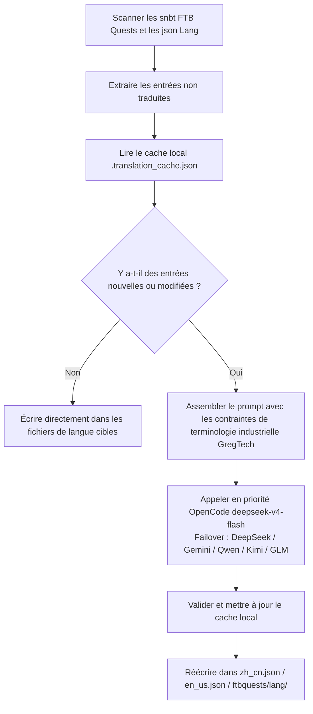

# Moteur de traduction internationalisé par IA (`opencode_translate.py`)

Le projet GTE implémente un système de traduction internationalisée multilingue de niveau industriel piloté par un script unifié, couvrant trois domaines : les actifs de mods, les livres de quêtes FTB et les documents Markdown.

---

## 🔒 Les cinq règles d'or de la traduction

Ce projet de traduction respecte les **5 règles d'or inviolables** suivantes :

1. **Script unique** : toutes les traductions sont pilotées uniquement par `scripts/opencode_translate.py`, connecté au modèle `deepseek-v4-flash` d'OpenCode Zen. Il est interdit d'introduire un second script de traduction ou d'assembler manuellement des appels API.
2. **Exécution cloud** : toutes les traductions complètes doivent être exécutées dans GitHub Actions CI (`translate.yml` / `docs-deploy.yml` / `sync-build.yml`), il est strictement interdit de les exécuter manuellement à grande échelle en local.
3. **Emplacement unique** : le site entier est déployé de manière uniforme sur `https://takanashisatou.github.io/GregtechEasy/` (branche `gh-pages`), pas de second site de documentation, pas de déploiement redondant.
4. **Règles pour l'anglais** :
   - Système de documentation (`docs/en/`) : l'anglais doit être entièrement traduit par IA à partir de `docs/zh/`, toute intervention manuelle est interdite ;
   - Projet de mod : seul `en_us.json` de `gtecore` reste maintenu manuellement, le script intègre une logique de protection, il ne sera jamais écrasé par une traduction automatique.
5. **Localisation profonde** : les menus de navigation (`nav_translations`), les textes des diagrammes Mermaid, les commentaires de code et les étiquettes de tableaux doivent être localisés à 100% dans la langue correspondante.

---

## 🤖 Architecture du moteur de traduction

La localisation communautaire traditionnelle repose sur la maintenance manuelle de textes JSON et SNBT complexes, avec des mises à jour lentes et un risque élevé d'erreurs et d'omissions.

Le moteur de traduction IA de GTE, via une API standardisée compatible OpenAI, réalise l'**extraction incrémentale automatisée, l'alignement terminologique et la traduction concurrente** des livres de quêtes FTB et des fichiers de langue du mod principal :

---

## 🔑 Fournisseurs LLM pris en charge et variables d'environnement

Le script sélectionne automatiquement la première clé API disponible selon la priorité suivante, sans avoir à spécifier manuellement le fournisseur :

| Priorité | Fournisseur | Variable d'environnement API Key | Variable d'environnement Base URL | Modèle par défaut |
| :---: | :--- | :--- | :--- | :--- |
| **1 (préféré)** | **OpenCode Zen** | `OPENCODE_API_KEY` | `OPENCODE_BASE_URL` | **`deepseek-v4-flash`** |
| 2 | DeepSeek | `DEEPSEEK_API_KEY` | `DEEPSEEK_BASE_URL` | `deepseek-chat` |
| 3 | Google Gemini | `GEMINI_API_KEY` | `GEMINI_BASE_URL` | `gemini-3.6-flash` |
| 4 | Qwen (DashScope) | `DASHSCOPE_API_KEY` | `DASHSCOPE_BASE_URL` | `qwen-plus` |
| 5 | Moonshot | `MOONSHOT_API_KEY` | `MOONSHOT_BASE_URL` | `moonshot-v1-8k` |
| 6 | Zhipu GLM | `ZHIPU_API_KEY` | `ZHIPU_BASE_URL` | `glm-4-flash` |
| 7 | OpenAI | `OPENAI_API_KEY` | `OPENAI_BASE_URL` | `gpt-4o-mini` |
| 8 | Proxy d'agrégation générique | `LLM_API_KEY` | `LLM_BASE_URL` | `LLM_MODEL` (personnalisé) |

> **Remarque** : il suffit de configurer `OPENCODE_API_KEY` dans les secrets GitHub pour que le CI fonctionne entièrement. Les autres sont des solutions de secours (Failover).

---

## 🎯 Principes de contrainte du prompt de niveau industriel

Lors de l'appel API pour la traduction, le système intègre des règles strictes de terminologie Minecraft et GregTech :

1. **Préservation absolue des codes de format** : conserver intégralement les codes de formatage de couleur natifs de Minecraft (comme `§a`, `§c`, `§6`) et les espaces réservés (`%s`, `%d`, `{0}`).
2. **Normalisation des termes techniques** : verrouiller strictement la traduction des noms propres techniques (comme `UHV`, `EU/t`, `Amps`, `Voltage`, `Overclock`, `Subtick`, etc.).
3. **Cache incrémental par hachage** : toutes les entrées déjà traduites sont automatiquement enregistrées de manière persistante dans `.translation_cache.json`, seuls les textes nouveaux ou modifiés déclenchent des requêtes réseau, ce qui réduit considérablement les coûts de tokens et le temps de CI.
4. **Localisation des textes des diagrammes Mermaid** : les étiquettes des nœuds du diagramme (comme `A[étiquette]`) sont traduites dans la langue cible, tandis que les mots-clés de syntaxe tels que `graph TD`, `-->`, `subgraph` restent inchangés.
5. **Commentaires de code et étiquettes de tableaux** : les commentaires dans les blocs de code (`//` / `#`) et les en-têtes de colonnes de tableaux sont entièrement localisés.

---

## 🏗️ Fichiers protégés (non traduits automatiquement)

| Chemin | Raison de protection | Mécanisme de protection |
| :--- | :--- | :--- |
| `modules/gtecore/src/main/resources/assets/gtecore/lang/en_us.json` | La traduction anglaise de gtecore est maintenue manuellement par l'auteur | Le script détecte le drapeau `is_gtecore`, la langue `en_us` est ignorée pour l'écrasement |

---

## 💻 Méthodes de déclenchement CI (exécution cloud, règle d'or 2)

| Scénario | Workflow | Méthode de déclenchement |
| :--- | :--- | :--- |
| Construction complète automatique + traduction après push du code | `sync-build.yml` | Déclenché automatiquement sur push vers `main`/`master` |
| Traduction automatique + déploiement après modification de la documentation | `docs-deploy.yml` | Déclenché lors de modifications de `docs/` ou `mkdocs.yml` |
| Traduction manuelle complète des actifs du mod | `translate.yml` | Déclenchement manuel depuis la page Actions, choix du fournisseur et de la langue |
| Traduction manuelle complète de la documentation | `translate.yml` | Cocher l'entrée `translate_docs` |

> [!CAUTION]
> Il est interdit d'exécuter manuellement `python scripts/opencode_translate.py` en local pour des traductions complètes à grande échelle. L'exécution locale est réservée au débogage d'un fichier unique ou à la vérification de la connectivité de la clé API.