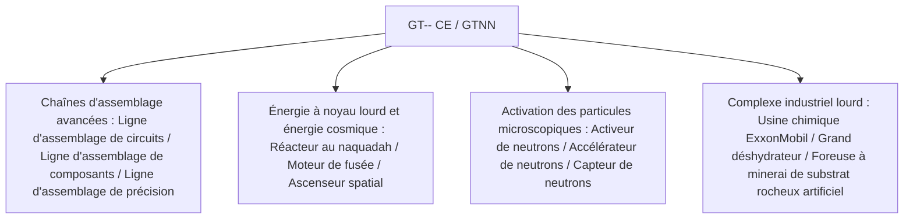

# GT-- Community Edition (GTNN)

`modules/gt--` (nom du paquet `dev.arbor.gtnn`) est le module officiel de la communauté GT-- Community Edition, construit sur une architecture hybride **Kotlin + Java** (branche de développement `kotlin`).

---

## 🏗️ Architecture et pile technologique

- **Langages de développement** : Kotlin 2.0.21 + Java 21.
- **Positionnement** : introduit les chaînes d'assemblage géantes, les réacteurs à noyau lourd, le système de déshydrateurs et l'industrie d'exploration spatiale, très appréciés des joueurs dans le GT 5.09 classique et les extensions modernes.



---

## 🏭 Machines et installations multifonctions principales

### 1. Réseau de chaînes d'assemblage
- **Ligne d'assemblage de circuits (`circuit_assembly_line`)** : spécialisée dans la production en série efficace de puces de niveau intermédiaire à avancé et de circuits composites, prend en charge plusieurs niveaux de châssis de précision.
- **Ligne d'assemblage de composants (`component_assembly_line`)** : utilise des châssis de niveau correspondant selon le niveau de tension (de LV à MAX), pour l'assemblage en série de moteurs principaux et de capteurs.
- **Ligne d'assemblage de précision (`precision_assembly_line`)** : produit des masques de lithographie nanométrique de la plus haute précision et des bus de supercalcul.

### 2. Système d'accélération des particules et d'activation neutronique
- **Activeur de neutrons (`neutron_activator`)** et **Accélérateur de neutrons (`neutron_accelerator`)** :
  - Simulent les collisions à haute énergie et les réactions de capture rapide des neutrons, activant des isotopes stables ordinaires en matériaux à noyau lourd radioactifs ou en éléments supraconducteurs superlourds.
- **Capteur de neutrons (`neutron_sensor`)** : détecte en temps réel le flux d'énergie cinétique des neutrons dans la cavité de réaction, fournissant un retour de signal redstone ou informatique.

### 3. Énergie à noyau lourd et industrie aérospatiale
- **Grand réacteur au naquadah (`large_naquadah_reactor`)** : alimenté par des alliages de naquadah et du combustible enrichi, fournit une sortie d'énergie EU stable et à haute densité.
- **Moteur de fusée (`rocket_engine`)** : consomme du carburant de fusée avancé pour fournir une puissance pulsée aux équipements à forte charge.
- **Ascenseur spatial (`space_elevator`)** : relie l'orbite terrestre basse, permettant l'extraction de minéraux spatiaux et la fabrication industrielle en microgravité.

### 4. Installations combinées de chimie et d'exploitation minière
- **Usine chimique ExxonMobil (`exxonmobil_chemical_plant`)** : installation combinée de raffinage pétrolier à très grande échelle, réalisant en une seule machine toutes les étapes de craquage, reformage, aromatisation et polymérisation.
- **Grand déshydrateur (`large_dehydrator`)** : élimine efficacement l'eau de cristallisation et l'humidité libre des fluides ou des minéraux chimiques.
- **Foreuse à minerai de substrat rocheux artificiel (`homemade_bedrock_ore_machine`)** : déploie des forets artificiels dans la couche de substrat rocheux pour extraire en continu des filons miniers infinis en profondeur.

---

## 🌿 Normes de flux de travail Git pour les sous-modules

`modules/gt--` correspond au dépôt Git indépendant `takanashisatou/GT---Community-Edition`, avec la branche de développement `kotlin` :

```bash
# Développer et committer indépendamment dans le sous-module
cd modules/gt--
git checkout kotlin
git add .
git commit -m "feat: ajouter des recettes de ligne d'assemblage de précision"
git push origin kotlin

# Revenir au projet principal pour mettre à jour le pointeur du sous-module
cd ../..
git add modules/gt--
git commit -m "chore: mettre à jour le pointeur du sous-module gt--"
```