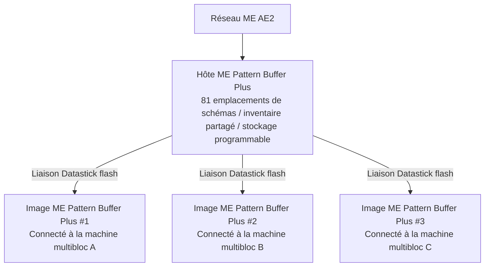

# AE2 深度集成与样板总成 Plus 系统

GTECore 为应用能源 2 (Applied Energistics 2) 与 GregTech 多方块结构之间搭建了极其强大的直接数据互联桥梁。

---

## 🧩 ME 样板总成 Plus (`me_pattern_buffer_plus`)

在传统科技模组中，将 AE2 样板供应器连接到多方块机器通常面临**槽位不足、流体与物品无法混合输出、样板难以多机共享**的痛点。

GTECore 研发的 **ME 样板总成 Plus** 彻底解决了这一问题：

### Caractéristiques principales
1. **Capacité de schémas massive** : Un seul hôte de buffer possède **81 emplacements de schémas** (équivalent à la somme de 9 fournisseurs de schémas AE2 standard).
2. **Capacité de compartiment universel** : Dispose simultanément des capacités `IMPORT_ITEMS`, `IMPORT_FLUIDS`, `EXPORT_ITEMS`, `EXPORT_FLUIDS`, permettant une interaction mixte fluides/objets dans le même compartiment.
3. **Support du stockage programmable** : Intègre le mécanisme de stockage programmable en interne, prenant en charge l'alimentation précise et la mise en cache pour les recettes complexes.

---

## 🪞 Image ME Pattern Buffer Plus (`me_pattern_buffer_proxy_plus`)

**L'Image Pattern Buffer Plus** est un composant structurel révolutionnaire pour l'automatisation distribuée :

### Principe de fonctionnement et partage entre machines
- Installez l'image du buffer sur l'emplacement de compartiment de n'importe quelle machine multibloc.
- Tenez un **Datastick** en main, faites un clic droit sur le **ME Pattern Buffer Plus** principal pour lire les coordonnées, puis faites un clic droit sur l'**Image Pattern Buffer Plus** pour effectuer la liaison.
- **Toutes les images liées partagent en temps réel les 81 schémas placés dans le buffer principal** !
- Lorsque le réseau AE2 lance une tâche d'automatisation de fabrication, le réseau répartit automatiquement la charge entre toutes les machines images inactives pour un fonctionnement en parallèle !

### Affichage d'état Jade en survol
En pointant le buffer ou l'image, Jade affiche automatiquement :
- Buffer principal : `Nombre d'images connectées : X`
- Composant image : `Lié à - X: ..., Y: ..., Z: ...`

---

## 💨 ME Steam Hatch (`me_steam_hatch`)

- **Fonction** : Connecte directement le réseau de fluides AE2 aux structures multiblocs à vapeur.
- **Rôle** : Les structures multiblocs à vapeur n'ont plus besoin de tuyaux et réservoirs à vapeur haute vitesse complexes en externe ; elles peuvent directement extraire la vapeur du réseau ME à débit maximal pour l'alimentation, éliminant ainsi les goulots d'étranglement de transport par tuyaux.