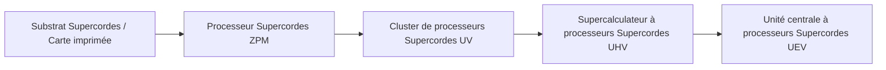
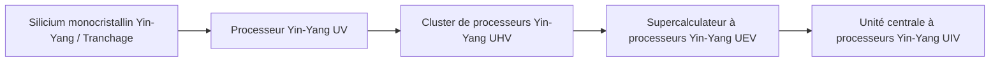

# Systèmes de circuits avancés Supercordes et Yin-Yang, et matériaux

GTECore étend deux grandes branches de circuits avancés couvrant tout le cycle de ZPM à MAX — **le système de circuits Supercordes** et **le système de circuits Yin-Yang Taiji**, accompagnés d'un centre de traitement intégré des minerais pour réaliser un cycle automatique des matériaux.

---

## 🌌 Système de circuits Supercordes (Super String Circuitry)

Les circuits Supercordes obtiennent une puissance de calcul supraluminique à partir de cordes vibrantes de haute dimension, couvrant principalement la gamme de tension **ZPM ➜ UEV** :

### Matériaux Supercordes et substances de cordes
- **Corde originelle (`item.gtecore.original_string`)** : source vibratoire fondamentale de l'univers de haute dimension.
- **Corde α / Corde β / Corde γ (`alpha_string`, `beta_string`, `gamma_string`)** : polymères de supercordes à différents niveaux d'énergie et états de polarisation.
- **Mélangeur de supercordes (`super_string_mixer`)** , **Corde de la création (`string_of_creation`)** et **Réseau d'oscillation de supercordes (`super_string_oscillator_array`)** : utilisés pour la division, l'accord et la solidification avancée de la matière de supercordes.

---

## ☯️ Système de circuits Yin-Yang Taiji (Yin-Yang Circuitry)

Le système de circuits Yin-Yang suit la philosophie cyclique de génération et de contrôle mutuels **« Le Yin engendre le Yang, le Yang engendre le Yin, dans un cycle sans fin »**, couvrant **UV ➜ UIV** et même au-delà :

### Symboles spéciaux des Huit Trigrammes et des Cinq Éléments
- **Cinq Éléments** : Élément Métal (`jinyuansu`), Élément Bois (`muyuansu`), Élément Eau (`shuiyuansu`), Élément Feu (`huo`), Élément Terre (`tuyuansu`).
- **Talismans des Cinq Éléments** : Talisman du Métal, Talisman du Bois, Talisman de l'Eau, Talisman du Feu, Talisman de la Terre.
- **Symboles des Huit Trigrammes et puces** : pierres symboliques et puces centrales des huit trigrammes — Qian, Kun, Zhen, Xun, Kan, Li, Gen, Dui.
- **Particule des Trois Purs (`god_nugget`)** : milieu de synthèse ultime condensant l'énergie primordiale du ciel et de la terre.

---

## 💎 Modes de recettes du Centre de traitement intégré des minerais

Le **Centre de traitement intégré des minerais (`ore_process_center`)** propose 7 modes de circuits standardisés, commutables en réglant le numéro de circuit programmé dans la machine :

| Numéro de circuit | Ligne de processus | Types de minerais applicables et caractéristiques des produits | Multiplicateur de rendement |
| :---: | :--- | :--- | :---: |
| **Circuit 1** | Concassage ➜ Concassage ➜ Lavage | Minerais métalliques de base (fer, cuivre, étain, etc.) pour production rapide en masse | 5× produit principal + sous-produits |
| **Circuit 2** | Concassage ➜ Concassage ➜ Centrifugation | Minerais de métaux légers rares de haute valeur associés | 5× produit principal + sous-produits centrifugés purifiés |
| **Circuit 3** | Concassage ➜ Lavage ➜ Séparation thermique ➜ Concassage | Minerais réfractaires à haute température, minerais de métaux précieux (platine, or, argent, etc.) | 5~6× + poudre métallique pure |
| **Circuit 4** | Concassage ➜ Séparation thermique ➜ Concassage | Sulfures et minerais à gangue complexe fortement disséminée | 5× + sous-produits spéciaux de séparation thermique |
| **Circuit 5** | Concassage ➜ Lavage ➜ Concassage ➜ Lavage | Minerais de terres rares et sels solubles en plusieurs étapes | 6× + sous-produits de double lavage |
| **Circuit 6** | Concassage ➜ Lavage ➜ Concassage ➜ Centrifugation | Minerais lourds radioactifs (uranium, thorium, plutonium) et terres rares | 6× + métaux lourds fins centrifugés |
| **Circuit 8** | Concassage ➜ Lavage ➜ Concassage ➜ Séparation électromagnétique | Minéraux ferromagnétiques et paramagnétiques (magnétite, chrome, titane, etc.) | 6~8× + poudre pure électromagnétique |