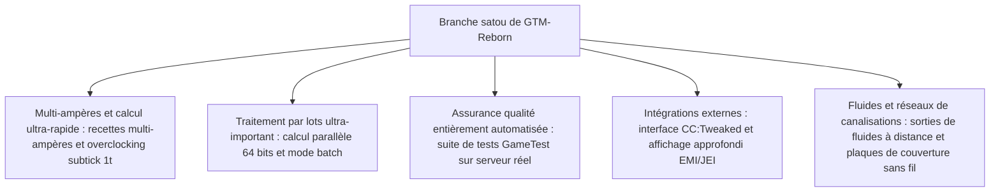

# GregTech Modern Reborn (GTM Reborn)

`modules/gtm-reborn` est une branche indépendante profondément personnalisée de GregTech Modern pour GTE-Multi (nom de branche : `satou`).

---

## 🚀 Fonctionnalités améliorées principales de la branche `satou`

Par rapport à la version originale en amont, GTM-Reborn implémente plusieurs évolutions technologiques révolutionnaires et améliorations de l'expérience industrielle sur Minecraft moderne en version 1.20.1 :



### 1. Parallélisme 64 bits et mode de traitement par lots (Batch Mode)
- **Dépassement de la limite des entiers 32 bits** : le calcul parallèle utilise entièrement le type de données `long`, résolvant définitivement les problèmes de débordement numérique ou de troncature de calcul dans les très grandes installations industrielles à très haute parallélisation.
- **Mode de traitement par lots intelligent** : lorsque les matières premières sont extrêmement abondantes, la machine peut regrouper des centaines, voire des milliers de micro-recettes en un seul cycle d'exécution, réduisant considérablement la charge des ticks du serveur.

### 2. Overclocking instantané subtick 1T (OC_PERFECT_SUBTICK)
- Optimisation du pipeline d'exécution de la logique de recette des machines, permettant aux machines avancées désignées d'effectuer plusieurs itérations de recettes en un seul tick, libérant ainsi la limite absolue de la production industrielle.

### 3. Entrées multi-ampères et support des recettes (Multi-Amp)
- Les recettes des machines prennent en charge la consommation/la sortie de plusieurs ampères (Ampères) par recette, avec un affichage intuitif des valeurs multi-ampères et des spécifications de câbles dans les interfaces EMI/JEI.

### 4. Sorties de fluides à distance (Ranged Fluid Outputs)
- Permet aux tours de distillation et aux réacteurs chimiques de haut niveau de produire des fluides avec des plages de variation en fonction de différentes conditions de température et de pression.

### 5. Intégration moderne des périphériques CC:Tweaked (ComputerCraft)
- Toutes les machines standard exposent des interfaces périphériques à ComputerCraft :
  - Interrogation en temps réel de la progression des recettes, du temps restant et de la consommation EU/t actuelle.
  - Activation, mise en pause ou changement de mode de fonctionnement des machines dynamiquement via des scripts Lua.

---

## 🧪 Tests automatisés et validation GameTest

GTM-Reborn comprend une suite complète de tests automatisés GameTest natifs de Minecraft (située dans `src/test`) :

```powershell
# Exécuter les tests automatisés côté serveur GameTest
$env:JAVA_HOME='C:\Users\Ex_Je\.jdks\ms-21.0.11'
.\gradlew.bat :modules:gtm-reborn:runGameTestServer
```

### Couverture des tests
- **Système Cover** : teste le débit et la logique anti-fuite des plaques de pompe à fluide, des plaques de transfert d'objets et des plaques de conduction d'énergie.
- **Logique de recette des machines** : teste le multi-ampères, le traitement par lots, le parallélisme inter-recettes et le calcul d'overclocking.
- **Formation et rotation des multiblocs** : teste la validation structurelle de divers boîtiers et chambres dans différentes orientations.

---

## 🌿 Normes de flux de travail Git pour les sous-modules

`modules/gtm-reborn` correspond au dépôt Git indépendant `takanashisatou/GregTech-Modern-Reborn`, avec la branche de développement par défaut `satou` :

```bash
# Développer et committer indépendamment dans le sous-module
cd modules/gtm-reborn
git checkout satou
git add .
git commit -m "feat: optimiser la logique de recette des multiblocs"
git push origin satou

# Revenir au projet principal pour mettre à jour le pointeur du sous-module
cd ../..
git add modules/gtm-reborn
git commit -m "chore: mettre à jour le pointeur du sous-module gtm-reborn"
```