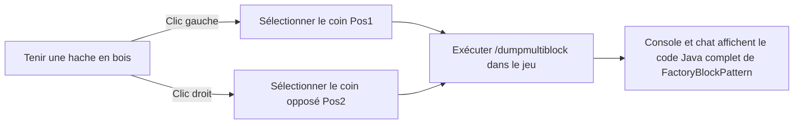

# Ensemble d'outils KubeJS et exportateur de multiblocs (`/dumpmultiblock`)

GTE intègre dans les scripts serveur KubeJS des outils de construction automatisée et d'extraction de structure de multiblocs, spécialement conçus pour les développeurs, libérant ainsi complètement le processus de conception de structures multiblocs.

---

## 🪓 Exportateur visuel de multiblocs (`/dumpmultiblock`)

Lors du développement de multiblocs personnalisés (que ce soit en code Java ou en scripts KubeJS), écrire manuellement `FactoryBlockPattern.aisle(...)` composé de dizaines de couches de caractères est extrêmement chronophage et sujet aux erreurs.

GTE intègre **l'exportateur de sélection à la hache en bois `/dumpmultiblock`** (`server_scripts/easymultiblock.js`):



### Étapes d'utilisation

1. Passez en mode créatif dans le jeu, tenez une **hache en bois (`minecraft:wooden_axe`)**.
2. Construisez directement dans le monde la structure physique complète du multibloc selon votre conception (y compris la coque, les compartiments, les bobines, le contrôleur principal).
3. Avec la hache en bois, **cliquez avec le bouton gauche** sur un bloc d'angle inférieur de la structure (le chat affiche `Pos1 défini : x, y, z`).
4. Avec la hache en bois, **cliquez avec le bouton droit** sur le bloc d'angle supérieur opposé de la structure (le chat affiche `Pos2 défini : x, y, z`).
5. Dans la fenêtre de chat, entrez la commande :
   ```mcfunction
   /dumpmultiblock
   ```
6. Le script analyse automatiquement tous les types de blocs dans la boîte englobante 3D, attribue une cartographie de caractères (`.` pour l'air, `A-Z/a-z/0-9` pour les blocs spécifiques), et génère directement le code de structure dans les journaux d'arrière-plan et le client :

```java
// Modèle FactoryBlockPattern exporté automatiquement
.pattern(definition -> FactoryBlockPattern.start()
    .aisle("BBB", "BBB", "BBB")
    .aisle("BBB", "BAB", "BBB")
    .aisle("BBB", "B#B", "BBB")
    .where('A', Predicates.blocks("minecraft:air"))
    .where('#', Predicates.controller(Predicates.blocks(definition.getBlock())))
    .where('B', Predicates.blocks("gtceu:steam_machine_casing").or(Predicates.autoAbilities(definition.getRecipeTypes())))
    .build()
)
```

---

## 🌌 Configuration des gaz dimensionnels et des veines de fluides

GTE étend la collecte de fluides et de gaz à toutes les dimensions via KubeJS :

### 1. Extraction de gaz à toutes les dimensions (`dimension_gas.js`)
En utilisant la grande chambre de collecte de gaz (`gas_collector`) avec différents numéros de circuit, vous pouvez extraire l'atmosphère spécifique de chaque dimension :
- **Air du monde normal** : `circuit(4)` ➜ sortie `gtceu:air 10000`
- **Air du Nether** : `circuit(5)` ➜ sortie `gtceu:nether_air 10000`
- **Air du vide de l'End** : `circuit(6)` ➜ sortie `gtceu:ender_air 10000`

### 2. Convertisseur de circuits universels (`universal_circuit.js`)
Pour résoudre l'empilement complexe de recettes entre les mods et les différents niveaux de circuits, GTE introduit le système de **circuit universel (`universal_circuit`)** :
- Permet de convertir sans perte, dans la machine d'emballage (`packer`), tout circuit de même niveau de tension (de ULV à MAX) en un objet de circuit universel unifié, à raison de **1 EU / 1 tick**.