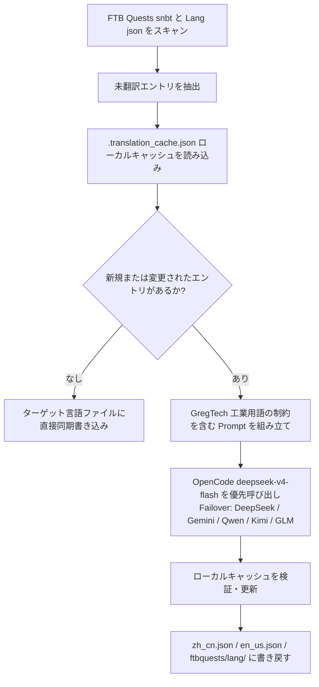

# AI 国際化翻訳エンジン (`opencode_translate.py`)

GTE プロジェクトは、統一スクリプトによって駆動される産業級の多言語国際化翻訳システムを実装し、Mod アセット、FTB クエスト、Markdown ドキュメントの 3 つの領域をカバーしています。

---

## 🔒 翻訳五つの鉄則

このプロジェクトの翻訳作業は、以下の **5 つの不可侵の鉄則** に従います：

1. **単一スクリプト**：すべての翻訳は `scripts/opencode_translate.py` のみによって駆動され、OpenCode Zen の `deepseek-v4-flash` モデルに接続されます。2 つ目の翻訳スクリプトの導入や手動での API 呼び出しの組み立ては禁止されています。
2. **クラウド実行**：すべての全量翻訳は GitHub Actions CI で実行する必要があります（`translate.yml` / `docs-deploy.yml` / `sync-build.yml`）。ローカルでの手動大規模実行は厳禁です。
3. **唯一の配置**：サイト全体は `https://takanashisatou.github.io/GregtechEasy/`（`gh-pages` ブランチ）に統一的にデプロイされ、2 つ目のドキュメントサイトは作成せず、重複デプロイもしません。
4. **英語ルール**：
   - ドキュメントシステム（`docs/en/`）：英語は AI によって `docs/zh/` から全量翻訳され、手動での上書きは禁止です；
   - Mod プロジェクト：`gtecore` の `en_us.json` のみ手動で保守され、スクリプトには保護ロジックが組み込まれており、機械翻訳による上書きは絶対に行いません。
5. **深いローカライゼーション**：ナビゲーションメニュー（`nav_translations`）、Mermaid フローチャートのテキスト、コードコメント、テーブルラベルは 100% 対象言語にローカライズする必要があります。

---

## 🤖 翻訳エンジンアーキテクチャ

従来のコミュニティ翻訳は、複雑な JSON と SNBT テキストを手動で保守することに依存しており、更新が遅れ、誤りや漏れが発生しやすくなっています。

GTE の AI 翻訳エンジンは、標準化された OpenAI 互換 API を通じて、FTB Quests クエストとコア Mod 言語ファイルの**自動増分抽出、用語整合、並行翻訳**を実現しています：

---

## 🔑 対応 LLM プロバイダーと環境変数

スクリプトは以下の優先順位で最初に利用可能な API Key を自動的に選択し、プロバイダーを手動で指定する必要はありません：

| 優先度 | プロバイダー名 | API Key 環境変数 | Base URL 環境変数 | デフォルトモデル |
| :---: | :--- | :--- | :--- | :--- |
| **1（優先）** | **OpenCode Zen** | `OPENCODE_API_KEY` | `OPENCODE_BASE_URL` | **`deepseek-v4-flash`** |
| 2 | DeepSeek | `DEEPSEEK_API_KEY` | `DEEPSEEK_BASE_URL` | `deepseek-chat` |
| 3 | Google Gemini | `GEMINI_API_KEY` | `GEMINI_BASE_URL` | `gemini-3.6-flash` |
| 4 | 通义千问 (DashScope) | `DASHSCOPE_API_KEY` | `DASHSCOPE_BASE_URL` | `qwen-plus` |
| 5 | 月之暗面 (Moonshot) | `MOONSHOT_API_KEY` | `MOONSHOT_BASE_URL` | `moonshot-v1-8k` |
| 6 | 智谱清言 (Zhipu GLM) | `ZHIPU_API_KEY` | `ZHIPU_BASE_URL` | `glm-4-flash` |
| 7 | OpenAI | `OPENAI_API_KEY` | `OPENAI_BASE_URL` | `gpt-4o-mini` |
| 8 | 汎用アグリゲーションプロキシ | `LLM_API_KEY` | `LLM_BASE_URL` | `LLM_MODEL`（カスタム） |

> **注意**：GitHub Secrets に `OPENCODE_API_KEY` を設定するだけで CI を完全に実行できます。残りは予備の Failover です。

---

## 🎯 工業級 Prompt 制約原則

API を呼び出して翻訳する際、システムには厳格な Minecraft と GregTech の用語ルールが組み込まれています：

1. **フォーマットコードの絶対保持**：Minecraft ネイティブの色フォーマットコード（例：`§a`, `§c`, `§6`）とプレースホルダー（`%s`, `%d`, `{0}`）を完全に保持します。
2. **科学技術用語の統一**：科学技術の固有名詞の翻訳を厳密に固定します（例：`UHV`, `EU/t`, `Amps`, `Voltage`, `Overclock`, `Subtick` など）。
3. **ハッシュ増分キャッシュ**：翻訳済みのすべてのエントリは `.translation_cache.json` に自動的に永続化され、新規または変更されたテキストのみがネットワークリクエストを発行するため、Token 消費と CI 時間を大幅に節約します。
4. **Mermaid 図表テキストのローカライゼーション**：フローチャートのノードラベル（例：`A[ラベル]`）は対象言語に翻訳され、`graph TD`、`-->`、`subgraph` などの構文キーワードは変更されません。
5. **コードコメントとテーブルラベル**：コードブロック内のコメント（`//` / `#`）とテーブルの列見出しはすべてローカライズされます。

---

## 🏗️ 保護対象ファイル（機械翻訳不可）

| パス | 保護理由 | 保護メカニズム |
| :--- | :--- | :--- |
| `modules/gtecore/src/main/resources/assets/gtecore/lang/en_us.json` | gtecore の英語翻訳は作者が手動で保守 | スクリプトは `is_gtecore` フラグを検出し、`en_us` 言語は上書きをスキップ |

---

## 💻 CI トリガー方法（クラウド実行、鉄則 2）

| シナリオ | ワークフロー | トリガー方法 |
| :--- | :--- | :--- |
| プッシュ後に自動で全量ビルド + 翻訳 | `sync-build.yml` | `main`/`master` へのプッシュで自動トリガー |
| ドキュメント変更後に自動翻訳 + デプロイ | `docs-deploy.yml` | `docs/` または `mkdocs.yml` の変更時にトリガー |
| 手動で全量 Mod アセット翻訳 | `translate.yml` | Actions ページから手動トリガー、Provider と言語を選択可能 |
| 手動で全量ドキュメント翻訳 | `translate.yml` | `translate_docs` 入力項目をチェック |

> [!CAUTION]
> ローカルで `python scripts/opencode_translate.py` を手動実行して大規模な全量翻訳を行うことは禁止されています。ローカル実行は単一ファイルのデバッグや API Key の接続確認のみに使用してください。