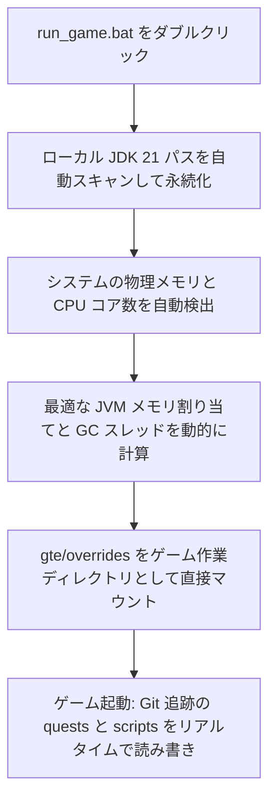

# ローカルホットデバッグとランチャー不要のクイック起動

GTEは、統合パックの企画者、クエスト作成者、Modプログラマーにとって非常に使いやすいシームレスなデバッグシステムを設計しました。

---

## ⚡ 1. ランチャー不要の超高速起動スクリプト (`run_game.bat` / `run_game.sh`)

クエストブック作成者（FTB Quests）とKubeJSレシピプランナーにとって、**IntelliJ IDEAを開く必要も、サードパーティのランチャーをインストールする必要もなく**、プロジェクトルートディレクトリの **`run_game.bat`** をダブルクリックするだけで、ゲームを超高速に起動できます！



### 主な特徴
1. **全自動 JDK 21 検出**: `.jdks`、`Adoptium`、`Zulu`、`Program Files` 配下にインストールされた Java 21 を自動検索し、`.jdk_path` に自動記憶します。
2. **ハードウェア適応最適化**: 現在の PC の RAM 総量に基づいて、最適な割合（利用可能な物理メモリの50%〜60%）で JVM ヒープサイズを自動割り当てし、並列 GC スレッドを自動構成します。
3. **ゼロ移動ワークフロー**: ゲーム内でクエストを変更（`/ftbquests editing_mode true`）して保存すると、変更は Git リポジトリの対応する `config/ftbquests/` にリアルタイムで保存され、GitHub Desktop を開いてワンクリックでコミットできます！

---

## 🔗 2. 外部ランチャーゼロコピーマッピングツール (`link_to_launcher.bat`)

スキンやキー設定を自分で設定したランチャー（PCL2 / HMCL / Prism Launcher など）を使い慣れている場合：

1. ルートディレクトリの **`link_to_launcher.bat`** をダブルクリックして実行します。
2. プロンプトに従って、ランチャーのゲームディレクトリ（例: `D:\PCL2\.minecraft\versions\GTE-Dev\.minecraft\`）をコンソールにドラッグ＆ドロップし、Enter キーを押します。
3. スクリプトは Windows ディレクトリのシンボリックリンク（ディレクトリジャンクション）を自動的に作成します：
   - `config` ➜ `gte/overrides/config`
   - `kubejs` ➜ `gte/overrides/kubejs`
   - `ftbquests` ➜ `gte/overrides/config/ftbquests`
   - `defaultconfigs` ➜ `gte/overrides/defaultconfigs`
4. ランチャーでクエストやレシピをどのように変更しても、**物理データはメインの Git リポジトリにリアルタイムで同期保存されます**！

---

## ☕ 3. Modコードのホットコンパイルシャドウ環境 (`gte-dev-runtime`)

Java/Kotlin プログラマー向けに、`modules/gte-dev-runtime` は専用のシャドウデバッグモジュールです：

### 動作原理と設計上の考慮事項
- **位置付け**: 純粋なローカルホットコンパイルデバッグサンドボックスであり、**パッケージングや公開は禁止されており、プレイヤー向けのビルドには一切含まれません**。
- **ModDevGradle 動的リマッピング**: `gtm-reborn` と `gtecore` の最新ソースコードを自動的にホットコンパイルし、Mojang の難読化解除名前空間にマウントします。
- **起動方法**:
  - IDEA で実行構成 **`Run GTE Full Pack (Client - Hot Debug)`** を選択します。
  - またはコマンドラインで実行：
    ```powershell
    .\gradlew.bat :modules:gte-dev-runtime:runClient
    ```