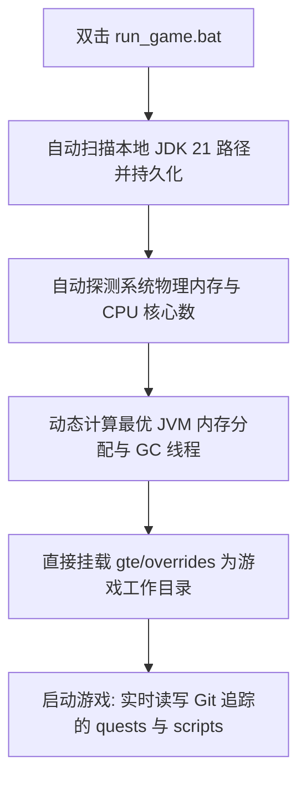

# ローカルホットデバッグとランチャー不要のクイック起動

GTEは、Modpackプランナー、クエスト作成者、Modプログラマーにとって非常に使いやすいシームレスな連携デバッグシステムを設計しました。

---

## ⚡ 1. ランチャー不要の超高速起動スクリプト (`run_game.bat` / `run_game.sh`)

クエストブック作成者（FTB Quests）やKubeJSレシピ担当者にとって、**IntelliJ IDEAを開く必要も、サードパーティ製ランチャーをインストールする必要もありません**。プロジェクトルートの **`run_game.bat`** をダブルクリックするだけで、ゲームを超高速に起動できます！



### 主な特徴
1. **全自動JDK 21検出**: `.jdks`、`Adoptium`、`Zulu`、`Program Files` 配下にインストールされたJava 21を自動的に検索し、`.jdk_path` に自動的に記憶します。
2. **ハードウェア適応最適化**: 現在のPCのRAM総量に基づき、最適な割合（使用可能な物理メモリの50%〜60%）でJVMヒープサイズを自動割り当てし、並列GCスレッドを自動構成します。
3. **移動ゼロのワークフロー**: ゲーム内でクエストを変更（`/ftbquests editing_mode true`）して保存すると、変更はGitリポジトリ内の対応する `config/ftbquests/` にリアルタイムで直接保存されます。GitHub Desktopを開けばワンクリックでコミットできます！

---

## 🔗 2. 外部ランチャー向けコピー不要マッピングツール (`link_to_launcher.bat`)

スキンやキー設定を自分好みに設定したランチャー（PCL2 / HMCL / Prism Launcher など）を使い慣れている場合：

1. ルートディレクトリの **`link_to_launcher.bat`** をダブルクリックして実行します。
2. プロンプトに従って、ランチャーのゲームディレクトリ（例: `D:\PCL2\.minecraft\versions\GTE-Dev\.minecraft\`）をコンソールにドラッグ＆ドロップしてEnterキーを押します。
3. スクリプトはWindowsのディレクトリジャンクション（Directory Junctions）を自動的に作成します：
   - `config` ➜ `gte/overrides/config`
   - `kubejs` ➜ `gte/overrides/kubejs`
   - `ftbquests` ➜ `gte/overrides/config/ftbquests`
   - `defaultconfigs` ➜ `gte/overrides/defaultconfigs`
4. ランチャー内でクエストやレシピをどのように変更しても、**物理データはメインのGitリポジトリにリアルタイムで同期保存されます**！

---

## ☕ 3. Modコードのホットコンパイルシャドウ環境 (`gte-dev-runtime`)

Java/Kotlinプログラマー向けに、`modules/gte-dev-runtime` は専用のシャドウデバッグモジュールです：

### 動作原理と設計上の考慮点
- **位置付け**: 純粋なローカルホットコンパイル/連携デバッグ用サンドボックスであり、**パッケージングして公開することは禁止されており、いかなるプレイヤー向け成果物にも含まれません**。
- **ModDevGradle動的リマッピング**: `gtm-reborn` と `gtecore` の最新ソースコードを自動的にホットコンパイルし、Mojangの難読化解除名前空間にマウントします。

### 正しい起動方法

以下の3つのエントリポイントは等価であり、いずれもゲームウィンドウを自動的に最前面へ持ち上げます：

```powershell
$env:JAVA_HOME='C:\Users\Ex_Je\.jdks\ms-21.0.11'
.\gradlew.bat runFullPack                          # preferred, root aggregate entry point
.\gradlew.bat :modules:gte-dev-runtime:runClient    # equivalent
.\run_game.bat                                     # same task, auto-detects JDK/RAM/cores
```

### 最初の25秒間ウィンドウが表示されない理由（これは正常です）

独立GPU上でのEmbeddium/OculusによるGLFWコンテキストのデッドロックを避けるため、Forgeの早期進捗ウィンドウは意図的に無効化されています。その代償として、ウィンドウは `Minecraft.<init>` の内部でようやく作成されます。その時点でゲームJVMはGradleデーモンからforkされたバックグラウンドプロセスであり、Windowsのフォアグラウンドロックがそのフォーカス要求を拒否します。そのためウィンドウは正しく作成・描画されているにもかかわらず、アクティブウィンドウの背後に隠れてしまい、まさに「ウィンドウが一向に表示されない」ように見えます。

そこで `runClient` は `scripts/dev/raise_game_window.ps1` を非同期に起動します。このスクリプトは今回の実行自身のJVMに属する `GLFW30` ウィンドウをポーリングし、`SetWindowPos` で最前面へ持ち上げます（Zオーダーの変更はフォアグラウンドロックの対象外なので、この処理は必ず成功します）。そのログは `modules/gte-dev-runtime/build/raise-game-window.log` にあります。完全なコールドスタートには約70秒かかります。

### 環境変数スイッチ

| 環境変数 | 効果 |
| --- | --- |
| `GTE_WINDOW_WIDTH` / `GTE_WINDOW_HEIGHT` | ウィンドウサイズ（デフォルト 1600x900） |
| `GTE_NO_WINDOW_RAISE=1` | 最前面化をスキップし、GLFWが配置した位置のままにする |
| `GTE_RUNTIME_XMX` | クライアントのヒープ上限（デフォルト `8G`） |

### `.vscode/launch.json` から起動しないこと

`.vscode/launch.json` 内の構成は、IDE同期時にModDevGradleによって自動生成されます。これらは `net.neoforged.devlaunch.Main` を直接呼び出し、`runClient` タスクをバイパスするため、ウィンドウは決して最前面に持ち上げられません。さらにこのファイルはIDE同期のたびに書き換えられるため、手動での編集は残りません。恒久的な実行引数は `build.gradle` の `runs {}` ブロックに記述してください。

ブレークポイントが必要な場合は、IntelliJの `Run Client (Hot Debug)` 構成を使用してください。これはJDWPデバッガーをアタッチし、終了時に `run/client/` へ `hs_err_pid*.log` ファイルを残すことがあります。これは既知の無害な副産物であり、起動処理とは無関係です。