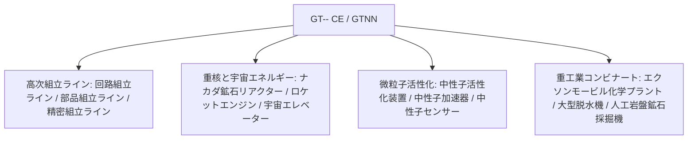

# GT-- Community Edition (GTNN)

`modules/gt--`（パッケージ名 `dev.arbor.gtnn`）は、**Kotlin + Java** のハイブリッドアーキテクチャに基づいて構築された GT-- Community Edition の公式コミュニティ版MODです（開発ブランチは `kotlin`）。

---

## 🏗️ アーキテクチャと技術スタック

- **開発言語**：Kotlin 2.0.21 + Java 21。
- **位置づけ**：クラシックな GT 5.09 および現代の拡張でプレイヤーに愛されている巨大組立ライン、重核リアクター、脱水機システム、宇宙探査産業を導入します。



---

## 🏭 コア多方塊機械と施設

### 1. 組立パイプラインアレイ
- **回路組立ライン (`circuit_assembly_line`)**：中高次チップと複合回路の効率的な量産に特化し、多段階の精密機殻をサポートします。
- **部品組立ライン (`component_assembly_line`)**：電圧レベル（LV から MAX）に応じて対応する階級の機殻を使用し、コアモーターとセンサーをバッチ組み立てします。
- **精密組立ライン (`precision_assembly_line`)**：最高精度のナノリソグラフィマスクとスーパーコンピューティングバスを生産します。

### 2. 粒子加速と中性子活性化システム
- **中性子活性化装置 (`neutron_activator`)** と **中性子加速器 (`neutron_accelerator`)**：
  - 高エネルギー衝突型加速器と高速中性子捕獲反応をシミュレートし、通常の安定同位体を放射性重核材料または超重超伝導元素に活性化します。
- **中性子センサー (`neutron_sensor`)**：反応チャンバー内の中性子運動エネルギーフラックスをリアルタイムで検出し、レッドストーンまたはコンピューター信号のフィードバックを提供します。

### 3. 重核エネルギーと宇宙産業
- **大型ナカダ鉱石リアクター (`large_naquadah_reactor`)**：ナカダ合金と濃縮燃料を動力源とし、安定した高密度の EU エネルギー出力を提供します。
- **ロケットエンジン (`rocket_engine`)**：高度なロケット燃料を消費し、高負荷機器にパルス動力を供給します。
- **宇宙エレベーター (`space_elevator`)**：低軌道を貫通し、宇宙ベースの鉱物採集と微小重力工業製造を実現します。

### 4. 化学と鉱業の複合施設
- **エクソンモービル化学プラント (`exxonmobil_chemical_plant`)**：超大型石油深加工複合装置で、単体で分解、改質、芳香族化、重合の全工程を完了します。
- **大型脱水機 (`large_dehydrator`)**：流体や化学鉱物から結晶水と遊離水分を効率的に除去します。
- **人工岩盤鉱石採掘機 (`homemade_bedrock_ore_machine`)**：岩盤層に人工ドリルを配置し、深部の無限鉱脈を継続的に抽出します。

---

## 🌿 サブモジュール Git ワークフロー規約

`modules/gt--` は独立した Git リポジトリ `takanashisatou/GT---Community-Edition` に対応し、開発ブランチは `kotlin` です：

```bash
# サブモジュール内で独立して開発・コミットする
cd modules/gt--
git checkout kotlin
git add .
git commit -m "feat: 精密組立ラインのレシピを追加"
git push origin kotlin

# メインプロジェクトに戻ってサブモジュールのポインタを更新する
cd ../..
git add modules/gt--
git commit -m "chore: gt-- サブモジュールのポインタを更新"
```