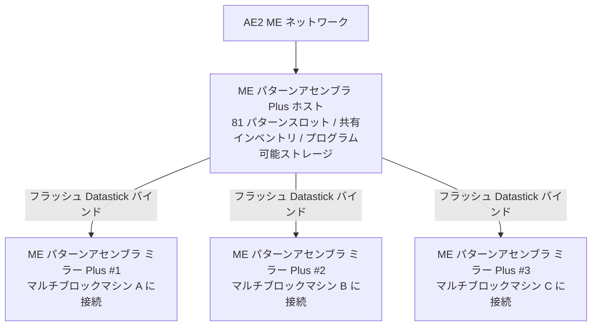

# AE2 深層統合とパターンアセンブラ Plus システム

GTECore は、Applied Energistics 2 (AE2) と GregTech マルチブロック構造の間に、極めて強力な直接データ連携ブリッジを構築します。

---

## 🧩 ME パターンアセンブラ Plus (`me_pattern_buffer_plus`)

従来のテクノロジーモッドでは、AE2 パターンプロバイダーをマルチブロックマシンに接続する際、**スロット不足、流体とアイテムの混合出力ができない、パターンを複数マシンで共有しにくい**といった問題がよくありました。

GTECore が開発した **ME パターンアセンブラ Plus** は、この問題を完全に解決します：

### 主な特徴
1. **大容量パターン**：単一のアセンブラホストは **81 パターンスロット**（標準 AE2 パターンプロバイダー 9 台分に相当）を搭載。
2. **万能ハッチ能力**：`IMPORT_ITEMS`、`IMPORT_FLUIDS`、`EXPORT_ITEMS`、`EXPORT_FLUIDS` のすべての能力を同時に備え、流体とアイテムの同一ハッチ内での混合インタラクションをサポート。
3. **プログラム可能ストレージ対応**：内部に Programmable Storage メカニズムを統合し、複雑なレシピの精密な投入とキャッシュをサポート。

---

## 🪞 ME パターンアセンブラ ミラー Plus (`me_pattern_buffer_proxy_plus`)

**パターンアセンブラ ミラー Plus** は、革新的な分散型自動化構造部品です：

### 動作原理とクロスマシン共有
- ミラーアセンブラを任意のマルチブロックマシンのハッチ位置に設置します。
- 手持ちの **フラッシュ (Datastick)** でメインの **ME パターンアセンブラ Plus** を右クリックして座標を読み取り、その後 **パターンアセンブラ ミラー Plus** を右クリックしてバインドします。
- **バインドされたすべてのミラーは、メインアセンブラ内に配置された全 81 パターンをリアルタイムで共有します**！
- AE2 ネットワークが自動合成タスクを開始すると、ネットワークは自動的に負荷分散し、アイドル状態のすべてのミラーマシンに並行して作業を割り当てます！

### Jade ホバー状態表示
パターンアセンブラまたはミラーにカーソルを合わせると、Jade が自動的に表示します：
- メインアセンブラ：`接続済みミラー数: X`
- ミラー部品：`バインド先 - X: ..., Y: ..., Z: ...`

---

## 💨 ME 蒸気ハッチ (`me_steam_hatch`)

- **機能**：AE2 流体ネットワークと蒸気マルチブロック構造を直接接続します。
- **効果**：蒸気マルチブロック構造は、複雑な高速蒸気パイプやタンクを外部に設置する必要がなく、ME ネットワークから最高スループットで即座に蒸気を抽出して供給でき、パイプ輸送のボトルネックを排除します。