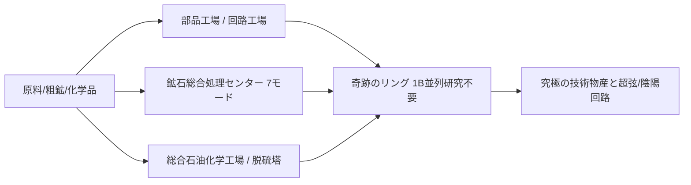

# GTECore マルチブロック機械図鑑

GTECoreは、テクノロジーライン中後期の煩雑なパイプライン積み重ねに対応するため、**超並列能力**と**集約生産ロジック**を兼ね備えた多数のマルチブロック機械を設計しました。

---

## 🏭 蒸気時代の大型マルチブロック

蒸気時代の単機生産能力の低さとスペースの冗長性を解決するため、GTECoreは一連の大型蒸気マルチブロックを導入しました。すべてがレシピ横断並列と大容量蒸気スループットをサポートします：

| 機械名 (Block ID) | コア機能とレシピタイプ | 特徴と利点 |
| :--- | :--- | :--- |
| **大型蒸気合金炉** (`gtceu:big_alloy`) | 合金精錬 (`alloy_smelter`) | 初期の高倍率合金生産、高圧蒸気をサポート |
| **大型蒸気圧縮機** (`gtceu:big_compressor`) | 圧縮処理 (`compressor`) | 緻密な金属板とブロックを一括圧縮 |
| **大型蒸気鍛造ハンマー** (`gtceu:big_forge_hammer`) | 鍛造ハンマー粉砕/板 (`forge_hammer`) | 自動化された板材と粗鉱の高速破砕 |
| **大型蒸気抽出機** (`gtceu:big_steam_extractor`) | ゴム/流体抽出 (`extractor`) | 樹脂と工業流体を大規模に抽出 |
| **簡易蒸気粉砕機** (`gtceu:steam_grinder_easy`) | 鉱石粉砕 (`macerator`) | 初期の鉱物倍率処理 |
| **簡易蒸気溶鉱炉** (`gtceu:steam_oven_easy`) | 熱分解溶鉱 (`pyrochlore_oven`) | コークスと木炭の工業的大量焼成 |
| **蒸気鉱物処理プラント** (`gtecore:steam_op`) | 総合鉱石粉砕と精製 | **10億 (1B) 並列**、すべてのレシピが **1 tick** で実行完了！任意の入出力コンパートメントをサポート |

---

## ⚡ スーパー電気産業マルチブロック

電力時代に入ると、GTECoreはオールインワンと高次加工センターを提供します：

### 1. コア生産工場

- **§6部品工場 (`gtceu:component_factory`)**：
  - **位置付け**：モーター、ポンプ、ピストン、ロボットアーム、コンベア、発光ダイオードなど、さまざまな一般的な基本部品をワンステップで生産します。
  - **特徴**：煩雑な中間サブプロセスをスキップし、指定された電圧レベルの標準工業部品を高速で生産します。
- **§6回路工場 (`gtceu:circuit_factory`)**：
  - **位置付け**：集積回路基板、チップエッチング、集積パッケージングを一体化。
  - **特徴**：レシピ横断並列コンパートメントをサポートし、ULVからMAXまでの全電圧グレードの回路基板生産を全面的に加速します。
- **§6奇跡のリング (`gtceu:miracle_ring`)**：
  - **位置付け**：工業の奇跡を実現する究極の組み立て施設。
  - **特徴**：**10億 (1B) 並列**と **1t Subtick オーバークロック**を備え、**いかなる研究/組み立てライン研究も不要**で、組み立てラインのレシピを直接実行できます！
- **化学ターミネーター (`gtecore:chemistry_terminator`)**：
  - **位置付け**：「化学と物理の存在を覆し、化学の終焉を象徴する」。
  - **特徴**：複雑な数十ステップの長鎖化学反応をワンクリックで集約し、さまざまな究極ポリマーと酸媒体を超高速で合成します。
- **十合一汎用処理工場 (`gtecore:ten_in_one`)**：
  - **位置付け**：遠心分離、電解、化学浸出、重合、高圧反応など、10大基本プロセスを融合した万能統合ボックス。

### 2. 鉱石と流体精製システム

- **§6鉱石総合処理センター (`gtecore:ore_process_center`)**：
  - **7種類のプログラミング回路モード**をサポートし、異なる産物指向の鉱物5〜8倍精製（粉砕、洗鉱、熱分解、遠心分離、電磁選鉱を完全統合）を実現、1t Subtickオーバークロックをサポート。
- **総合石油化学工場 (`gtecore:integrated_petrochemical_plant`)**：
  - 原油分留、接触分解、改質、脱硫の全チェーンを統合し、単機で全炭化水素軽質ガスと芳香族炭化水素を生産。
- **脱硫機 (`gtceu:desulfurization`)**：
  - 各種重質硫黄含有燃料油を高速で浄化し、高純度硫黄粉末の副産物を回収。
- **簡易/上級流体掘削リグ (`gtecore:easy_fluid_drilling_rig` / `not_hard_fluid_drilling_rig`)**：
  - 基盤流体鉱脈を自動で汲み上げ、枯渇することなく、複雑なパイプライン探査を不要にします。

### 3. ハイエンドと超伝導ケーブル加工

- **§6導線工場 (`gtecore:wiremill_factory`)**：すべての金属単線、二重線、四重線、八重線、十六重線および超伝導ケーブルをワンクリックで生産。
- **§6結晶中枢 (`gtecore:crystal_center`)**：単結晶シリコン柱、エメラルド、サファイア、チャージ済みサイクステル結晶を大規模に自動育成。
- **§6量子線擎 (`gtecore:quantum_cable_assembler`)**：量子光ファイバーと超次元エネルギー伝送ケーブルの高速製造に特化。
- **§3星刃エッチング機 (`gtecore:starblade_etching_machine`)**：高エネルギービームを使用して極紫外/X線帯域で銀河系規模のマイクロナノチップをエッチング。

---

## 🔋 エネルギーと発電機システム

| 機械名 | エネルギー出力/レベル | コアメカニズムと特徴 |
| :--- | :--- | :--- |
| **§6汎用燃料エンジン** (`gtceu:general_fuel_engine`) | 動的自適応 (最大 MAX) | **世界中のすべてのタイプの燃料**（ディーゼル、バイオマス、天然ガス、ロケット燃料など）をサポートし、**20億 (2B) 並列**を備え、瞬時に天量のエネルギーを放出！ |
| **大型汎用発電機** (`gtecore:large_general_generator`) | 多段電圧選択可能 | 通常のガス、蒸気、プラズマ発電機ローターに適合 |
| **スーパー核融合炉** (`gtecore:super_fusion_reactor`) | 核融合プラズマ出力 | 通常の核融合の長い昇温待ちを完全に排除し、**1T Subtickオーバークロックを完全サポート**、瞬時に高温核融合生成物を出力 |
| **上限圧スーパーバッテリーボックス** (`gtecore:max_super_battery_buffer_1x`) | **MAX (2,147,483,647 V)** | 超大量のEUキャッシュを収容し、損失ゼロの次元間ワイヤレス充電インターフェースをサポート |