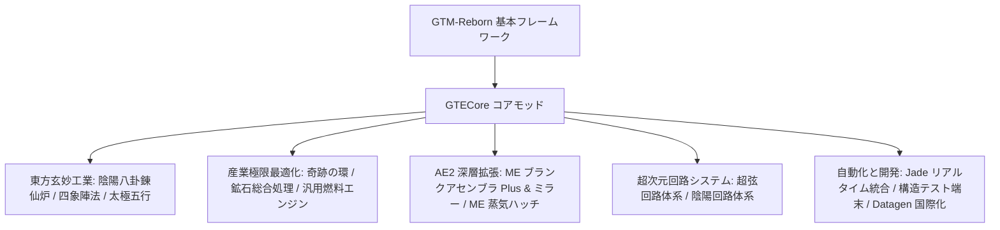

# GTECore 核心模組概要

**GTECore** は GregTech Easy プロジェクトのカスタム Java コアモッドです。`gtm-reborn` ソースコードに直接依存し、大規模なマルチブロック産業構造、高次元の陣法技術、AE2 の深層連携、そして超回路製造体系を拡張します。

---

## 🏛️ モッドアーキテクチャと設計方針

---

## 📦 クリエイティブタブと分類

GTECore はゲーム内に独立したクリエイティブタブを登録します：

1. **GregTech Easy 機械 (`itemGroup.gtecore.gtecore_machines`)**：
   - GTE オリジナルのマルチブロックメインブロック（陰陽八卦高炉、奇跡の環、鉱石処理センター、化学終焉者など）を含む。
   - 多段階スーパーバッテリーボックス（Max Super Battery Buffer）、ME 蒸気ハッチ、ME ブランクアセンブラ Plus およびミラーを含む。
2. **GregTech Easy アイテム (`itemGroup.gtecore.gtecore_items`)**：
   - 超弦および陰陽回路シリーズのアイテム（プロセッサ、クラスタ、スーパーコンピュータ、ホスト）を含む。
   - 五行元素符篆、八卦チップ、三清の粒、構造テスト端末などの専用アイテムを含む。

---

## ⚙️ モッド全体設定 (`GTEConfig`)

GTECore は豊富なゲーム内およびファイル設定項目を提供します（`config/gtecore-common.toml` またはゲーム内設定メニュー）：

| 設定項目 | デフォルト値 | 詳細説明 |
| :--- | :--- | :--- |
| `superPeace` (スーパーピースモード) | `false` | 有効にすると悪性の敵対生物のスポーンを全面的に無効化し、テック建築に完全にクリーンな環境を提供します |
| `durationMultiplier` (レシピ時間倍率) | `1.0` | GTECore カスタムレシピの所要時間倍率をグローバルに調整します |

---

## 🔍 Jade / TOP ネイティブ統合

GTECore は **`GTEJadePlugin`** プラグインを内蔵しています：
- **ME ブランクアセンブラ Plus ステータス**：現在アセンブラにバインドされているブランク数、流体とアイテムの出力モードをリアルタイム表示します。
- **ME ブランクアセンブラミラー Plus バインド情報**：ホバーで直接、バインドされているメインアセンブラの座標 `(X, Y, Z)` とネットワーク接続状態を表示します。
- **陣法活性化インジケーター**：陰陽八卦錬仙炉上で青龍、白虎、朱雀、玄武の四象陣法の準備状態をリアルタイム表示します。

---

## 🛠️ 構造テスト端末 (`Structure Testing Terminal`)

GTECore は専用の手持ちツール **構造テスト端末** (`item.gtecore.check_structure_terminal`) を提供します：
- **マルチブロックコントローラーを右クリック**：構造の完全性をリアルタイムスキャンします。
- **エラー診断ヒント**：構造が未完成の場合、端末はチャット欄とホバーヒントで**エラーとなっているブロック座標および配置すべきでない位置**を正確に指摘し、大型マルチブロックの建造とデバッグを大幅に高速化します。