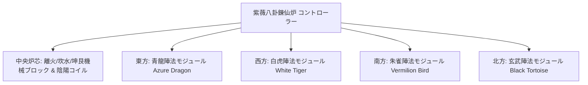

# 陰陽八卦錬仙炉と四象陣法システム

GTECoreは、東洋の道家哲学と現代の重工業工学を組み合わせた **「太極八卦と四象陣法体系」** を独自に開発しました。この体系は、ゲーム中後期の冶金、超伝導物質合成、仙道技術の躍進の中核となるハブを構成しています。

---

## 🌌 陰陽八卦錬仙炉 (`yin_yang_eight_trigmas_blast_furnace`)

**紫薇八卦錬仙炉** は、現在のテクノロジーモッド界で最も大規模で、最も精密なメカニズムを持つマルチブロック構造の1つです（55×55ブロック以上を占有します）：



### 🧭 風水方位の法則（重要なメカニズム）
> [!IMPORTANT]
> **風水方位の法則**：風水と磁場の制約により、**錬仙炉のメインコントローラーは正面を南に向けて設置する必要があります**。そうすることで、天地の陰陽の気と通じ、正常に形成・稼働できます！

### 炉体の基本能力
- **対応レシピライブラリ**：通常の高炉レシピ (`blast_recipes`)、溶解炉レシピ (`furnace_recipes`)、合金炉レシピ (`alloy_smelter_recipes`)、GCYM 巨大合金高炉レシピ (`alloy_blast_recipes`)、および専用の **陰陽八卦レシピ (`yin_yang_eight_trigmas_blast`)** をネイティブにサポートします。
- **オーバークロック特性**：**1T Subtick 瞬時オーバークロック** と **バッチモード (Batch Mode)** を完全にサポートします。

---

## 🐉 四象陣法サブモジュールと動的条件検出

錬仙炉の周囲には、**東の青龍、西の白虎、南の朱雀、北の玄武** の4つの陣法翼をそれぞれ延伸して構築できます：

| 陣法モジュール | 陣法方位 | 陣法ブロック | レシピ条件 (`RecipeCondition`) | 有効化後の効果と作用 |
| :--- | :--- | :--- | :--- | :--- |
| **青龍陣法** (`Qing Long`) | **東方 (East)** | `qinglong_module` | `QING_LONG_CONDITION` | 木生火の勢いを活性化し、超高温製錬のエネルギー消費を大幅に削減し、生生不息の高次触媒レシピを解放します。 |
| **白虎陣法** (`Bai Hu`) | **西方 (West)** | `baihu_module` | `BAI_HU_CONDITION` | 金煞が主伐し、高硬度の神金、超密重核元素の裂解、量子金属の変成レシピを解放します。 |
| **朱雀陣法** (`Zhu Que`) | **南方 (South)** | `zhuque_module` | `ZHU_QUE_CONDITION` | 南明離火が、上限なしの極限炉温を提供し、恒星級プラズマ溶鋳と神丹炼制レシピを解放します。 |
| **玄武陣法** (`Xuan Wu`) | **北方 (North)** | `xuanwu_module` | `XUAN_WU_CONDITION` | 坎水が鎮守し、超高温生成物を急速冷却し、瞬時固化と反物質安定化レシピを解放します。 |

### 動的検出と状態フィードバック
- コントローラーは、構造とレシピのマッチングをスキャンするたびに、`checkModule()` を自動的に呼び出して、四方のオフセット座標上の陣法ブロックが準備できているかどうかを計算します。
- **Jade** を使用してコントローラーにカーソルを合わせると、現在の4つの陣法のアクティブ状態を直感的に確認できます（緑色はアクティブ、赤色は未準備を示します）。

---

## 🔮 派生道道コアと群星マトリックス

八卦錬仙炉に基づいて、GTECore はさらに一連の星天道法マルチブロックを拡張しました：

```
GTE 高次アレイ工業群
├── 太極五行分離アレイ (Tai Chi Five Elements Separation Array)
├── 坤艮星枢 (Kun Gen Star Hub)
├── 謙穹エンジン (Qian Qiong Engine)
├── 赤陽道核 (Red Sun Tao Core)
└── 燼星核融合アレイ (Ashing Star Fusion Array)
```

1. **太極五行分離アレイ (`taichi_five_elements_separation_array`)**：
   - 現実と幻想のあらゆる鉱物や化学物質を、純粋な **金、木、水、火、土** の五行本源元素に分離・解析します。
2. **坤艮星枢 (`kun_gen_star_hub`)**：
   - 大地と星辰の重力波を結びつけ、微視的グラビトンを集束し、微小ブラックホールを構築するために使用されます。
3. **謙穹エンジン (`qian_qiong_engine`)**：
   - 虚空からエネルギーを取得するエンジンで、虚無の量子ゆらぎから広大無辺の虚空エネルギーを抽出します。
4. **赤陽道核 (`red_sun_tao_core`)**：
   - 人工の超微小恒星コアで、恒星のコロナ層の兆度単位の極端な物理条件をシミュレートします。
5. **燼星核融合アレイ (`ashing_star_fusion_array`)**：
   - 超新星残骸の消滅核融合マトリックスで、暗黒物質と反物質の平衡状態を再構築するために使用されます。