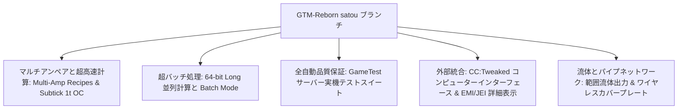

# GregTech Modern Reborn (GTM Reborn)

`modules/gtm-reborn` は、GTE-Multi が深くカスタマイズした GregTech Modern の独立ブランチ（ブランチ名は `satou`）です。

---

## 🚀 `satou` ブランチのコア拡張機能

上流のオリジナル版と比較して、GTM-Reborn は現代の高バージョン Minecraft 1.20.1 において、複数の革新的な技術進化と工業体験のアップグレードを実現しています：



### 1. 64ビット長整数並列処理とバッチモード (Batch Mode)
- **32ビット整数の上限を突破**：並列計算は全面的に `long` データ型を採用し、超大型工業群が極めて高い並列度で数値オーバーフローや計算切り捨てが発生する問題を完全に解決します。
- **スマートバッチモード**：原料が非常に豊富な場合、機械は数百から数千回の微小レシピを1サイクルにまとめて実行でき、サーバーの Tick 負荷を大幅に低減します。

### 2. 1T Subtick 瞬時オーバークロック (OC_PERFECT_SUBTICK)
- 機械の Recipe Logic 実行パイプラインを最適化し、指定された上位機械が1 Tick 内で複数回のレシピ反復を完了できるようにし、純粋な工業生産の限界を解放します。

### 3. マルチアンペア入力とレシピサポート (Multi-Amp)
- 機械レシピは単一レシピで複数アンペア（Amperes）の電流を消費/出力でき、EMI/JEI インターフェースでマルチアンペア値と導線仕様のヒントを直感的に表示します。

### 4. 範囲流体出力 (Ranged Fluid Outputs)
- 上位の蒸留塔と化学反応器が、異なる温度と圧力条件に応じて範囲変動のある流体生成物を出力できるようにします。

### 5. CC:Tweaked (ComputerCraft) モダンなペリフェラル統合
- すべての標準機械は ComputerCraft にペリフェラルインターフェースを開放します：
  - レシピの進行状況、残り時間、現在の EU/t 消費をリアルタイムで照会。
  - Lua スクリプトで機械の起動、一時停止、または動作モードの切り替えを動的に実行。

---

## 🧪 自動テストと GameTest 検証

GTM-Reborn には、完全な Minecraft ネイティブ GameTest 自動テストスイート（`src/test` に配置）が含まれています：

```powershell
# GameTest 自動サーバーテストを実行
$env:JAVA_HOME='C:\Users\Ex_Je\.jdks\ms-21.0.11'
.\gradlew.bat :modules:gtm-reborn:runGameTestServer
```

### テストカバレッジ範囲
- **Cover システム**：流体ポンププレート、アイテム搬送プレート、エネルギー導流プレートのスループットと漏れ防止ロジックをテスト。
- **機械 Recipe Logic**：マルチアンペア、バッチ処理、クロスレシピ並列、オーバークロック計算をテスト。
- **マルチブロック構造と回転**：各種ケーシング、ハッチが異なる向きでの構造検証をテスト。

---

## 🌿 サブモジュール Git ワークフロー規約

`modules/gtm-reborn` は独立した Git リポジトリ `takanashisatou/GregTech-Modern-Reborn` に対応し、デフォルト開発ブランチは `satou` です：

```bash
# サブモジュール内で独立して開発・コミット
cd modules/gtm-reborn
git checkout satou
git add .
git commit -m "feat: optimize multiblock recipe logic"
git push origin satou

# メインプロジェクトに戻り、サブモジュールのポインタを更新
cd ../..
git add modules/gtm-reborn
git commit -m "chore: bump gtm-reborn submodule pointer"
```