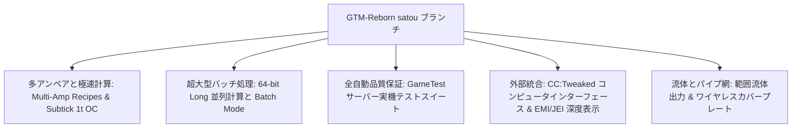

# GregTech Modern Reborn (GTM Reborn)

`modules/gtm-reborn` は GTE-Multi が深くカスタマイズした GregTech Modern の独立ブランチです（ブランチ名は `satou`）。

---

## 🚀 `satou` ブランチの核心拡張機能

上流のオリジナル版と比較して、GTM-Reborn は現代の高バージョン Minecraft 1.20.1 上で多くの革命的な技術進化と工業体験のアップグレードを実現しました：



### 1. 64ビット長整数並列とバッチ処理モード (Batch Mode)
- **32ビット整数の上限を突破**：並列計算は全面的に `long` データ型を採用し、超大型工業群の極めて高い並列下での数値オーバーフローや計算切り捨ての問題を完全に解決します。
- **スマートバッチ処理モード**：原料が非常に豊富な場合、機械は何百何千もの微小なレシピを単一の周期にまとめて実行でき、サーバーのTick負荷を大幅に低減します。

### 2. 1T Subtick 瞬時オーバークロック (OC_PERFECT_SUBTICK)
- 機械のRecipe Logic実行パイプラインを最適化し、指定された上級機械が1 Tick内で複数回のレシピ反復を完了できるようにし、純粋な工業生産の限界を解放します。

### 3. マルチアンペア入力とレシピサポート (Multi-Amp)
- 機械レシピは単一レシピでの複数アンペア（Amperes）の電流消費/出力をサポートし、EMI/JEIインターフェースでマルチアンペア値と導線仕様のヒントを直感的に表示します。

### 4. 範囲流体出力 (Ranged Fluid Outputs)
- 高級蒸留塔と化学反応器が異なる温度と圧力条件に応じて、範囲変動のある流体生成物を出力できるようにします。

### 5. CC:Tweaked (ComputerCraft) 現代周辺機器統合
- すべての標準機械はComputerCraftに周辺機器インターフェースを開放します：
  - レシピの進行状況、残り時間、現在のEU/t消費をリアルタイムに照会します。
  - Luaスクリプトを介して機械を動的に起動・一時停止したり、動作モードを切り替えたりできます。

---

## 🧪 自動テストとGameTest検証

GTM-Reborn は完全なMinecraftネイティブGameTest自動テストスイートを含みます（`src/test` にあります）：

```powershell
# GameTest自動サーバーテストを実行
$env:JAVA_HOME='C:\Users\Ex_Je\.jdks\ms-21.0.11'
.\gradlew.bat :modules:gtm-reborn:runGameTestServer
```

### テストカバレッジ範囲
- **Coverシステム**：流体ポンププレート、アイテム輸送プレート、エネルギー導流プレートのスループットと漏れ防止ロジックをテストします。
- **機械Recipe Logic**：マルチアンペア、バッチ処理、クロスレシピ並列、オーバークロック計算をテストします。
- **マルチブロック成形と回転**：各種ケーシング、コンパートメントの異なる向きでの構造検証をテストします。

---

## 🌿 サブモジュール Git ワークフロー規範

`modules/gtm-reborn` は独立したGitリポジトリ `takanashisatou/GregTech-Modern-Reborn` に対応し、デフォルトの開発ブランチは `satou` です：

```bash
# サブモジュール内で独立に開発とコミット
cd modules/gtm-reborn
git checkout satou
git add .
git commit -m "feat: optimize multiblock recipe logic"
git push origin satou

# メインプロジェクトに戻ってサブモジュールのポインタを更新
cd ../..
git add modules/gtm-reborn
git commit -m "chore: bump gtm-reborn submodule pointer"
```