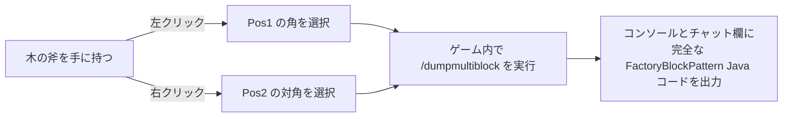

# KubeJS ツールセットとマルチブロックエクスポーター (`/dumpmultiblock`)

GTE は KubeJS サーバーサイドスクリプトに、開発者専用のマルチブロック自動構築・構造抽出ツールを内蔵しており、マルチブロック構造の設計プロセスを完全に解放します。

---

## 🪓 マルチブロック可視化エクスポーター (`/dumpmultiblock`)

カスタムマルチブロック（Java コードでも KubeJS スクリプトでも）を開発する際、数十層の文字で構成される `FactoryBlockPattern.aisle(...)` を手動で記述するのは非常に時間がかかり、エラーも発生しやすいです。

GTE には **`/dumpmultiblock` 木の斧フレーム選択エクスポーター** (`server_scripts/easymultiblock.js`) が内蔵されています：



### 使用手順

1. ゲームをクリエイティブモードにし、**木の斧 (`minecraft:wooden_axe`)** を手に持ちます。
2. 構想に従って、ワールド内に完全なマルチブロック物理構造（筐体、バス、コイル、メインコントローラーを含む）を直接構築します。
3. 木の斧で構造の **底面の角ブロックを左クリック** します（チャット欄に `Pos1 を設定: x, y, z` と表示されます）。
4. 木の斧で構造の **対角線上の頂点ブロックを右クリック** します（チャット欄に `Pos2 を設定: x, y, z` と表示されます）。
5. チャットボックスにコマンドを入力します：
   ```mcfunction
   /dumpmultiblock
   ```
6. スクリプトが自動的に3次元バウンディングボックス内のすべてのブロックタイプをスキャンし、文字マッピングを割り当て（`.` は空気、`A-Z/a-z/0-9` は具体的なブロック）、バックグラウンドログとクライアントに直接構造コードを生成します：

```java
// 自動エクスポートされた FactoryBlockPattern テンプレート
.pattern(definition -> FactoryBlockPattern.start()
    .aisle("BBB", "BBB", "BBB")
    .aisle("BBB", "BAB", "BBB")
    .aisle("BBB", "B#B", "BBB")
    .where('A', Predicates.blocks("minecraft:air"))
    .where('#', Predicates.controller(Predicates.blocks(definition.getBlock())))
    .where('B', Predicates.blocks("gtceu:steam_machine_casing").or(Predicates.autoAbilities(definition.getRecipeTypes())))
    .build()
)
```

---

## 🌌 次元ガスと流体鉱脈の設定

GTE は KubeJS を通じて、全次元の流体・ガス収集を拡張しています：

### 1. 全次元ガス抽出 (`dimension_gas.js`)
大型ガスコレクター (`gas_collector`) と異なる回路番号を組み合わせることで、任意の次元でその次元固有の大気を抽出できます：
- **オーバーワールドの空気**：`circuit(4)` ➜ 出力 `gtceu:air 10000`
- **ネザーの地獄のガス**：`circuit(5)` ➜ 出力 `gtceu:nether_air 10000`
- **エンドの虚空のガス**：`circuit(6)` ➜ 出力 `gtceu:ender_air 10000`

### 2. 万能回路コンバーター (`universal_circuit.js`)
クロスモッドや各グレードの回路基板の複雑なレシピの山積みを解決するため、GTE は **汎用回路 (`universal_circuit`)** システムを導入しました：
- パッカー (`packer`) 内で、任意の同電圧グレードの回路（ULV から MAX まで）を **1 EU / 1 tick** でロスなく汎用回路アイテムに変換できます。