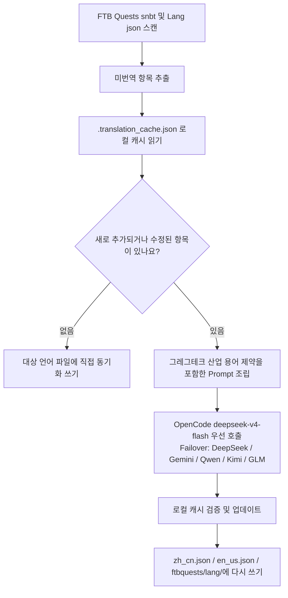

# AI 국제화 번역 엔진 (`opencode_translate.py`)

GTE 프로젝트는 통합 스크립트로 구동되는 산업급 다국어 국제화 번역 체계를 구현하여 Mod 자산, FTB 퀘스트북, Markdown 문서의 세 가지 영역을 포괄합니다.

---

## 🔒 번역 5대 철칙

본 프로젝트의 번역 작업은 다음 **5가지 불가침 철칙**을 따릅니다:

1. **단일 스크립트**: 모든 번역은 오직 `scripts/opencode_translate.py`에 의해 구동되며, OpenCode Zen의 `deepseek-v4-flash` 모델을 사용합니다. 두 번째 번역 스크립트를 도입하거나 API 호출을 수동으로 조합하는 것을 금지합니다.
2. **클라우드 실행**: 모든 전체 번역은 GitHub Actions CI에서 실행되어야 합니다 (`translate.yml` / `docs-deploy.yml` / `sync-build.yml`). 로컬에서 수동으로 대규모 실행하는 것을 엄격히 금지합니다.
3. **단일 배포**: 전체 사이트는 `https://takanashisatou.github.io/GregtechEasy/` (`gh-pages` 브랜치)에 통합 배포되며, 두 번째 문서 사이트를 만들거나 중복 배포하지 않습니다.
4. **영문 규칙**:
   - 문서 시스템 (`docs/en/`): 영문은 AI가 `docs/zh/`에서 전체 번역해야 하며, 수동 덮어쓰기를 금지합니다;
   - 모드 프로젝트: `gtecore`의 `en_us.json`만 수동 유지되며, 스크립트에 보호 로직이 내장되어 절대 기계 번역으로 덮어쓰지 않습니다.
5. **심층 현지화**: 내비게이션 메뉴 (`nav_translations`), Mermaid 흐름도 텍스트, 코드 주석, 테이블 레이블은 반드시 100% 해당 언어로 현지화되어야 합니다.

---

## 🤖 번역 엔진 아키텍처

전통적인 커뮤니티 한글화는 복잡한 JSON 및 SNBT 텍스트를 수동으로 유지하는 데 의존하여 업데이트가 지연되고 오류가 발생하기 쉽습니다.

GTE의 AI 번역 엔진은 표준화된 OpenAI 호환 API를 통해 FTB Quests 퀘스트북과 핵심 Mod 언어 파일의 **자동 증분 추출, 용어 정렬 및 동시 번역**을 구현합니다:

---

## 🔑 지원되는 LLM 공급자 및 환경 변수

스크립트는 다음 우선순위에 따라 사용 가능한 첫 번째 API Key를 자동으로 선택하며, 공급자를 수동으로 지정할 필요가 없습니다:

| 우선순위 | 공급자 이름 | API Key 환경 변수 | Base URL 환경 변수 | 기본 모델 |
| :---: | :--- | :--- | :--- | :--- |
| **1 (우선)** | **OpenCode Zen** | `OPENCODE_API_KEY` | `OPENCODE_BASE_URL` | **`deepseek-v4-flash`** |
| 2 | DeepSeek | `DEEPSEEK_API_KEY` | `DEEPSEEK_BASE_URL` | `deepseek-chat` |
| 3 | Google Gemini | `GEMINI_API_KEY` | `GEMINI_BASE_URL` | `gemini-3.6-flash` |
| 4 | 通义千问 (DashScope) | `DASHSCOPE_API_KEY` | `DASHSCOPE_BASE_URL` | `qwen-plus` |
| 5 | 月之暗面 (Moonshot) | `MOONSHOT_API_KEY` | `MOONSHOT_BASE_URL` | `moonshot-v1-8k` |
| 6 | 智谱清言 (Zhipu GLM) | `ZHIPU_API_KEY` | `ZHIPU_BASE_URL` | `glm-4-flash` |
| 7 | OpenAI | `OPENAI_API_KEY` | `OPENAI_BASE_URL` | `gpt-4o-mini` |
| 8 | 일반 집계 프록시 | `LLM_API_KEY` | `LLM_BASE_URL` | `LLM_MODEL` (사용자 정의) |

> **참고**: GitHub Secrets에 `OPENCODE_API_KEY`만 구성하면 CI가 완전히 실행됩니다. 나머지는 예비 Failover입니다.

---

## 🎯 산업급 Prompt 제약 원칙

API를 호출하여 번역할 때 시스템에는 엄격한 Minecraft 및 GregTech 용어 규칙이 내장되어 있습니다:

1. **형식 코드 절대 보존**: Minecraft 고유 색상 형식 코드 (예: `§a`, `§c`, `§6`) 및 자리 표시자 (`%s`, `%d`, `{0}`)를 완전히 보존합니다.
2. **과학 기술 용어 규범 통일**: 과학 기술 고유 명사 번역 (예: `UHV`, `EU/t`, `Amps`, `Voltage`, `Overclock`, `Subtick` 등)을 엄격히 고정합니다.
3. **해시 증분 캐시**: 모든 번역된 항목은 `.translation_cache.json`에 자동으로 영구 기록되며, 새로 추가되거나 변경된 텍스트만 네트워크 요청을 발생시켜 Token 비용과 CI 시간을 크게 절약합니다.
4. **Mermaid 다이어그램 텍스트 현지화**: 흐름도 노드 레이블 (예: `A[레이블]`)을 대상 언어로 번역하며, `graph TD`, `-->`, `subgraph` 등의 문법 키워드는 변경하지 않습니다.
5. **코드 주석 및 테이블 레이블**: 코드 블록 내 주석 (`//` / `#`) 및 테이블 열 제목을 전체 현지화합니다.

---

## 🏗️ 보호되는 파일 (기계 번역 불가)

| 경로 | 보호 이유 | 보호 메커니즘 |
| :--- | :--- | :--- |
| `modules/gtecore/src/main/resources/assets/gtecore/lang/en_us.json` | gtecore 영문 번역은 작성자가 수동으로 유지 | 스크립트가 `is_gtecore` 플래그를 감지하여 `en_us` 언어는 덮어쓰기를 건너뜁니다 |

---

## 💻 CI 트리거 방식 (클라우드 실행, 철칙 2)

| 시나리오 | 워크플로우 | 트리거 방식 |
| :--- | :--- | :--- |
| 코드 푸시 후 자동 전체 빌드 + 번역 | `sync-build.yml` | `main`/`master`로 푸시 시 자동 트리거 |
| 문서 변경 후 자동 번역 + 배포 | `docs-deploy.yml` | `docs/` 또는 `mkdocs.yml` 변경 시 트리거 |
| 수동 전체 모드 자산 번역 | `translate.yml` | Actions 페이지에서 수동 트리거, Provider 및 언어 선택 가능 |
| 수동 전체 문서 번역 | `translate.yml` | `translate_docs` 입력 항목 체크 |

> [!CAUTION]
> 로컬에서 `python scripts/opencode_translate.py`를 수동으로 실행하여 대규모 전체 번역을 수행하는 것을 금지합니다. 로컬 실행은 단일 파일 디버깅 또는 API Key 연결 확인에만 사용됩니다.