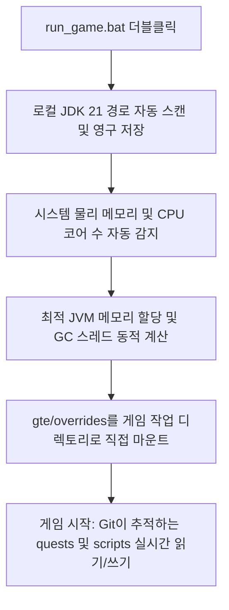

# 로컬 핫 리로드 및 런처 없이 빠른 실행

GTE는 통합팩 기획자, 퀘스트 작성자, 모드 프로그래머에게 매우 친숙한 무감각(無感) 핫 디버깅 시스템을 설계했습니다.

---

## ⚡ 1. 런처 없이 초고속 실행 스크립트 (`run_game.bat` / `run_game.sh`)

퀘스트 북 작성자(FTB Quests)와 KubeJS 레시피 기획자라면 **IntelliJ IDEA를 열 필요도 없고, 서드파티 런처를 설치할 필요도 없이**, 프로젝트 루트 디렉토리의 **`run_game.bat`** 을 더블클릭만 하면 즉시 게임에 진입할 수 있습니다!



### 핵심 기능
1. **완전 자동 JDK 21 탐지**: `.jdks`, `Adoptium`, `Zulu`, `Program Files` 아래에 설치된 Java 21을 자동 검색하고 `.jdk_path`에 자동 저장합니다.
2. **하드웨어 적응형 최적화**: 현재 PC의 총 RAM 용량에 따라 최적 비율(사용 가능한 물리 메모리의 50%~60%)로 JVM 힙 크기를 자동 할당하고, 병렬 GC 스레드를 자동 구성합니다.
3. **파일 이동 없는 워크플로우**: 게임 내에서 퀘스트를 수정(`/ftbquests editing_mode true`)하고 저장하면, 변경 사항이 Git 저장소의 해당 `config/ftbquests/`에 실시간으로 저장됩니다. GitHub Desktop을 열어 한 번의 클릭으로 커밋할 수 있습니다!

---

## 🔗 2. 외부 런처 제로 복사 매핑 도구 (`link_to_launcher.bat`)

자신이 설정한 스킨, 키 설정이 있는 런처(예: PCL2 / HMCL / Prism Launcher)를 사용하는 데 익숙하다면:

1. 루트 디렉토리의 **`link_to_launcher.bat`** 을 더블클릭하여 실행합니다.
2. 안내에 따라 런처의 게임 디렉토리(예: `D:\PCL2\.minecraft\versions\GTE-Dev\.minecraft\`)를 콘솔에 드래그 앤 드롭하고 Enter 키를 누릅니다.
3. 스크립트가 자동으로 Windows 디렉토리 정션(Directory Junctions)을 생성합니다:
   - `config` ➜ `gte/overrides/config`
   - `kubejs` ➜ `gte/overrides/kubejs`
   - `ftbquests` ➜ `gte/overrides/config/ftbquests`
   - `defaultconfigs` ➜ `gte/overrides/defaultconfigs`
4. 런처에서 퀘스트나 레시피를 어떻게 수정하든 **물리적 데이터가 메인 Git 저장소에 실시간으로 동기화 저장됩니다**!

---

## ☕ 3. 모드 코드 핫 컴파일 섀도우 환경 (`gte-dev-runtime`)

Java/Kotlin 프로그래머를 위해 `modules/gte-dev-runtime`은 전용 섀도우 디버깅 모듈입니다:

### 작동 원리 및 설계 고려 사항
- **위치**: 순수 로컬 핫 컴파일 연동 샌드박스로, **배포 패키징이 금지되며 어떤 플레이어 빌드에도 포함되지 않습니다**.
- **ModDevGradle 동적 리매핑**: `gtm-reborn`과 `gtecore`의 최신 소스 코드를 자동으로 핫 컴파일하여 Mojang 디난독화 네임스페이스에 마운트합니다.
- **실행 방법**:
  - IDEA에서 실행 구성 **`Run GTE Full Pack (Client - Hot Debug)`** 을 선택합니다.
  - 또는 명령줄에서 실행:
    ```powershell
    .\gradlew.bat :modules:gte-dev-runtime:runClient
    ```