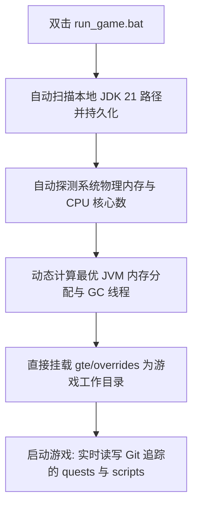

# 로컬 핫 디버깅 및 런처 없이 빠른 실행

GTE는 통합팩 기획자, 퀘스트 작성자, 모드 프로그래머에게 매우 친숙한 무감각 연동 디버깅 시스템을 설계했습니다.

---

## ⚡ 1. 런처 없이 빠른 시작 스크립트 (`run_game.bat` / `run_game.sh`)

퀘스트북 작성자(FTB Quests)와 KubeJS 레시피 기획자라면 **IntelliJ IDEA를 열 필요도 없고, 서드파티 런처를 설치할 필요도 없이** 프로젝트 루트 디렉터리의 **`run_game.bat`** 을 더블클릭하기만 하면 빠르게 게임에 진입할 수 있습니다!



### 핵심 기능
1. **완전 자동 JDK 21 탐색**: `.jdks`, `Adoptium`, `Zulu`, `Program Files` 아래에 설치된 Java 21을 자동으로 검색하고 `.jdk_path`에 자동으로 저장합니다.
2. **하드웨어 적응형 최적화**: 현재 PC의 총 RAM 용량에 따라 최적 비율(사용 가능한 물리 메모리의 50%~60%)로 JVM 힙 크기를 자동 할당하고 병렬 GC 스레드를 자동 구성합니다.
3. **파일 이동 없는 워크플로우**: 게임 내에서 퀘스트를 수정(`/ftbquests editing_mode true`)하고 저장하면, 변경 사항이 Git 저장소의 해당 `config/ftbquests/`에 실시간으로 직접 저장됩니다. GitHub Desktop을 열어 한 번의 클릭으로 커밋할 수 있습니다!

---

## 🔗 2. 외부 런처 복사 없이 연결하는 매핑 도구 (`link_to_launcher.bat`)

자신이 설정한 스킨과 키 설정이 있는 런처(예: PCL2 / HMCL / Prism Launcher)를 사용하는 데 익숙하다면:

1. 루트 디렉터리의 **`link_to_launcher.bat`** 을 더블클릭하여 실행합니다.
2. 안내에 따라 런처의 게임 디렉터리(예: `D:\PCL2\.minecraft\versions\GTE-Dev\.minecraft\`)를 콘솔에 끌어다 놓고 Enter 키를 누릅니다.
3. 스크립트가 Windows 디렉터리 심볼릭 링크(Directory Junctions)를 자동으로 생성합니다:
   - `config` ➜ `gte/overrides/config`
   - `kubejs` ➜ `gte/overrides/kubejs`
   - `ftbquests` ➜ `gte/overrides/config/ftbquests`
   - `defaultconfigs` ➜ `gte/overrides/defaultconfigs`
4. 런처에서 퀘스트나 레시피를 어떻게 수정하든 **실제 데이터는 메인 Git 저장소에 실시간으로 동기화되어 저장됩니다**!

---

## ☕ 3. 모드 코드 핫 컴파일 섀도우 환경 (`gte-dev-runtime`)

Java/Kotlin 프로그래머에게 `modules/gte-dev-runtime`은 전용 섀도우 디버깅 모듈입니다:

### 작동 원리 및 설계 고려 사항
- **위치/목적**: 순수 로컬 핫 컴파일 연동 디버깅 샌드박스로, **패키징 및 배포가 금지되며 어떤 플레이어 빌드에도 포함되지 않습니다**.
- **ModDevGradle 동적 리매핑**: `gtm-reborn` 및 `gtecore`의 최신 소스 코드를 자동으로 핫 컴파일하여 Mojang 디오브퓨케이션 네임스페이스에 마운트합니다.

### 올바른 실행 방법

다음 세 가지 진입점은 서로 동일하며, 모두 게임 창을 자동으로 맨 앞으로 올립니다:

```powershell
$env:JAVA_HOME='C:\Users\Ex_Je\.jdks\ms-21.0.11'
.\gradlew.bat runFullPack                          # preferred, root aggregate entry point
.\gradlew.bat :modules:gte-dev-runtime:runClient    # equivalent
.\run_game.bat                                     # same task, auto-detects JDK/RAM/cores
```

### 처음 25초 동안 창이 보이지 않는 이유 (정상입니다)

외장 GPU에서 발생하는 Embeddium/Oculus의 GLFW 컨텍스트 데드락을 피하기 위해 Forge의 초기 진행 창은 의도적으로 비활성화되어 있습니다. 그 대가로 창은 `Minecraft.<init>` 내부에서야 생성되며, 그 시점에 게임 JVM은 이미 Gradle 데몬이 fork한 백그라운드 프로세스입니다. Windows 포그라운드 잠금이 이 프로세스의 포커스 요청을 거부하므로, 창은 정상적으로 생성되고 렌더링되지만 활성 창 아래에 놓입니다 — 이는 마치 "창이 아예 뜨지 않은" 것처럼 보입니다.

따라서 `runClient`는 `scripts/dev/raise_game_window.ps1`을 비동기적으로 실행합니다. 이 스크립트는 이번 실행의 JVM에 속한 `GLFW30` 창을 폴링하여 `SetWindowPos`로 맨 앞으로 올립니다(Z 순서 변경은 포그라운드 잠금의 대상이 아니므로 창 올리기는 항상 성공합니다). 로그는 `modules/gte-dev-runtime/build/raise-game-window.log`에 있습니다. 전체 콜드 스타트에는 약 70초가 걸립니다.

### 환경 변수 스위치

| 환경 변수 | 효과 |
| --- | --- |
| `GTE_WINDOW_WIDTH` / `GTE_WINDOW_HEIGHT` | 창 크기(기본값 1600x900) |
| `GTE_NO_WINDOW_RAISE=1` | 창 올리기를 건너뛰고 GLFW가 배치한 위치에 그대로 둡니다 |
| `GTE_RUNTIME_XMX` | 클라이언트 힙 상한(기본값 `8G`) |

### `.vscode/launch.json`으로 실행하지 마세요

`.vscode/launch.json`의 구성은 IDE 동기화 중에 ModDevGradle이 자동으로 생성합니다. 이 구성들은 `net.neoforged.devlaunch.Main`을 직접 호출하여 `runClient` 태스크를 우회하므로 창이 결코 앞으로 올라오지 않습니다. 또한 이 파일은 IDE 동기화마다 다시 작성되므로 수동 편집은 유지되지 않습니다. 지속적으로 유지해야 하는 실행 인자는 `build.gradle`의 `runs {}` 블록에 작성하세요.

중단점이 필요할 때는 IntelliJ의 `Run Client (Hot Debug)` 구성을 사용하세요. 이 구성은 JDWP 디버거를 연결하며, 종료 시 `run/client/`에 `hs_err_pid*.log` 파일을 남길 수 있습니다. 이는 알려진 무해한 산출물이며 시작 과정과는 무관합니다.