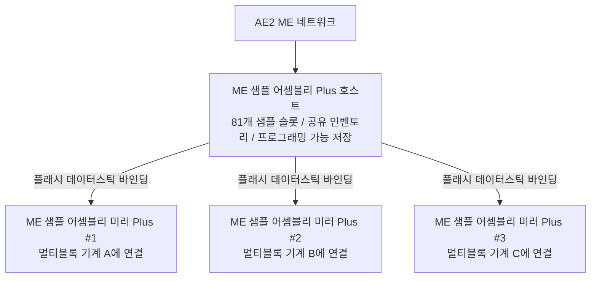

# AE2 심층 통합 및 샘플 어셈블리 Plus 시스템

GTECore는 Applied Energistics 2(AE2)와 GregTech 멀티블록 구조 사이에 매우 강력한 직접 데이터 연결 브리지를 구축합니다.

---

## 🧩 ME 샘플 어셈블리 Plus (`me_pattern_buffer_plus`)

기존 테크 모드에서 AE2 샘플 공급기를 멀티블록 기계에 연결할 때 일반적으로 **슬롯 부족, 유체와 아이템 혼합 출력 불가, 샘플 다중 기계 공유 어려움** 같은 문제가 발생합니다.

GTECore가 개발한 **ME 샘플 어셈블리 Plus**가 이 문제를 완전히 해결합니다:

### 핵심 기능
1. **대용량 샘플 슬롯**: 단일 어셈블리 호스트는 **81개의 샘플 슬롯**을 보유합니다 (표준 AE2 샘플 공급기 9개의 합계에 해당).
2. **올인원 컴파트먼트 능력**: `IMPORT_ITEMS`, `IMPORT_FLUIDS`, `EXPORT_ITEMS`, `EXPORT_FLUIDS` 능력을 동시에 갖추어 유체와 아이템을 같은 컴파트먼트에서 혼합 상호작용할 수 있습니다.
3. **프로그래밍 가능 저장 지원**: 내부에 Programmable Storage 메커니즘이 통합되어 복잡한 레시피의 정밀 투입과 캐싱을 지원합니다.

---

## 🪞 ME 샘플 어셈블리 미러 Plus (`me_pattern_buffer_proxy_plus`)

**샘플 어셈블리 미러 Plus**는 혁신적인 분산 자동화 구조 부품입니다:

### 작동 원리 및 크로스 머신 공유
- 미러 어셈블리를 임의의 멀티블록 기계의 컴파트먼트 위치에 설치합니다.
- 손에 **플래시 데이터스틱(Datastick)** 을 들고 메인 **ME 샘플 어셈블리 Plus**를 우클릭하여 좌표를 읽은 다음, **샘플 어셈블리 미러 Plus**를 우클릭하여 바인딩합니다.
- **바인딩된 모든 미러는 메인 어셈블리에 배치된 모든 81개 샘플을 실시간으로 공유합니다!**
- AE2 네트워크가 자동 합성 작업을 시작하면 네트워크가 자동으로 부하 분산하여 모든 유휴 미러 기계에 분배하여 병렬로 작업을 시작합니다!

### Jade 호버 상태 표시
샘플 어셈블리 또는 미러를 바라보면 Jade가 자동으로 표시합니다:
- 메인 어셈블리: `연결된 미러 수: X`
- 미러 부품: `바인딩됨 - X: ..., Y: ..., Z: ...`

---

## 💨 ME 증기 해치 (`me_steam_hatch`)

- **기능**: AE2 유체 네트워크와 증기 멀티블록 구조를 직접 연결합니다.
- **역할**: 증기 멀티블록 구조는 복잡한 고속 증기 파이프와 저장 탱크를 외부에 설치할 필요 없이, ME 네트워크에서 최대 처리량으로 즉시 증기를 추출하여 동력을 공급하므로 파이프 전송 병목 현상을 완전히 제거합니다.