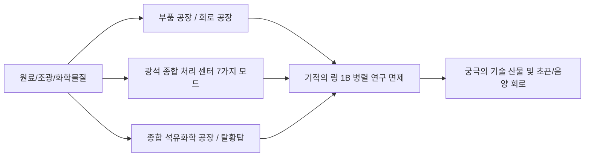

# GTECore 멀티블록 기계 도감

GTECore는 기술 라인 중후반의 번거로운 파이프라인 스태킹을 위해 **초고병렬 처리 능력**과 **통합 생산 로직**을 갖춘 대량의 멀티블록 기계를 설계했습니다.

---

## 🏭 증기 시대 대형 멀티블록

증기 시대의 단일 기계 생산성 저하와 공간 낭비 문제를 해결하기 위해, GTECore는 일련의 대형 증기 멀티블록을 도입했습니다. 모두 크로스 레시피 병렬 처리와 대용량 증기 처리량을 지원합니다:

| 기계 이름 (블록 ID) | 핵심 기능 및 레시피 유형 | 특징 및 장점 |
| :--- | :--- | :--- |
| **대형 증기 합금로** (`gtceu:big_alloy`) | 합금 제련 (`alloy_smelter`) | 초기 고배율 합금 생산, 고압 증기 지원 |
| **대형 증기 압축기** (`gtceu:big_compressor`) | 압축 처리 (`compressor`) | 대량 압축으로 치밀한 금속판 및 블록 생산 |
| **대형 증기 단조 해머** (`gtceu:big_forge_hammer`) | 단조 해머 분쇄/판 (`forge_hammer`) | 자동화된 판재 및 조광 빠른 파쇄 |
| **대형 증기 추출기** (`gtceu:big_steam_extractor`) | 고무/유체 추출 (`extractor`) | 대규모 수지 및 산업용 유체 추출 |
| **간이 증기 분쇄기** (`gtceu:steam_grinder_easy`) | 광석 분쇄 (`macerator`) | 초기 광물 다배율 처리 |
| **간이 증기 제련로** (`gtceu:steam_oven_easy`) | 열분해 제련 (`pyrochlore_oven`) | 코크스 및 숯 산업적 대량 생산 |
| **증기 광물 처리 공장** (`gtecore:steam_op`) | 종합 광석 분쇄 및 정제 | **10억 (1B) 병렬 처리**, 모든 레시피 **1 tick** 실행 완료! 임의 입력/출력 창고 지원 |

---

## ⚡ 초전기 산업 멀티블록

전기 시대에 진입한 후, GTECore는 올인원 및 고급 가공 센터를 제공합니다:

### 1. 핵심 생산 공장

- **§6부품 공장 (`gtceu:component_factory`)**:
  - **위치**: 모터, 펌프, 피스톤, 로봇 팔, 컨베이어 벨트, 발광 다이오드 등 다양한 일반 기본 부품을 한 번에 생산.
  - **특징**: 번거로운 중간 하위 공정을 건너뛰고, 지정된 전압 등급의 표준 산업용 부품을 초고속으로 생산.
- **§6회로 공장 (`gtceu:circuit_factory`)**:
  - **위치**: 집적 회로 기판, 칩 에칭, 집적 패키징을 하나로 통합.
  - **특징**: 크로스 레시피 병렬 창고 지원, ULV에서 MAX까지 전체 전압 구배의 회로 기판 생산을 전면 가속.
- **§6기적의 링 (`gtceu:miracle_ring`)**:
  - **위치**: 산업 기적의 궁극 조립 시설.
  - **특징**: **10억 (1B) 병렬 처리** 및 **1t Subtick 오버클럭** 보유, **어떤 연구/조립 라인 연구도 필요 없이** 조립 라인 레시피를 직접 실행 가능!
- **화학 종결자 (`gtecore:chemistry_terminator`)**:
  - **위치**: "화학과 물리의 존재를 뒤엎으며, 화학의 종말을 의미합니다."
  - **특징**: 복잡한 수십 단계의 장쇄 화학 반응을 원클릭으로 통합, 다양한 궁극 폴리머와 산성 매체를 초고속 합성.
- **십합일 범용 처리 공장 (`gtecore:ten_in_one`)**:
  - **위치**: 원심 분리, 전기 분해, 화학 침출, 중합, 고압 반응 등 10대 기본 공정을 융합한 만능 통합 상자.

### 2. 광석 및 유체 정제 시스템

- **§6광석 종합 처리 센터 (`gtecore:ore_process_center`)**:
  - **7가지 프로그래밍 회로 모드** 지원, 다양한 산물 지향의 광물 5~8배 정제(분쇄, 세광, 열분리, 원심 분리, 전자기 선광 통합), 1t Subtick 오버클럭 지원.
- **종합 석유화학 공장 (`gtecore:integrated_petrochemical_plant`)**:
  - 원유 분별 증류, 촉매 분해, 개질, 탈황 전체 공정을 통합, 단일 기계로 모든 탄화수소 경질 가스와 방향족 탄화수소 생산.
- **탈황기 (`gtceu:desulfurization`)**:
  - 다양한 중질 황 함유 연료를 빠르게 정화, 고순도 황 분말 부산물 회수.
- **간이/고급 유체 시추 장비 (`gtecore:easy_fluid_drilling_rig` / `not_hard_fluid_drilling_rig`)**:
  - 기반암 유체 광맥을 자동으로 흡입, 절대 고갈되지 않으며, 복잡한 파이프라인 탐사 불필요.

### 3. 고급 및 초전도 케이블 가공

- **§6전선 공장 (`gtecore:wiremill_factory`)** : 모든 금속 단일, 이중, 사중, 팔중, 십육중 전선 및 초전도 케이블을 원클릭 생산.
- **§6결정 핵 중추 (`gtecore:crystal_center`)** : 단결정 실리콘 기둥, 에메랄드, 사파이어, 충전된 사이크스텔 결정을 대규모 자동 배양.
- **§6양자 케이블 엔진 (`gtecore:quantum_cable_assembler`)** : 양자 광섬유 및 초차원 에너지 전송 케이블 고속 제조 전용.
- **§3별날 에칭 장치 (`gtecore:starblade_etching_machine`)** : 고에너지 빔을 극자외선/X선 파장대에서 사용하여 은하계급 미세 나노 칩 에칭.

---

## 🔋 에너지 및 발전기 시스템

| 기계 이름 | 에너지 출력/등급 | 핵심 메커니즘 및 특징 |
| :--- | :--- | :--- |
| **§6범용 연료 엔진** (`gtceu:general_fuel_engine`) | 동적 적응 (최대 MAX) | **세계의 모든 유형의 연료 지원** (디젤, 바이오매스, 천연가스, 로켓 연료 등), **20억 (2B) 병렬 처리**, 순간적으로 천문학적 에너지 방출! |
| **대형 범용 발전기** (`gtecore:large_general_generator`) | 다단계 전압 선택 가능 | 일반 가스, 증기 및 플라즈마 발전기 로터에 적합 |
| **초융합 원자로** (`gtecore:super_fusion_reactor`) | 융합 플라즈마 출력 | 일반 융합의 긴 가열 대기를 완전히 제거, **1T Subtick 오버클럭 완벽 지원**, 순간적으로 고온 융합 산물 출력 |
| **상한 초전지 상자** (`gtecore:max_super_battery_buffer_1x`) | **MAX (2,147,483,647 V)** | 초대용량 EU 캐시 수용, 무손실 크로스 차원 무선 충전 인터페이스 지원 |