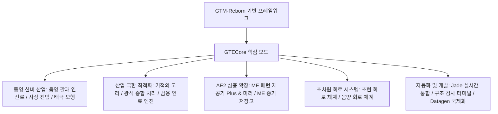

# GTECore 핵심 모드 개요

**GTECore**는 GregTech Easy 프로젝트의 맞춤형 Java 핵심 모드입니다. `gtm-reborn` 소스 코드에 직접 의존하며, 대규모 멀티블록 산업 구조, 고급 진법 기술, AE2 심층 상호작용 및 초고급 회로 제조 시스템을 확장합니다.

---

## 🏛️ 모드 아키텍처 및 설계 포지셔닝

---

## 📦 창작 모드 아이템 탭 및 분류

GTECore는 게임 내에 독립적인 창작 모드 탭을 등록합니다:

1. **그레그테크 이지 머신 (`itemGroup.gtecore.gtecore_machines`)**:
   - 모든 GTE 오리지널 멀티블록 본체 블록 포함 (음양 팔괘 고로, 기적의 고리, 광물 처리 센터, 화학 종결자 등).
   - 다단계 초대형 배터리 박스 (Max Super Battery Buffer), ME 증기 저장고, ME 패턴 제공기 Plus 및 미러 포함.
2. **그레그테크 이지 아이템 (`itemGroup.gtecore.gtecore_items`)**:
   - 초현 및 음양 회로 시리즈 아이템 포함 (프로세서, 클러스터, 슈퍼컴퓨터, 호스트).
   - 오행 원소 부적, 팔괘 칩, 삼청의 입자, 구조 검사 터미널 등 전용 도구 포함.

---

## ⚙️ 모드 전역 설정 (`GTEConfig`)

GTECore는 풍부한 게임 내 및 파일 설정 항목을 제공합니다 (`config/gtecore-common.toml` 또는 게임 내 설정 메뉴):

| 설정 항목 | 기본값 | 상세 설명 |
| :--- | :--- | :--- |
| `superPeace` (슈퍼 평화 모드) | `false` | 활성화 시 악성 적대적 몹 생성을 완전히 비활성화하여 기술 건설에 절대적으로 깨끗한 환경 제공 |
| `durationMultiplier` (레시피 시간 배율) | `1.0` | GTECore 사용자 정의 레시피의 소요 시간 배율을 전역적으로 조정 |

---

## 🔍 Jade / TOP 네이티브 통합

GTECore에는 **`GTEJadePlugin`** 플러그인 지원이 내장되어 있습니다:
- **ME 패턴 제공기 Plus 상태**: 현재 제공기에 바인딩된 패턴 수, 유체 및 아이템 출력 모드를 실시간으로 표시합니다.
- **ME 패턴 제공기 미러 Plus 바인딩 정보**: 마우스를 올리면 바인딩된 메인 제공기의 좌표 `(X, Y, Z)` 및 네트워크 연결 상태를 직접 표시합니다.
- **진법 활성 표시**: 음양 팔괘 연선로에서 청룡, 백호, 주작, 현무 사상 진법의 준비 상태를 실시간으로 표시합니다.

---

## 🛠️ 구조 검사 터미널 (`Structure Testing Terminal`)

GTECore는 전용 휴대용 도구인 **구조 검사 터미널** (`item.gtecore.check_structure_terminal`)을 제공합니다:
- **멀티블록 컨트롤러 우클릭**: 구조 무결성을 실시간으로 스캔합니다.
- **오류 진단 힌트**: 구조가 완성되지 않은 경우, 터미널은 채팅 및 마우스 오버 힌트에서 **오류 블록 좌표 및 배치해서는 안 되는 위치**를 정확히 지적하여 대형 멀티블록 건설 및 오류 수정 속도를 크게 향상시킵니다.