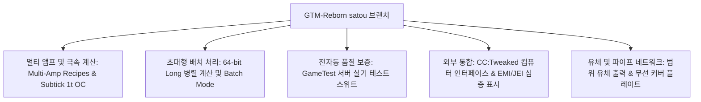

# GregTech Modern Reborn (GTM Reborn)

`modules/gtm-reborn`은 GTE-Multi가 깊이 맞춤화한 GregTech Modern의 독립 브랜치입니다 (브랜치 이름: `satou`).

---

## 🚀 `satou` 브랜치 핵심 강화 기능

상위 원본과 비교하여 GTM-Reborn은 최신 하이버전 Minecraft 1.20.1에서 여러 혁신적인 기술 발전과 산업 경험 업그레이드를 구현했습니다:



### 1. 64비트 정수 병렬 및 배치 모드 (Batch Mode)
- **32비트 정수 한계 돌파**: 병렬 계산에 전면 `long` 데이터 타입을 사용하여 초대형 산업 클러스터에서 극도로 높은 병렬 처리 시 숫자 오버플로우나 계산 잘림 문제를 완전히 해결했습니다.
- **지능형 배치 모드**: 원료가 매우 풍부할 때 기계는 수백 수천 번의 미세 레시피를 단일 주기로 묶어 실행할 수 있어 서버 Tick 부하를 크게 줄입니다.

### 2. 1T Subtick 순간 오버클럭 (OC_PERFECT_SUBTICK)
- 기계 Recipe Logic 실행 파이프라인을 최적화하여 지정된 고급 기계가 1 Tick 내에 여러 번의 레시피 반복을 완료할 수 있게 하여 순수한 산업 생산 한계를 해방합니다.

### 3. 멀티 앰프 입력 및 레시피 지원 (Multi-Amp)
- 기계 레시피는 단일 레시피에서 여러 앰프(Amperes) 전류를 소비/출력할 수 있으며, EMI/JEI 인터페이스에서 멀티 앰프 수치와 와이어 규격 힌트를 직관적으로 렌더링합니다.

### 4. 범위 유체 출력 (Ranged Fluid Outputs)
- 고급 증류탑과 화학 반응기가 온도와 압력 조건에 따라 범위가 변동하는 유체 산출물을 출력할 수 있게 합니다.

### 5. CC:Tweaked (ComputerCraft) 현대 주변기기 통합
- 모든 표준 기계는 ComputerCraft에 주변기기 인터페이스를 개방합니다:
  - 레시피 진행률, 남은 시간, 현재 EU/t 소비량을 실시간으로 조회.
  - Lua 스크립트를 통해 기계를 동적으로 시작, 일시 중지하거나 작업 모드를 전환.

---

## 🧪 자동화 테스트 및 GameTest 검증

GTM-Reborn은 완전한 Minecraft 네이티브 GameTest 자동화 테스트 스위트(`src/test`에 위치)를 포함합니다:

```powershell
# GameTest 자동화 서버 테스트 실행
$env:JAVA_HOME='C:\Users\Ex_Je\.jdks\ms-21.0.11'
.\gradlew.bat :modules:gtm-reborn:runGameTestServer
```

### 테스트 적용 범위
- **Cover 시스템**: 유체 펌프 플레이트, 아이템 전송 플레이트, 에너지 전도 플레이트의 처리량 및 누수 방지 로직 테스트.
- **기계 Recipe Logic**: 멀티 앰프, 배치 처리, 크로스 레시피 병렬 및 오버클럭 계산 테스트.
- **멀티블록 성형 및 회전**: 다양한 방향에서 각종 기계 케이싱, 버스의 구조 검증 테스트.

---

## 🌿 서브모듈 Git 워크플로 규칙

`modules/gtm-reborn`은 독립 Git 저장소 `takanashisatou/GregTech-Modern-Reborn`에 해당하며, 기본 개발 브랜치는 `satou`입니다:

```bash
# 서브모듈에서 독립적으로 개발 및 커밋
cd modules/gtm-reborn
git checkout satou
git add .
git commit -m "feat: optimize multiblock recipe logic"
git push origin satou

# 메인 프로젝트로 돌아가 서브모듈 포인터 업데이트
cd ../..
git add modules/gtm-reborn
git commit -m "chore: bump gtm-reborn submodule pointer"
```