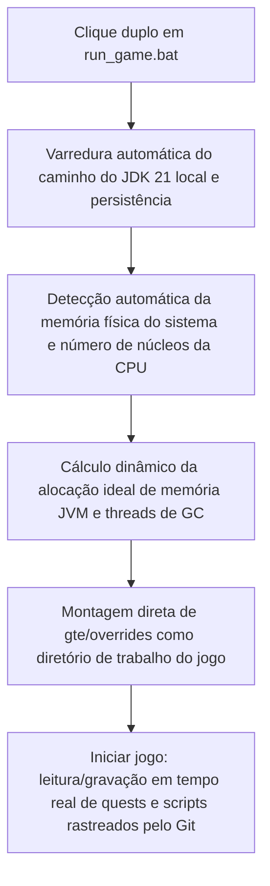

# Depuração local a quente e execução rápida sem launcher

O GTE projetou um sistema de depuração integrada extremamente amigável para planejadores de modpacks, escritores de missões e programadores de mods.

---

## ⚡ 1. Script de inicialização ultrarrápida sem launcher (`run_game.bat` / `run_game.sh`)

Para autores de livros de missões (FTB Quests) e planejadores de receitas do KubeJS, **não é necessário abrir o IntelliJ IDEA nem instalar qualquer launcher de terceiros** — basta clicar duas vezes no **`run_game.bat`** na raiz do projeto para entrar no jogo em altíssima velocidade!



### Características principais
1. **Detecção totalmente automática do JDK 21**: busca automaticamente por Java 21 instalado em `.jdks`, `Adoptium`, `Zulu`, `Program Files` e memoriza automaticamente em `.jdk_path`.
2. **Otimização adaptativa ao hardware**: aloca automaticamente o tamanho do heap da JVM na proporção ideal (50%~60% da memória física disponível) de acordo com a RAM total do computador atual e configura automaticamente threads de GC paralelas.
3. **Fluxo de trabalho sem deslocamento**: modifique missões dentro do jogo (`/ftbquests editing_mode true`) e salve — as alterações são salvas diretamente em tempo real no diretório `config/ftbquests/` correspondente no repositório Git. Abra o GitHub Desktop e faça commit com um clique!

---

## 🔗 2. Ferramenta de mapeamento sem cópia para launchers externos (`link_to_launcher.bat`)

Se você está acostumado a usar um launcher já configurado com skins e atalhos personalizados (como PCL2 / HMCL / Prism Launcher):

1. Execute **`link_to_launcher.bat`** na raiz do projeto com um duplo clique.
2. Siga as instruções para arrastar o diretório do jogo do seu launcher (por exemplo, `D:\PCL2\.minecraft\versions\GTE-Dev\.minecraft\`) para o console e pressione Enter.
3. O script criará automaticamente junções de diretório (Directory Junctions) do Windows:
   - `config` ➜ `gte/overrides/config`
   - `kubejs` ➜ `gte/overrides/kubejs`
   - `ftbquests` ➜ `gte/overrides/config/ftbquests`
   - `defaultconfigs` ➜ `gte/overrides/defaultconfigs`
4. Independentemente de como você modificar missões ou receitas no launcher, **os dados físicos são sincronizados e salvos em tempo real no repositório Git principal**!

---

## ☕ 3. Ambiente sombra de compilação a quente para código de mods (`gte-dev-runtime`)

Para programadores Java/Kotlin, `modules/gte-dev-runtime` é o módulo de depuração sombra dedicado:

### Princípio de funcionamento e considerações de design
- **Posicionamento**: sandbox puramente local para depuração integrada com compilação a quente, **proibido empacotar para distribuição e não aparecerá em nenhum artefato de jogador**.
- **Remapeamento dinâmico com ModDevGradle**: compila automaticamente o código-fonte mais recente de `gtm-reborn` e `gtecore` a quente e monta no namespace de desofuscação Mojang.

### A forma correta de iniciar

Estes três pontos de entrada são equivalentes e todos trazem a janela do jogo para a frente automaticamente:

```powershell
$env:JAVA_HOME='C:\Users\Ex_Je\.jdks\ms-21.0.11'
.\gradlew.bat runFullPack                          # preferred, root aggregate entry point
.\gradlew.bat :modules:gte-dev-runtime:runClient    # equivalent
.\run_game.bat                                     # same task, auto-detects JDK/RAM/cores
```

### Por que nenhuma janela aparece nos primeiros 25 segundos (isso é normal)

A janela de progresso inicial do Forge é deliberadamente desativada para evitar o deadlock do contexto GLFW do Embeddium/Oculus em GPUs dedicadas. O custo é que a janela só é criada dentro de `Minecraft.<init>`, quando a JVM do jogo já é um processo em segundo plano criado por fork pelo daemon do Gradle. O bloqueio de primeiro plano do Windows nega o pedido de foco, então a janela é criada e renderizada corretamente, mas fica embaixo da janela ativa — o que parece exatamente com "a janela nunca apareceu".

Por isso o `runClient` inicia `scripts/dev/raise_game_window.ps1` de forma assíncrona. Ele faz polling à procura da janela `GLFW30` pertencente à JVM desta execução e a eleva com `SetWindowPos` (mudanças de ordem Z não estão sujeitas ao bloqueio de primeiro plano, portanto a elevação sempre funciona). Seu log fica em `modules/gte-dev-runtime/build/raise-game-window.log`. Uma inicialização a frio completa leva cerca de 70 segundos.

### Variáveis de ambiente

| Variável de ambiente | Efeito |
| --- | --- |
| `GTE_WINDOW_WIDTH` / `GTE_WINDOW_HEIGHT` | Tamanho da janela (padrão 1600x900) |
| `GTE_NO_WINDOW_RAISE=1` | Ignorar a elevação e deixar a janela onde o GLFW a colocou |
| `GTE_RUNTIME_XMX` | Limite de heap do cliente (padrão `8G`) |

### Não inicie pelo `.vscode/launch.json`

As configurações em `.vscode/launch.json` são geradas automaticamente pelo ModDevGradle durante a sincronização da IDE. Elas invocam `net.neoforged.devlaunch.Main` diretamente, ignorando a tarefa `runClient`, então a janela nunca é elevada — e o arquivo é reescrito a cada sincronização da IDE, portanto edições manuais não sobrevivem. Coloque argumentos de execução duráveis no bloco `runs {}` do `build.gradle`.

Quando você precisar de breakpoints, use a configuração `Run Client (Hot Debug)` do IntelliJ. Ela anexa um depurador JDWP e pode deixar arquivos `hs_err_pid*.log` em `run/client/` ao sair; esse é um artefato conhecido e inofensivo, sem relação com a inicialização.