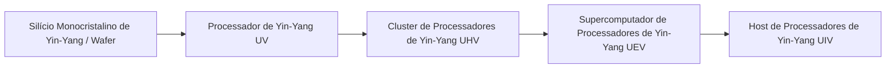

# Sistema de Circuitos Avançados e Materiais de Super String e Yin-Yang

O GTECore expande dois grandes ramos de circuitos avançados que abrangem todo o ciclo de ZPM a MAX — **o Sistema de Circuitos de Super String** e **o Sistema de Circuitos de Yin-Yang Taiji** — acompanhados pelo Centro de Processamento Integrado de Minérios para realizar um ciclo automatizado de materiais.

---

## 🌌 Sistema de Circuitos de Super String (Super String Circuitry)

Os circuitos de Super String obtêm poder computacional superluminal a partir de cordas oscilantes de alta dimensão, cobrindo principalmente a faixa de tensão **ZPM ➜ UEV**:

### Materiais de Super String e Substâncias de Cordas
- **Corda Original (`item.gtecore.original_string`)**: A fonte das oscilações do universo de alta dimensão.
- **Corda α / Corda β / Corda γ (`alpha_string`, `beta_string`, `gamma_string`)**: Polímeros de Super String com diferentes níveis de energia e estados de polarização.
- **Misturador de Super String (`super_string_mixer`)**, **Corda da Criação (`string_of_creation`)** e **Matriz de Oscilação de Super String (`super_string_oscillator_array`)**: Usados para divisão, sintonia e solidificação avançada de substâncias de Super String.

---

## ☯️ Sistema de Circuitos de Yin-Yang Taiji (Yin-Yang Circuitry)

O sistema de circuitos Yin-Yang segue a filosofia cíclica de **"Yin gera Yang, Yang gera Yin, geração infinita"**, cobrindo **UV ➜ UIV** e até limites mais altos:

### Talismãs Específicos dos Oito Trigramas e Cinco Elementos
- **Cinco Elementos**: Elemento Metal (`jinyuansu`), Elemento Madeira (`muyuansu`), Elemento Água (`shuiyuansu`), Elemento Fogo (`huo`), Elemento Terra (`tuyuansu`).
- **Talismãs dos Cinco Elementos**: Talismã do Metal, Talismã da Madeira, Talismã da Água, Talismã do Fogo, Talismã da Terra.
- **Símbolos dos Oito Trigramas e Chips**: Pedras-símbolo e chips centrais dos oito trigramas: Qian, Kun, Zhen, Xun, Kan, Li, Gen, Dui.
- **Partícula dos Três Puros (`god_nugget`)**: Meio de síntese de alto nível que condensa a energia do céu e da terra.

---

## 💎 Modos de Receita do Centro de Processamento Integrado de Minérios

O **Centro de Processamento Integrado de Minérios (`ore_process_center`)** possui 7 modos de circuito padronizados, que podem ser alternados configurando o número do circuito de programação na máquina:

| Número do Circuito | Rota de Processo | Tipos de Minério Aplicáveis e Características do Produto | Multiplicador de Produção |
| :---: | :--- | :--- | :---: |
| **Circuito 1** | Trituração ➜ Trituração ➜ Lavagem | Minérios metálicos básicos (ferro, cobre, estanho, etc.) para produção rápida em massa | 5x produto principal + subprodutos |
| **Circuito 2** | Trituração ➜ Trituração ➜ Centrifugação | Minérios de metais leves raros e valiosos associados | 5x produto principal + subprodutos refinados por centrifugação |
| **Circuito 3** | Trituração ➜ Lavagem ➜ Separação Térmica ➜ Trituração | Minérios refratários de alta temperatura, minérios de metais preciosos (platina, ouro, prata, etc.) | 5~6x + pó metálico puro |
| **Circuito 4** | Trituração ➜ Separação Térmica ➜ Trituração | Minérios de sulfeto e minérios complexos de intercalação pesada | 5x + subprodutos especiais de separação térmica |
| **Circuito 5** | Trituração ➜ Lavagem ➜ Trituração ➜ Lavagem | Minérios de terras raras e minérios de sais solúveis em múltiplas etapas | 6x + subprodutos de dupla lavagem |
| **Circuito 6** | Trituração ➜ Lavagem ➜ Trituração ➜ Centrifugação | Minérios pesados radioativos (urânio, tório, plutônio) e terras raras | 6x + metais pesados refinados por centrifugação |
| **Circuito 8** | Trituração ➜ Lavagem ➜ Trituração ➜ Separação Eletromagnética | Minérios fortemente magnéticos e paramagnéticos (magnetita, cromo, titânio, etc.) | 6~8x + pó puro eletromagnético |