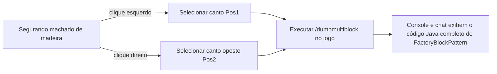

# Conjunto de ferramentas KubeJS e exportador de multibloco (`/dumpmultiblock`)

O GTE incorpora ferramentas de construção automatizada e extração de estrutura de multibloco dedicadas a desenvolvedores nos scripts do lado do servidor KubeJS, liberando completamente o processo de design de estrutura de multibloco.

---

## 🪓 Exportador visual de multibloco (`/dumpmultiblock`)

Ao desenvolver multiblocos personalizados (seja em código Java ou scripts KubeJS), escrever manualmente `FactoryBlockPattern.aisle(...)` composto por dezenas de camadas de caracteres é extremamente demorado e propenso a erros.

O GTE inclui o **exportador de seleção de machado de madeira `/dumpmultiblock`** (`server_scripts/easymultiblock.js`):



### Passos de uso

1. Entre no modo criativo do jogo e segure um **machado de madeira (`minecraft:wooden_axe`)**.
2. Construa a estrutura física completa do multibloco diretamente no mundo, conforme a ideia (incluindo carcaça, compartimentos, bobinas, controlador principal).
3. Use o machado de madeira **clique com o botão esquerdo** em um bloco de canto inferior da estrutura (o chat exibirá `Pos1 definido: x, y, z`).
4. Use o machado de madeira **clique com o botão direito** no bloco de canto superior oposto da estrutura (o chat exibirá `Pos2 definido: x, y, z`).
5. Digite o comando no chat:
   ```mcfunction
   /dumpmultiblock
   ```
6. O script escaneará automaticamente todos os tipos de blocos dentro da caixa delimitadora 3D, atribuirá mapeamentos de caracteres (`.` para ar, `A-Z/a-z/0-9` para blocos específicos) e gerará o código da estrutura diretamente no log do servidor e no cliente:

```java
// Modelo FactoryBlockPattern exportado automaticamente
.pattern(definition -> FactoryBlockPattern.start()
    .aisle("BBB", "BBB", "BBB")
    .aisle("BBB", "BAB", "BBB")
    .aisle("BBB", "B#B", "BBB")
    .where('A', Predicates.blocks("minecraft:air"))
    .where('#', Predicates.controller(Predicates.blocks(definition.getBlock())))
    .where('B', Predicates.blocks("gtceu:steam_machine_casing").or(Predicates.autoAbilities(definition.getRecipeTypes())))
    .build()
)
```

---

## 🌌 Configuração de gases dimensionais e veios de fluidos

O GTE estende a coleta de fluidos e gases em todas as dimensões via KubeJS:

### 1. Extração de gás em todas as dimensões (`dimension_gas.js`)
Usando a câmara de coleta de gás (`gas_collector`) com diferentes números de circuito, é possível extrair a atmosfera exclusiva de qualquer dimensão:
- **Ar do mundo normal**: `circuit(4)` ➜ saída `gtceu:air 10000`
- **Ar do Nether**: `circuit(5)` ➜ saída `gtceu:nether_air 10000`
- **Ar do End**: `circuit(6)` ➜ saída `gtceu:ender_air 10000`

### 2. Conversor de circuito universal (`universal_circuit.js`)
Para resolver a complexa sobreposição de receitas entre mods e circuitos de vários níveis, o GTE introduz o sistema de **circuito universal (`universal_circuit`)** :
- Permite converter qualquer circuito do mesmo nível de tensão (de ULV a MAX) na empacotadeira (`packer`) em um item de circuito universal unificado, sem perdas, a **1 EU / 1 tick**.