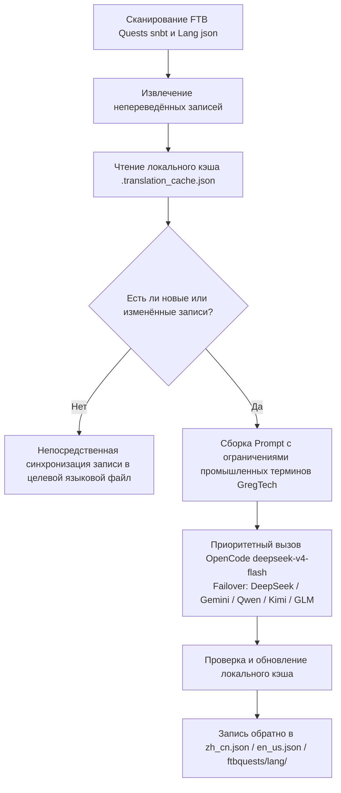

# ИИ-движок интернационализации перевода (`opencode_translate.py`)

Проект GTE реализует промышленную систему многоязычной интернационализации перевода, управляемую единым скриптом, охватывающую три области: активы модов, книги заданий FTB и документацию Markdown.

---

## 🔒 Пять железных правил перевода

Работа по переводу в этом проекте следует следующим **5 незыблемым правилам**:

1. **Единый скрипт**: Все переводы выполняются исключительно с помощью `scripts/opencode_translate.py`, подключённого к модели `deepseek-v4-flash` от OpenCode Zen. Запрещается вводить второй скрипт перевода или вручную собирать вызовы API.
2. **Облачное выполнение**: Все полные переводы должны выполняться в GitHub Actions CI (`translate.yml` / `docs-deploy.yml` / `sync-build.yml`), строго запрещено массовое выполнение вручную локально.
3. **Единое размещение**: Весь сайт развёртывается единообразно на `https://takanashisatou.github.io/GregtechEasy/` (ветка `gh-pages`), не создаётся второй сайт документации и не выполняется повторное развёртывание.
4. **Правила для английского языка**:
   - Система документации (`docs/en/`): Английский язык должен полностью переводиться ИИ из `docs/zh/`, ручное перезапись запрещена;
   - Мод-проект: Только `en_us.json` для `gtecore` поддерживается вручную, скрипт имеет встроенную логику защиты и никогда не перезаписывает машинным переводом.
5. **Глубокая локализация**: Навигационное меню (`nav_translations`), текст диаграмм Mermaid, комментарии в коде и заголовки таблиц должны быть локализованы на 100% на соответствующий язык.

---

## 🤖 Архитектура движка перевода

Традиционная локализация сообщества полагается на ручное обслуживание сложных текстов JSON и SNBT, что приводит к задержкам обновлений и высокой вероятности ошибок.

ИИ-движок перевода GTE через стандартизированный API, совместимый с OpenAI, реализует **автоматическое инкрементальное извлечение, выравнивание терминов и параллельный перевод** для книг заданий FTB Quests и языковых файлов основных модов:

---

## 🔑 Поддерживаемые поставщики LLM и переменные окружения

Скрипт автоматически выбирает первый доступный API-ключ по следующему приоритету, без необходимости вручную указывать поставщика:

| Приоритет | Поставщик | Переменная окружения API Key | Переменная окружения Base URL | Модель по умолчанию |
| :---: | :--- | :--- | :--- | :--- |
| **1 (предпочтительно)** | **OpenCode Zen** | `OPENCODE_API_KEY` | `OPENCODE_BASE_URL` | **`deepseek-v4-flash`** |
| 2 | DeepSeek | `DEEPSEEK_API_KEY` | `DEEPSEEK_BASE_URL` | `deepseek-chat` |
| 3 | Google Gemini | `GEMINI_API_KEY` | `GEMINI_BASE_URL` | `gemini-3.6-flash` |
| 4 | Qwen (DashScope) | `DASHSCOPE_API_KEY` | `DASHSCOPE_BASE_URL` | `qwen-plus` |
| 5 | Moonshot | `MOONSHOT_API_KEY` | `MOONSHOT_BASE_URL` | `moonshot-v1-8k` |
| 6 | Zhipu GLM | `ZHIPU_API_KEY` | `ZHIPU_BASE_URL` | `glm-4-flash` |
| 7 | OpenAI | `OPENAI_API_KEY` | `OPENAI_BASE_URL` | `gpt-4o-mini` |
| 8 | Универсальный агрегатор-прокси | `LLM_API_KEY` | `LLM_BASE_URL` | `LLM_MODEL` (пользовательский) |

> **Примечание**: Для полной работы CI достаточно настроить `OPENCODE_API_KEY` в GitHub Secrets. Остальные — резервные Failover.

---

## 🎯 Принципы ограничений промышленного уровня для Prompt

При вызове API для перевода система включает строгие правила терминологии Minecraft и GregTech:

1. **Абсолютное сохранение форматирования**: Полностью сохраняются нативные коды форматирования цвета Minecraft (например, `§a`, `§c`, `§6`) и плейсхолдеры (`%s`, `%d`, `{0}`).
2. **Единообразие научно-технических терминов**: Строго фиксируется перевод технических терминов (например, `UHV`, `EU/t`, `Amps`, `Voltage`, `Overclock`, `Subtick` и т.д.).
3. **Хэш-инкрементальный кэш**: Все переведённые записи автоматически сохраняются в `.translation_cache.json`, сетевые запросы выполняются только для новых или изменённых текстов, что значительно экономит затраты на токены и время CI.
4. **Локализация текста диаграмм Mermaid**: Метки узлов диаграмм (например, `A[метка]`) переводятся на целевой язык, синтаксические ключевые слова, такие как `graph TD`, `-->`, `subgraph`, остаются неизменными.
5. **Комментарии в коде и заголовки таблиц**: Комментарии в блоках кода (`//` / `#`) и заголовки столбцов таблиц полностью локализуются.

---

## 🏗️ Защищённые файлы (не подлежат машинному переводу)

| Путь | Причина защиты | Механизм защиты |
| :--- | :--- | :--- |
| `modules/gtecore/src/main/resources/assets/gtecore/lang/en_us.json` | Английский перевод gtecore поддерживается автором вручную | Скрипт проверяет флаг `is_gtecore`, язык `en_us` пропускается при перезаписи |

---

## 💻 Способы запуска CI (облачное выполнение, правило 2)

| Сценарий | Рабочий процесс | Способ запуска |
| :--- | :--- | :--- |
| Автоматическая полная сборка + перевод после пуша кода | `sync-build.yml` | Автоматический запуск при Push в `main`/`master` |
| Автоматический перевод + развёртывание после изменения документации | `docs-deploy.yml` | Запуск при изменении `docs/` или `mkdocs.yml` |
| Ручной полный перевод активов модов | `translate.yml` | Ручной запуск на странице Actions, можно выбрать поставщика и язык |
| Ручной полный перевод документации | `translate.yml` | Установка флажка `translate_docs` во входных данных |

> [!CAUTION]
> Запрещается вручную запускать `python scripts/opencode_translate.py` локально для массового полного перевода. Локальный запуск предназначен только для отладки отдельных файлов или проверки связи с API-ключом.